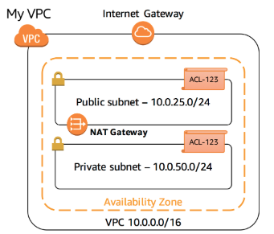
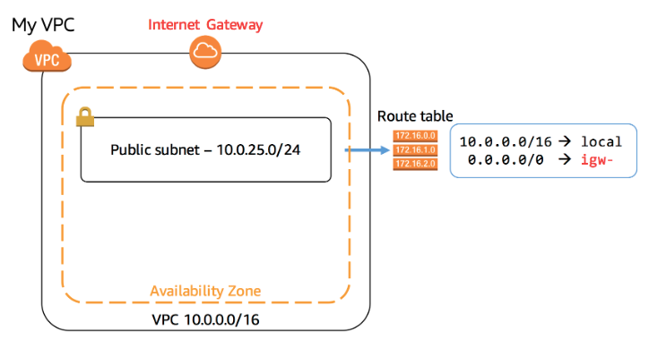
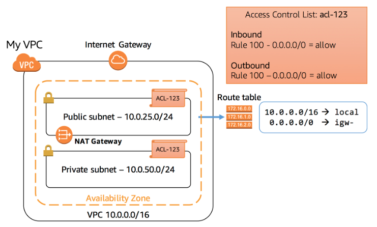
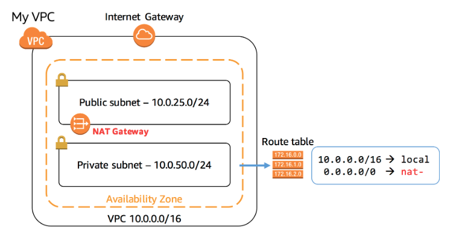
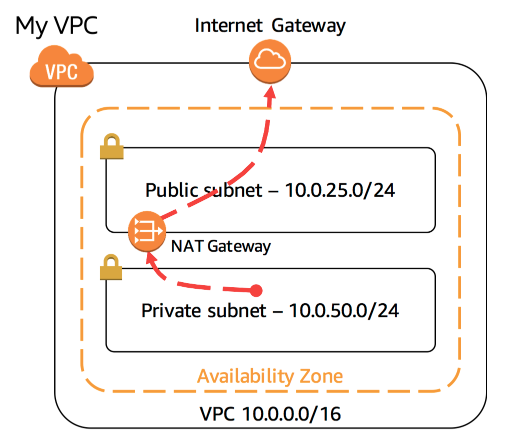

# Introduction to Amazon Virtual Private Cloud (VPC)

## Lab overview 
This lab introduces to Amazon Virtual Private Cloud (VPC). Inthis lab you use the Amazon VPC wizard to create a VPC, attach an Internet Gayeway, add a subnet and then define routing for the VPC so that traffic can flow between the subnet and the internet gateway.

## Objectives
By the end of this lab you should be able to do the following:
* Create an Amazon VPC using the VPC Wizard.
* Explore the basic components of a VPC including: 
  - Public and private subnets
  - Route tables and routes
  - NAT gateways
  - Network ACLs

## Services used in this lab
Amazon Virtual Private Cloud (VPC) 
Amazon VPC lets you provision a logically isolated section of the AWS Cloud where you can launch AWS resources in a virtual network that you can define. You have complete control over your virtual networking environment, including selection of your own IP address range, ceration of subnets, and configuration of route tables and internet gateways. You can use both IPv4 and IPv6 in your VPC for secure and easy access to resources and applications.

## Task 1: Create an Amazon VPC
In this task you create an Amazon VPC using the VPC wizard. The wizard automatically creates a VPC based upon parameters you specify. 
Here is an overview of the VPC:
 
Image description: the preceding diagram depicts a Amazon VPC consisting of a public subnet and a private subnet. An Internet Gateway is attached to the Amazon VPC, and a Network Address Translation gateway is launched in the public subnet.

### Steps
1. At the top of the AWS Management Console, in the search bar, search for and choose VPC.
2. On Create VPC page, under VPC settings section:
* Choose VPC and more (the second option). You are now presentes with parameters to customize the VPC configuration. 
* For Name tag auto-generation, select Auto-generate and enter Lab in the text box.
* For Number of Availability Zones (AZs), choose 1.
* For Numer of public subnets, choose 1.
* For numbre of private subnets, choose 1.
* Expand Customize subnets CIDR blocks and then:
  - For public subnet CIDR block, enter 10.0.25.0/24
  - For private subnets CIDR bloxk, enter: 10.0.50.0/24
* For NAT Gateways ($), choose In 1 AZ.
* For VPC endpoints, choose None
3. Choose Create VPC.
4. Choose View VPC.
5. Copy edit: Copy the VPC ID value and paste it into your text editor to use this later in the lab.

## Task 2: Explore your VPC
In this task, you exlplore the VPC componentes created by the VPC Wizard.
1. In the left navigation pane, under Virtual Private Cloud, choose Your VPCs.
2. Locate Your VPC's Name column, your VPC is created with the name lab-vpc.
3. In the left navigation pane, under Virtual Private Cloud, choose Internet gateways.
An Internet Gateway connects your VPC to the internet. If the IG was not present, then the VPC would have no connectivity to to the internet. An IG is an horizontally scaled, redundant and highly available VPC component. It therefore imposes no availability risks or bandwidth constraints on your network traffic.
4. In the left navigation pane, under Virtual private cloud, choose Subnets.
A subnet is a subset of a VPC. A subnet:
   - Belongs to a specific VPC.
   - Exists in a single Availability Zone (while a VPC can span multiple AZ).
   - Has a range of IP addresses (known as a CIDR range, which stands for Classless InterDomain Routing)
5. Select the Public subnet which starts with Lab-subnet-public in the Name column.
6. Examine the information displayed in the lower window pane:
  - Each subnet is assigned a unique Subnet ID.
  - The IPv4 CIDR of 10.0.25.0/24 means that the subnet contains the range of IP addresses from 10.0.25.0 to 10.0.25.255 (IPv6 is also supported).
  - The subnet only has 250 Available IPs out of 256 possible addresses. This is because there are severals reserved addresses in each subnet and one IP address has been consumed by the NAT gateway.

Why is this subnet considered to be a Public subnet? The answer lies in the subnet routing.

7. Choose the Route table tab.
Each subnet is associated with a Route Table, which specifies the routes for outbound traffic leaving the subnet. Think of it like an address book that lists where to direct traffic based upon its destination.
 
Image description: the preceding diagram depicts that the route table associated with the public subnet contains two routes. The first route is the local route (destination: 10.0.0.0/16), which allows communication within the VPC for the specified CIDR range. Traffic destined for this local route never leaves the VPC. The second route is the default route (destination: 0.0.0.0/0), which directs all IPv4 traffic destined for the internet to the IG.

Routing rules are evaluated from the most restrictive (with the bigger number after the slash) through to the least restricitive (which is 0.0.0.0/0 since it refers to the entire internet). Thus, traffic is first sent within the VPC if it fails within the range of the VPC, otherwise it is send to the internet. The rules can further be edited based upon your particular network configuration.

NOTE: This subnet is associated with a Route Table that has a route to an IG which makes it a Public Subnet. This makes its reachable from the internet.

8. Choose the network ACL tab.
 
Image description: the preceding diagram depicts a Network Access Control List (ACL), which is an optional security layer for a Virtual Private Cloud (VPC) in AWS. It acts as a stateless fw, controlling traffic in and out of subnets. The Network ACL is initially configured with default setting that allow all inbound and outbound traffic.

The following list details the rules in the diagram:
- Rule 100 Inbound allows all inbound traffic from any source to the public subnet.
- Rule 100 Outbound allows all outbound traffic from the public subnet to any destination.
- The second line in each ruleset is represented by an asterisk (*), which acts as a catch all rule. If the incoming or outgoing traffic does not match any of the earlier rules in the Network ACL, this catch all rule ensures that the traffic is denied by default, providing an additional layer of security.

9. In the left navigation pane, under Virtual Private Cloud, Choose Subnets.

10. Select the Private Subnet which starts with Lab-subnet-private in the Name column and ensure that is the only line selected.

11. Choose the Tags tab. 
NOTE: the subnet has been tagged with the key of Name starting with the value Lab-subnet-private. Tags helps you to manage and identify your AWS resources.

12. Choose the Route Table tab.
 
Image description: the preceding diagram depicts the RT confgiguration for the private subnet within the VPC.

The route table conatins the following two routes:
- Route 10.0.0.0/16 | local is identical to the one in the public subnet's RT. It allows communication within the VPC for the specified CIDR range (10.0.0.0/16). Traffic destined for this local route never leaves the VPC.
- Route 0.0.0.0/0 | nat is the default route, directing all IPv4 traffic destined for the internet to the NAT GW. The Network Address Translation gateway is an AWS managed service that enables instances in the private subnet to connect to the internet or other AWS services, but prevents the internet from initiating connections to those instances.

NOTE: the RT for the private subnet does not include a route to the IG. This absence of a direct internet route is what defines this subnet as a private subnet. Instances in this private subnet cannot be directly accesed from the internet, providing an additional layer of security and isolation.

13. In the left navigation pane, under Virtual Private Cloud, choose NAT gateways.
 
Image description: the preceding diagram depicts the resource within the private subnet initiates an outbound connection to the internet. The traffic from the private subnet is routed to the NAT gateway, as specified in the private subnets RT. The NAT gateway then forwards the traffic to the Internet Gateway, acting as an intermediary for the communication.

NOTE: a Network Address Translation (NAT) gateway allows resources in a private subnet to connect to the internet and other resources outside the VPC. This is an outbound only connection, which means that the connection must be initiated from within the priavte subnet. Resources on the internet cannot initiate an inbound connection. Therefore, it is a means of keeping resources private and improving security for VPC resources.

14. In the left navigation pane, under Security, choose Security Groups.

15. Select the SG that matches with the VPC ID that you copied to you text editor and choose the Inbound rules tab.

Learn more: Security Groups acts as virtual fw for your instances to control inbound and outbound traffic. When you launch an EC2 instance into a VPC, you can assign up to five security groups to the instance. SG act at the instance level and not the subnet level. Your VPC automatically comes with a default SG. If you do not specify a different SG when you launch an Amazon EC2 instance, it uses the default SG.

The default SG permits ALL traffic to access associated resources, but only if the Source is the default SG. This self-reference might appear strange, but this configuration simply means that any EC2 instance associated with the default SG can communicate with any other EC2 instance that is associated with the default SG. All other traffic is denied. This is a very safe default setting because it limits any access from other resources.
