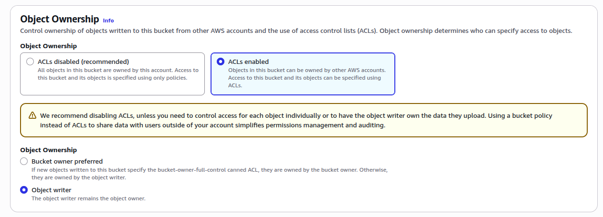
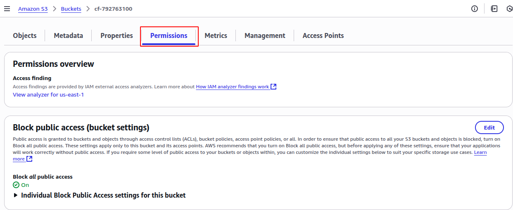
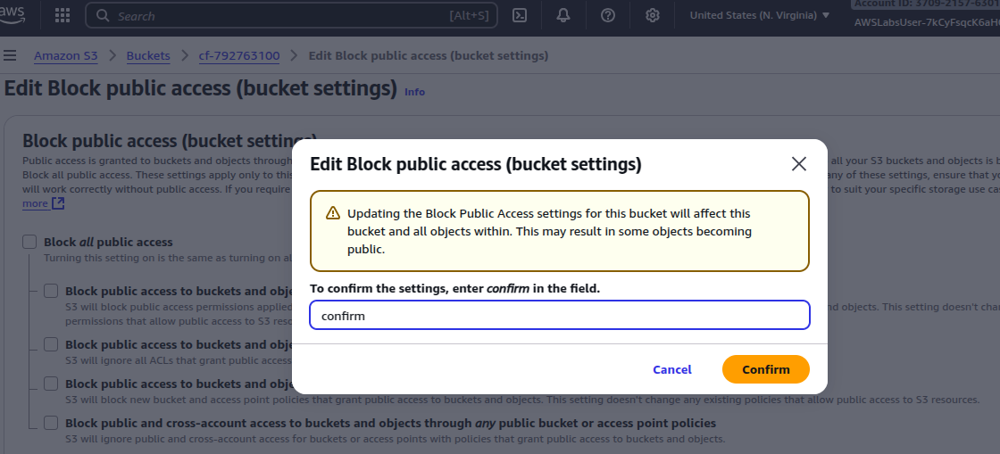
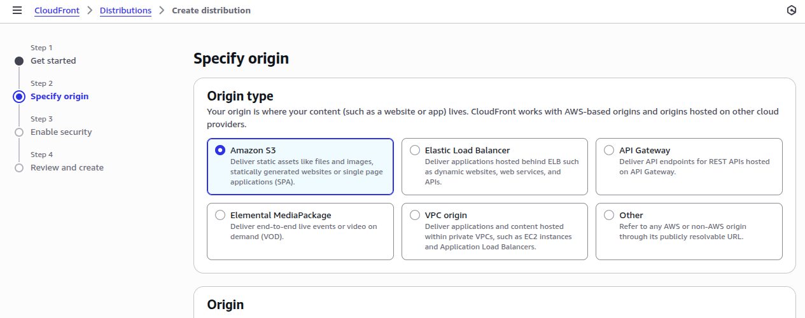
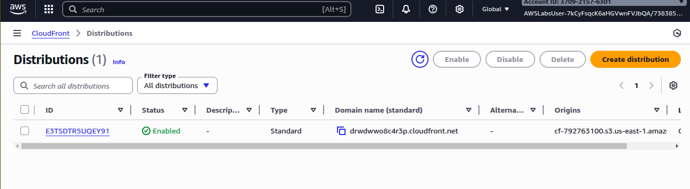

# Introduction to Amazon CloudFront
## Lab overview
This lab introduces you to Amazon CloudFront. In this lab you create an Amazon CloudFront distribution that uses a CloudFront domain name in the URL to distribute a publicly accessible image file stored in an Amazon Simple Storage Service (Amazon S3) bucket.

## Objectives
By the end of this lab, you should be able to do the following:
* Create a new Amazon CloudFront distribution.
* Use your Amazon CloudFront distribution to serve an image file.
* Delete your Amazon CloudFront distribution when it is no longer required.

## Services used in this lab 
### Amazon CloudFront
Amazon CloudFront is a content delivery web service. It integrates with other Amazon Web Services products to give developers and businesses an easy way to distribute content to end users with low latency, high data transfer speeds, and no minimum usage commitments.

## Task 1: Store a Publicly Accessible Image File in an Amazon S3 Bucket
In this task, you store a file that you wish to distribute using Amazon CloudFront in a publicly accessible location. You store the image file in a publicly accessible Amazon S3 bucket.

1. At the top of the AWS Management Console, in the search bar, search for and choose S3.
2. Choose Create bucket.
On the Create bucket page, configure the following:
* In the General configuration section, for Bucket name, enter cf-BUCKET.
* Replace BUCKET with the value of RandomNumber listed to the left of these instructions.
3. In the Object Ownership section, choose ACLs enabled and for Object Ownership, choose Object writer.
4. Scroll to the bottom of the screen and choose Create bucket.

Caution: If you receive an error saying that your bucket name is not available, try a different bucket name. For your bucket to work with CloudFront, the name must conform to DNS naming requirements.

Learn more: Refer to Bucket quotas, restrictions, and limitations in the Additional resources section for more information.





5. Choose the S3 bucket link for the bucket that you created to view its details.
6. Choose the Permissions tab.
7. In the Block public access (bucket settings) section, choose Edit.
8. Deselect the Block all public access option, and then leave all other options deselected.

Security: Notice all of the individual options remain deselected. When deselecting all public access, you must then select the individual options that apply to your situation and security objectives. In a production environment, it is recommended to use the least permissive settings possible.

9. Choose Save changes.
A dialogue box opens asking you to confirm your changes.
10. Type confirm in the field, and then choose Confirm.





11. Choose Objects tab.
12. Choose Upload.
13. Choose Add files.
14. Select an image that you would like to upload.
If you don’t have a file prepared, visit a favorite website in your browser and download an image from the website to your desktop. Then choose that file for this step.


15. Scroll to the bottom of the screen, then choose Upload.
16. Choose the file that you have uploaded.
17. Choose the Permissions tab.

18. In the Access control list (ACL) section, choose Edit.
On the Edit access control list page, configure the following:
19. In the Access control list (ACL) section, for Everyone (public access), select the checkbox next to Read for both Objects and Object ACL columns.
At this point, you see the following warning message:
When you grant access to the Everyone or Authenticated users group grantees, anyone in the world can access this object.
20. Select the checkbox next to I understand the effects of these changes on this object.
21. Choose Save changes.

22. In the Object overview section, copy the value of Key to a text editor for later use.
This is the name of your file.

2025-09-19_12-13.png


23. Copy the value of Object URL to a text editor.
24. Paste the Object URL into a new browser tab, then press Enter.

This displays your image. It also means that your content is publicly accessible. However, this is not the URL you should use when you are ready to distribute your content. Instead, you use CloudFront.

 Task complete: You have successfully stored a file that you wish to distribute using Amazon CloudFront in a publicly accessible Amazon S3 bucket.

## Task 2: Create an Amazon CloudFront Web Distribution
In this task, you create an Amazon CloudFront web distribution that distributes the file stored in the publicly accessible Amazon S3 bucket.
1. Switch back to the AWS Management Console browser tab.
2. At the top of the AWS Management Console, in the search bar, search for and choose CloudFront.
3. Choose Create a CloudFront distribution.
4. On the Create distribution page, configure the following:
* Distribution name: RandomNumber-df (Replace RandomNumber with the number in left of these instructions)
* Click Next
* For S3 origin choose Browse S3 and select the cf bucket created earlier. Click Choose
* Click Next
* For Web Application Firewall (WAF) select Do not enable security protections
* Click Next
5. Scroll to the bottom of the page, then choose Create distribution.

Ignore the yellow banner if it comes up.
CloudFront creates a domain name to distribute your content. From the Details section, copy the value of Distribution domain name and save it into a text editor.
It is similar to: dm2afjy05tegj.cloudfront.net
On the newly created distribution page, in the Details section, the Last modified value shows Deploying. Once ready, it updates to a date and time value. It can approximately take 10 minutes to be ready. Feel free to continue to the next step while the distribution is created.

 Task complete: You have successfully created an Amazon CloudFront web distribution that distributes the file stored in the publicly accessible Amazon S3 bucket.







## Task 3: Create a Link to Your Object
CloudFront knows where your Amazon S3 origin server is, and you know the domain name associated with the distribution. In this task, you create a link to your Amazon S3 bucket content with the distribution domain name. This enables CloudFront to serve your content.

1. Copy edit: Copy the following HTML into a new text file:
```
<html>
<head>My CloudFront Test</head>
<body>
<p>My text content goes here.</p>
<p></p>
</body>
</html>
```


2. In your text file:
* Replace DOMAIN with your Amazon CloudFront Distribution domain name for your distribution that you saved earlier.
* Replace OBJECT with the name (also known as Key) of the file that you uploaded to your Amazon S3 bucket.
For example, if your distribution name is: dm2afjy05tegj.cloudfront.net and the name of the file you uploaded is car.jpg, then your HTML file should be similar to the following:

```
<html>
<head>My CloudFront Test</head>
<body>
<p>My text content goes here.</p>
<p></p>
</body>
</html>
```

```
<html>
<head>My CloudFront Test</head>
<body>
<p>My text content goes here.</p>
<p></p>
</body>
</html>
```

3. Save the text file to your computer as myimage.html.

4. Open the web page you just created in a browser to ensure that you can see your content. (This can be done by double-clicking the file or right clicking the file and choosing open).

The browser returns your page with the embedded image file, served from the edge location that Amazon CloudFront determined was appropriate to serve the object.

 Task complete: You successfully created a link to your Amazon S3 bucket content with the distribution domain name.

## Task 4: Delete Your Amazon CloudFront Distribution
You can clean up your resources by deleting the Amazon CloudFront distribution and the Amazon S3 bucket. In this task, you delete your Amazon CloudFront distribution.

1. Switch back to the AWS Management Console browser tab.
2. At the top of the AWS Management Console, in the search bar, search for and choose CloudFront.
3. On the Distributions page, select the checkbox next to your CloudFront distribution.
4. At the top of the screen, choose Disable.
5. On the Disable distribution? pop-up window, choose Disable.
The value of the Status column immediately changes to Disabled.
6. Wait until the value of the Status column changes to Disabled and Last modified column updated with the last modified date and time.
7. Select the checkbox next to your CloudFront distribution.
8. Choose Delete.
Caution: If the Delete button is greyed out, wait for a few minutes and use the refresh  option as needed.
9. On the Delete distribution? pop-up window, choose Delete.
Task complete: You have successfully deleted your Amazon CloudFront distribution.

## Task 5: Delete Your Amazon S3 Bucket
In this task, you delete your Amazon S3 Bucket.
1. At the top of the AWS Management Console, in the search bar, search for and choose S3.
2. Choose the S3 bucket link that you created.
3. On the Objects page, select the checkbox next to your file.
4. Choose Delete.
5. On the Delete objects page, confirm the deletion by typing permanently delete.
6. Choose Delete objects.
7. At the top of the AWS Management Console, in the search bar, search for and choose S3.
8. Select the radio button next to the bucket that you created.
9. Choose Delete.
10. On the Delete bucket page, enter the name of your bucket in the text input field.
11. Choose Delete bucket.
You have now released the resources used by your CloudFront distribution and Amazon S3 bucket.

Task complete: You have successfully deleted your Amazon S3 Bucket.

# Conclusion
You successfully did the following:
* Created a new Amazon CloudFront distribution.
* Used your Amazon CloudFront distribution to serve an image file.
* Deleted your Amazon CloudFront distribution when it is no longer required.

# Additional resources
http://aws.amazon.com/cloudfront/ 
http://docs.aws.amazon.com/AmazonS3/latest/dev/BucketRestrictions.html 

# Knowledge check
Question 1
Answer status:
Correct
Question
What is the primary purpose of creating an Amazon CloudFront distribution?
Question Type
Multiple Choice
Answer Options
Option
Your Selection
Correct Answer
Rationale
To increase storage capacity
Not selected
Incorrect
CloudFront is not a storage service; it distributes content from your origin. It doesn't increase storage capacity.
To encrypt data in transit
Not selected
Incorrect
While CloudFront can use HTTPS for secure content delivery, this is a feature, not the primary purpose of creating a distribution.
To backup data across multiple regions
Not selected
Incorrect
While CloudFront distributes content globally, its purpose is not data backup. That's more aligned with services like S3 cross-region replication.
To improve content delivery speed and reduce latency
Selected
Correct
This is the correct primary purpose of CloudFront. It caches content at edge locations worldwide to deliver it faster to users.
Question 2
Answer status:
Correct
Question
Which of the following BEST describes the primary purpose of using Amazon CloudFront to serve an image file?
Question Type
Multiple Choice
Answer Options
Option
Your Selection
Correct Answer
Rationale
To encrypt the image file during transmission
Not selected
Incorrect
While CloudFront can work with HTTPS for secure transmission, its primary purpose is not encryption. This is not the best answer for describing CloudFront's main function in serving an image file.
To reduce latency for users accessing the image from different geographic locations
Selected
Correct
This is correct. Amazon CloudFront is a content delivery network (CDN) that distributes content to edge locations worldwide, reducing latency for users by serving the content from the nearest geographic location.
To automatically resize the image for different devices
Not selected
Incorrect
CloudFront does not automatically resize images. This functionality would typically be handled by a separate image processing service or at the origin server.
To compress the image file to save storage space
Not selected
Incorrect
CloudFront does not compress files to save storage space. It distributes the files as they are stored in the origin (e.g., an S3 bucket). Compression, if needed, would be done at the origin or through separate configuration.
Question 3
Answer status:
Correct
Question
What is the first step in deleting an Amazon CloudFront distribution?
Question Type
Multiple Choice
Answer Options
Option
Your Selection
Correct Answer
Rationale
Modify the distribution settings
Not selected
Incorrect
This is incorrect. Modifying the distribution settings is not necessary before deletion. The distribution needs to be disabled first.
Delete the distribution immediately
Not selected
Incorrect
This is incorrect. You cannot delete a CloudFront distribution immediately. It must first be disabled.
Disable the distribution
Selected
Correct
This is correct. Before deleting a CloudFront distribution, you must first disable it to ensure all edge locations stop serving content.
Delete the associated S3 bucket
Not selected
Incorrect
This is incorrect. Deleting the S3 bucket is not a prerequisite for deleting a CloudFront distribution, although it may be a subsequent step in cleaning up resources.
Question 4
Answer status:
Correct
Question
What does Amazon CloudFront determine when serving an image file through a distribution?
Question Type
Multiple Choice
Answer Options
Option
Your Selection
Correct Answer
Rationale
The color scheme of the image
Not selected
Incorrect
CloudFront does not analyze or determine image characteristics like color schemes.
The copyright status of the image
Not selected
Incorrect
CloudFront does not assess or determine the copyright status of content it serves.
The file size limit for the image
Not selected
Incorrect
While CloudFront has certain limits, it doesn't determine file size limits for individual images.
The appropriate edge location to serve the object
Selected
Correct
This is correct. CloudFront determines the most appropriate edge location to serve the content, optimizing for performance and reducing latency.
Question 5
Answer status:
Correct
Question
When creating an HTML file to serve an image through Amazon CloudFront, what should replace the 'DOMAIN' placeholder in the image source URL?
Question Type
Multiple Choice
Answer Options
Option
Your Selection
Correct Answer
Rationale
The CloudFront distribution domain name
Selected
Correct
This is correct. The CloudFront distribution domain name should replace 'DOMAIN' in the HTML to properly link to the image served through CloudFront.
The AWS account ID
Not selected
Incorrect
The AWS account ID is not used in the URL for serving content through CloudFront.
The image file name
Not selected
Incorrect
While the image file name is part of the URL, it replaces 'OBJECT', not 'DOMAIN' in the HTML structure provided.
The Amazon S3 bucket name
Not selected
Incorrect
While the S3 bucket contains the original image, the CloudFront URL is used to serve the content, not the S3 bucket name directly.
