# Introduction to Amazon EC2

## Lab overview 
This lab provides you with a basic overview of launching, resizing, managing and monitoring an Amazon EC2 instance.

Amazon Elastic Compute Cloud (EC2) is a web service that provides resizable compute capacity in the cloud. It is designd to make web-scale cloud computing easy for developers.

Amazon EC2's simple web service interface allows you to obtain and configure capacit with minimal friction. It provides you with complete control of your computing resources and lets you run on Amazon's proven computing environment. Amazon EC2 reduces the time required to obtain and boot new server instances to minutes, allowing you to quickly scale capacity, both up and down, as your computing requirements change.

Amazon EC2 changes the economics of computing by allowing you to pay only for capacity that you actually use. Amazon EC2 provides developers the tools to build failure resilient applications and isolate themselves from common failure scenarios.

## Objectives
By the end of this lab, you should be able to do the following.
* Launch a web server with termination protection enabled.
* Monitor your EC2 instance.
* Modify the security group that your web server is using to allow HTTP access.
* Resize your Amazon EC2 instance to scale.
* Test termination protection.
* Terminate your EC2 instance.

## Task 1: Launch your Amazon EC2 instance
In this task, you launch an Amazon EC2 instance with termination protection. Termination protection prevents you from accidentally terminating an EC2 instance. Ypur instance includes a User Data script that installs a simple web server.

1. At the top of the Management Console, in the search bar, search for and choose EC2.
2. Choose Launch instance.
3. In the Name and Tags section, enter Web Server in the Name box.
4. For Amazon Machine Image (AMI), select an Amazon Linux 2023 AMI.

NOTE: An Amazon Machine Image (AMI) provides the information required to launch an instance, which is a virtual server in the cloud. An AMI includes:

* A template for the root volume for the instance (for example, an operating system or an application server with applications).
* Launch permissions that control which AWS accounts can use the AMI to launch intances.
* A block device mapping that specifies the volumes to attach to the instance when it is launched. 

The Quick Start list contains the most commonly-used AMIs. You can also create your own AMI or select an AMI from the AWS Marketplace, an online store where you can sell or buy software that runs on AWS.

5. In the Instance Type section, choose the Instance type drop down menu and choose t3.micro.

NOTE: Amazon EC2 provides a wide selection of instance types optimized to fit different use cases. Instance types comprises varying combinations of CPU, memory, storage, and networking capacity and give you the flexibility to choose the appropiate mix of resources for your applications. Each instance type includes one or more instance sizes, allowing you to scale your resources to the requirements of your target workload.

A t3.micro instance type has 2 virtual CPUs and 1 GiB of memory.

6. I the Key pair (login) section, locate the Key pair name - required drop down menu and choose Proceed without a key pair (Not recommended).

NOTE: Amazon EC2 uses public-key cryptography to encrypt and decrypt login information. To log in to your instance, you must cerate a key pair, specify the name of the key pair when you launch the instance, and provide the provate key when you connect to the instance.

In this lab you do not log into your instance, so you do not require a key pair.

7. In the Network settings section, choose the Edit button. Make the following selections.
    * VPC - required: choose the VPC with the name that contains Lab VPC
    * Subnet: choose the Subnet with the name that contains Public Subnet 1

NOTE: the Network indicates which Virtual Private Cloud (VPC) you wish to launch the instance into. You can have multiple networks, such as defferent ones for development, testing and production.
The Lab VPC was created using a CloudFormation template during the setupo process of you lab. This VPC includes a public subnet and a security group.

8. In the Firewall (security groups) section, choose Select existing security groups.
    * Common security groups: Enter Web server security groups.

NOTE: A security group acts as a virtual firewall that controls the traffic for one or more instances. When you launch an instance, you associate one or more security groups with the instance. You add rules to each SG that allow traffic to or from its associated instances. You can modify the rules for a SG at any time, the new rules are automatically applied to all instances that are associated with the SG.

9. The Configure storage section default choices can be left alone.

You launch the Amazon EC2 instance using a default 8GiB disk volume. This is your root volume (also known as a boot volume).

10. Expand the Adavanced details section. Scroll down to the Termination protection drop down menu and set to enable. 

NOTE: When an Amazon EC2 instance is no longer required, it can be terminated, which means that the instance is stopped and its resources are released. A terminated instance cannot be started again. If you want to prevent the instance from being accidentally terminated, you can enable termination protection for the instance, which prevents it from being terminated.

11. Scroll all the way to the bottom until you see a filed for User data -optional.

NOTE: when you launch an instance, you can pass user data to the instance that can be used to perform common automated configuration tasks and even run scripts after the instance start.

Your instance is running Amazon Linux, so you provide a shell script that runs when the instance starts.

12. Copy the following text and paste it into User data - optional field:

```
#!/bin/bash
dnf -y install httpd
systemctl enable httpd
systemctl start httpd
echo '<html><h1>Hello From Your Web Server!</h1></html>' > /var/www/html/index.html
```

This script:
* Installs an Apache web server (http).
* Configures the web server to automatically start to boot.
* Activates the web server.
* Creates a simple web server.

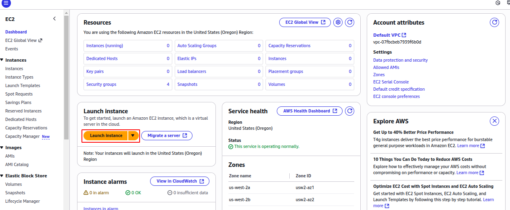
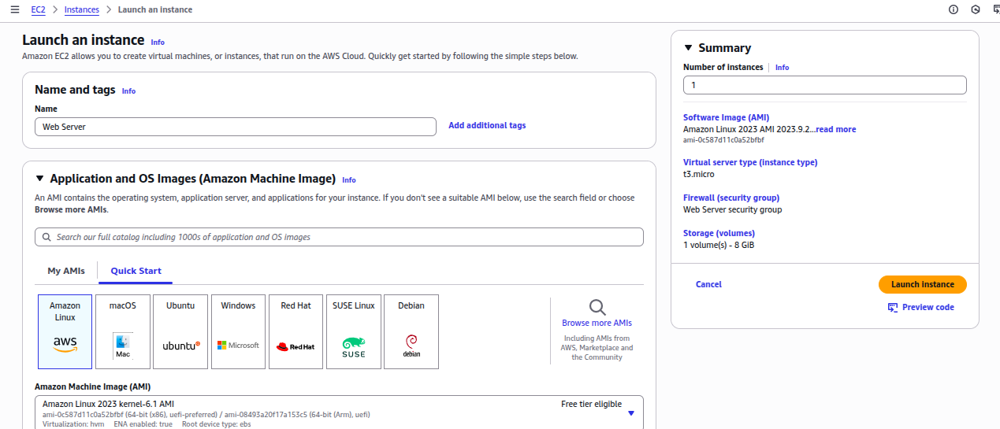
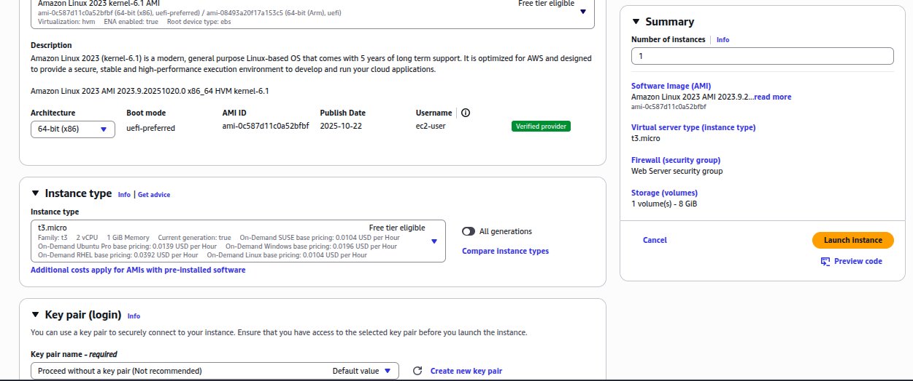
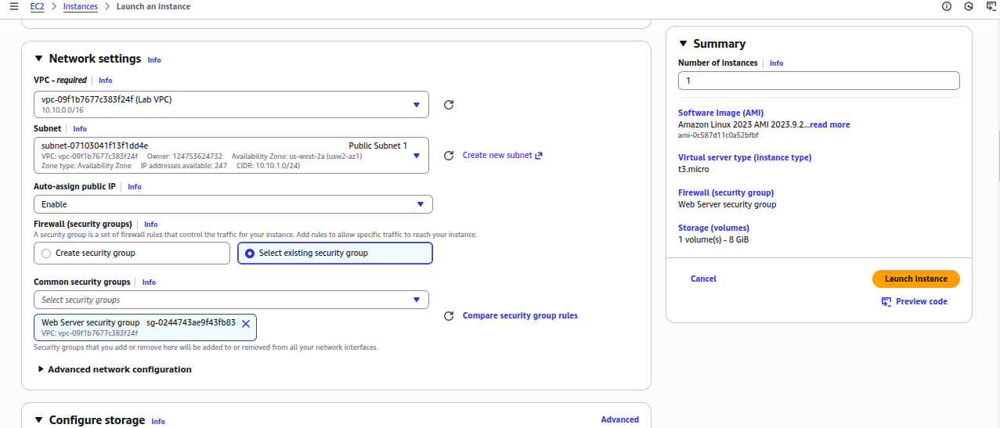
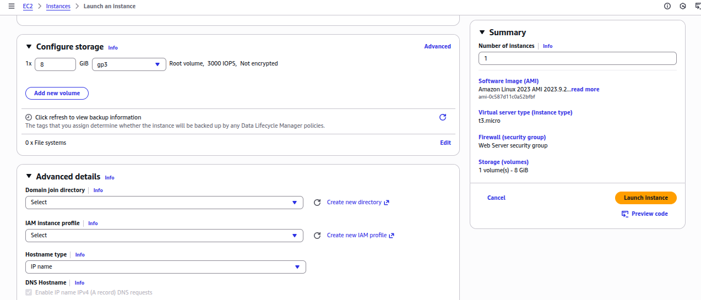
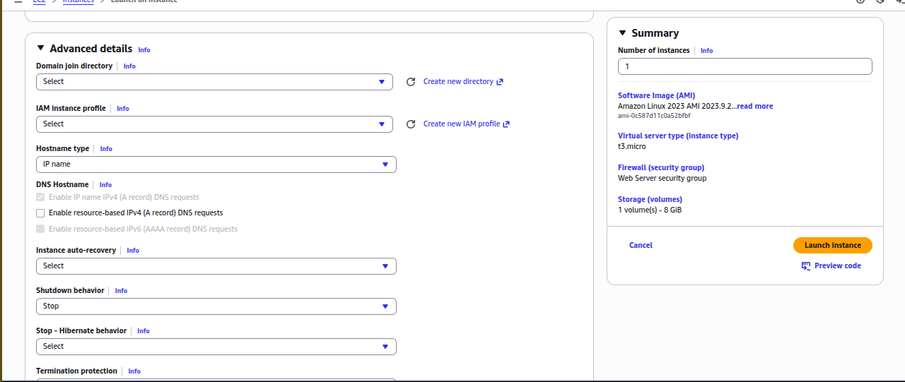
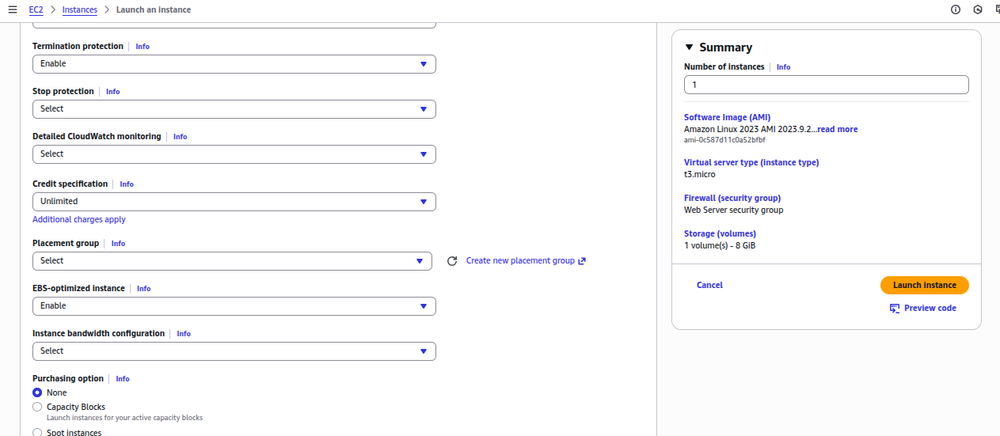
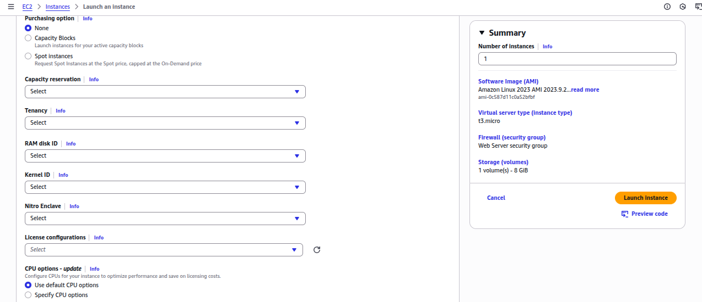
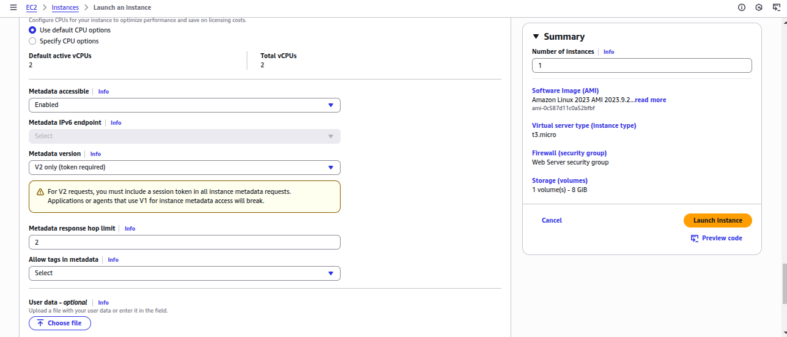
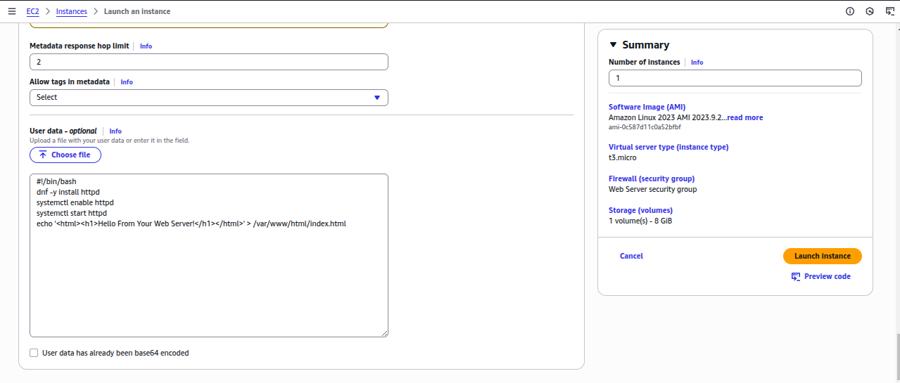


13. Choose Launch instance. Expected output: Success.

14. Choose Instances from the collapsible menu on the left pane. You may need to expand the menu to see this option.

The instance might appear in pending state, which means it is being launched. It then changes to running, which indicates that the instance has started booting. When creating a new instance, there is usually a short time before you can access the instance.

15. Wait for your instance to display the following:
    * Instance state: Running.
    * Status check: 3/3 passed.
Periodically refresh the page if you don’t see a change in the Instance state or Status check values.

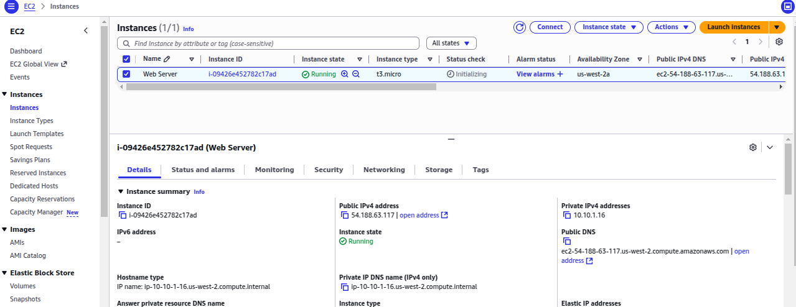
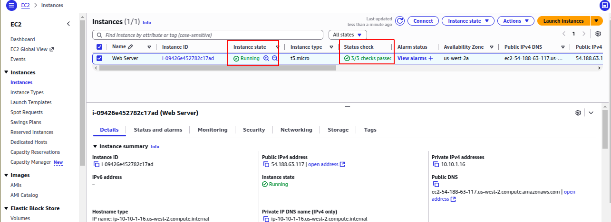

16. Select the checkbox next to your newly-created Web server and choose the Details tab that displays detailed information about your instance.

NOTE: To view more information in the details tab, drag the window divider upwards.

Review the information displayed in the Details tab. It includes information about the instance type, security settings, network settings, and more. The instance receives a Public IPv4 DNS name that you can use to communicate with the instance from the internet.

## Task 2: Monitor your instance
Monitoring is an important part of maintaining the reliability, availability and performance of you Amazon Elastic Compute Cloud (Amazon EC2) instances and your AWS solutions.

1. Choose the Status and alarm tab.

NOTE: With instance status monitoring, you can quickly determine whether Amazon EC2 has detected any problems that might prevent your instances from running applications. Amazon EC2 performs automated checks on every running EC2 instance to identify hardware and software issues.

Notice that the System reachability, Instance reachability and Attached EBS reachability checks have passed.

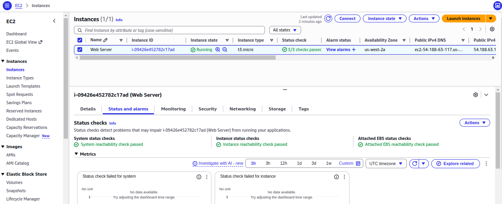

2. Choose the Monitoring tab.

This tab displays CloudWatch metrics for your instance. Currently, there are not many metrics to display because the instance was recently launched.

You can choose a graph to see and expanded view.

NOTE: Amazon EC2 sends metrics to Amazon Cloudwatch for your EC2 instances. Basic (5 min) monitoring is enabled by default. You can enable detailed (1 min) monitoring.

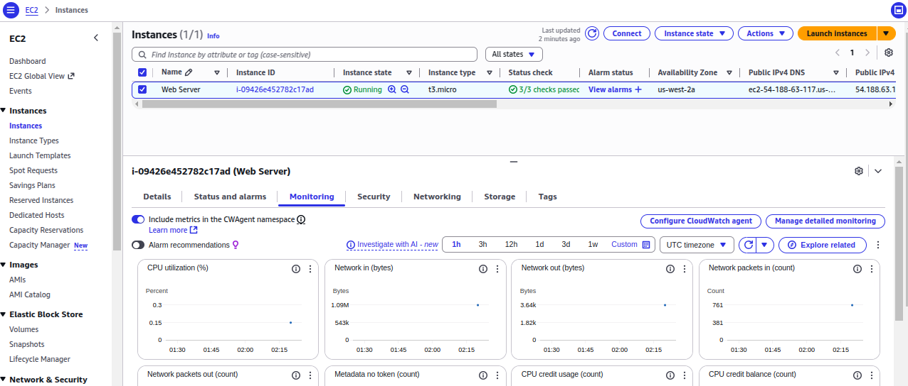

3. Select the Actions menú (in the upper right of the console), choose Monitor and troubleshoot and select Get system log.

NOTE: If you do not see a system log, wait a few minutes and refresh the log screen until it appears. The Sisyem Log displays the console output of the instance, which is a valuable tool for problem diagnosis. It is especially useful for troubleshooting kernel problem and service configurations issues that could cause an instance to terminate or become unreachable before its SSH daemon can be started.

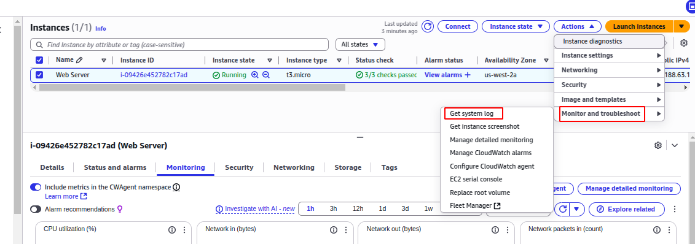

4. Scroll through the output and note that the httpd package was installed from the user data that you added when you created the instance.

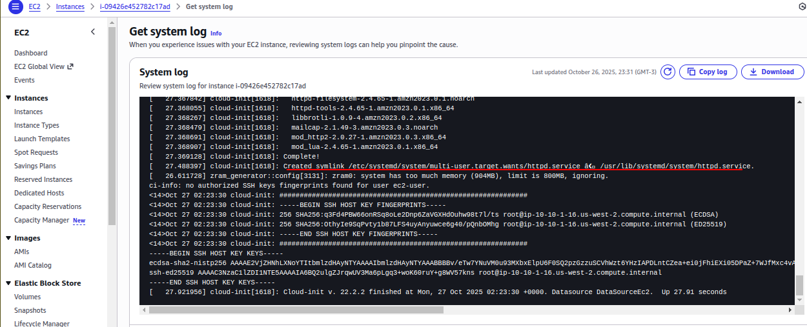

5. Scroll down to the bottom of the browser window and choose Cancel.

6. Select the checkbox next to the Web Server, choose the Actions menu, choose Monitor and troubleshoot and then choose Get instance screenshot. Expected output: Booting .. 

This shows you what your Amazon EC2 instance console would look like if a screen were attached to it.

NOTE: If you are unable to reach your instance via SSH or RDP, you can capture a screenshot of your instance and view it as an image. This provides visibility as to the status of the instance, and allows for quicker troubleshooting. 

7. Scroll down to the bottom of the browser window and choose Cancel.

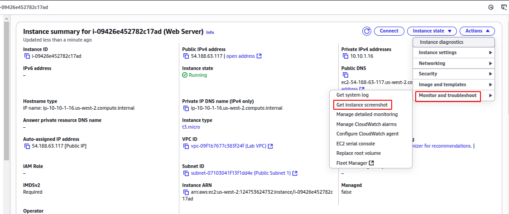
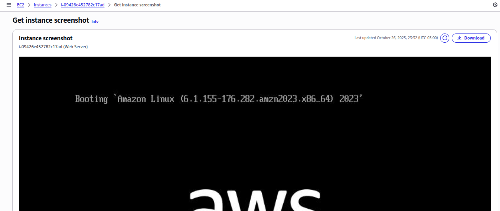

## Task 3: Upate your security group and access the web server
When you launched the EC2 instance, you provided a script that installed a web server and created a simple web page. In this task, you access content from the web server.

1. Select the checkbox next to the Web Server, then choose the Details tab.
2. Copy the value of Public IPv4 address of your instance yo your clipboard.
3. Open a new tab in your web browser, type http:// in the browser and paste the IP address you just copied, then press enter.

You are not currently able to access your web server because the security group is not permitting inbound traffic on port 80, which is used for HTTP web request. This is a demonstration of using a SG as a firewall to restrict the network traffic that is alloed in and out of an instance.

To correct this, you know update the SG yo permit web traffic on port 80.

4. Keep the browser tab open, but return to the EC2 Management Console tab.
5. In the left navigation pane, select SG.
6. Select the checkbox next to the SG ID with the security group name Web server SG.
7. Choose the Inbound rules tab.

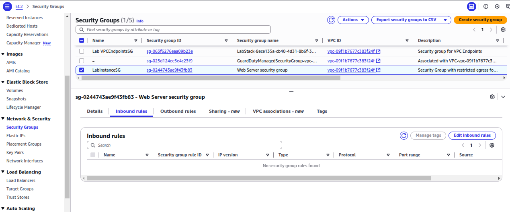
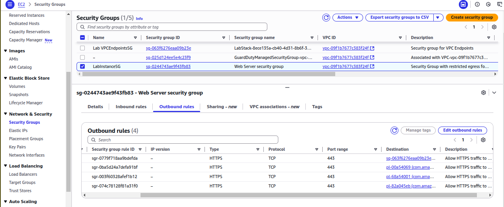

The SG currently has no rules.

8. Choose Edit inbound rules.
9. Choose Add rule then configure:
   * HTTP
   * Anywhere-IPv4
10. Choose Save Rules.

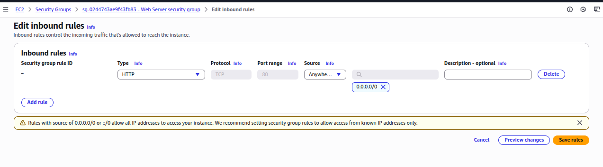

The new Inbound HTTP rule creates an entry for both IPv4 IP address (0.0.0.0/0) as well as IPV6 IP address (::/0).

Using Anywhere, or more specifically, using 0.0.0.0/0 or ::/0 is not a recommended best practice for production workloads.

11. Return to the web server tab that you previously opened and refresh the page. Expected output: you should see the message Hello from your web server.

## Task 4: Resize your instance, Instance type and EBS volume
As your needs change, you might find that your instance is over-utilized (too small) or under-utilized (too large). If so, you can change the instance type. For example, if a t3.micro instance is too small for its workload, you can change it to an t3.small instance. Similarly, you can change the size of a disk.

### 1.Stop your instance
Before you can resize an instance, you must stop it. 

NOTE: When you stop an instance, it is shutdown. There is no charge for a stopped EC2 instance, but the storage charge for attached Amazon EBS volumes remains.

1. On the EC2 Management Console, in the left navigation pane, choose Instances.
2. If it is not already selected, select the checkbox next to the Web server instance.
3. Choose Instance state, then Stop instance.
4. Choose Stop.
Your instance performs a normal shutdown and then stops running. This may take a couple minutes.
5. Wait for the Instance State to display: Stopped.

### 2.Change the instance type
1. If it is not already selected, select the checkbox next to the Web server instance.
2. Selects the Actions menu, select Instance settings and Change instance type, then configure: New instance type: t3.small.
3. Choose Change.

When the instance is started again it is a t3.small, which has twice as much memory as a t3.micro instance.

### 3.Resize the EBS volume
1. In the left navigation pane, choose Volumes from the  Elastic Block Store section.
2. Select the checkbox next to the listed volume.
3. In the Actions  menu, choose Modify volume.

The disk volume currently has a size of 8 GiB. You now increase the size of this disk.

4. Change the Size (GiB) to: 10
5. Choose Modify .
6. Choose Modify to confirm and increase the size of the volume.

### 4.Start the resized instance
You now start the instance again, which now has more memory and more disk space.
1. In left navigation pane, choose Instances.
2. Select the checkbox next to Web Server.
3. Choose Instance state  and then choose Start instance.

NOTE: An EBS volume being modified goes through a sequence of states: Modifying, Optimizing, and finally Complete.

## Task 5: Test Termination Protection
You can delete your instance when you no longer need it. This is referred to as terminating your instance. You cannot connect to or restart an instance after it has been terminated.

In this task, you learn how to use termination protection.

1. In left navigation pane, choose Instances.
2. Select the checkbox next to Web Server.
3. Choose Instance state  and then choose Terminate (delete) instance.
4. Choose Terminate (delete).

At this point you see the following error message on top of the page:

Failed to terminate (delete) an instance: The instance ‘i-xxxxxxxx’ may not be terminated. Modify its ‘disableApiTermination’ instance attribute and try again.

The above error is expected, and this is a safeguard to prevent the accidental termination of an instance. If you really want to terminate the instance, you need to disable the termination protection.

5. Choose Actions , choose Instance settings , and then choose Change termination protection.
6. Unselect the checkbox next to Enable.
7. Choose Save.

You can now terminate the instance.

8. Refresh  the instance console screen.
9. Select the checkbox next to Web Server.
10. Choose Instance state, and then choose Terminate (delete) instance.
11. Choose Terminate (delete) .

Expected output:

The Instance state of the Web Server instance should change to Terminated after about 30 seconds. You may have to refresh the page a few times.

## Conclusion
You successfully did the following:
* Launched a web server with termination protection enabled.
* Monitored Your EC2 instance.
* Modified the security group that your web server is using to allow HTTP access.
* Resized your Amazon EC2 instance to scale.
* Tested termination protection.
* Terminated your EC2 instance.

## Additional resources
Launch Your Instance
https://docs.aws.amazon.com/AWSEC2/latest/UserGuide/LaunchingAndUsingInstances.html 
Amazon EC2 Instance Types
https://aws.amazon.com/es/ec2/instance-types/ 
Amazon Machine Images (AMI)
https://docs.aws.amazon.com/AWSEC2/latest/UserGuide/AMIs.html 
Amazon EC2 - User Data and Shell Scripts
https://docs.aws.amazon.com/AWSEC2/latest/UserGuide/user-data.html#user-data-shell-scripts 
Amazon EC2 Root Device Volume
https://docs.aws.amazon.com/AWSEC2/latest/UserGuide/RootDeviceStorage.html 
Tagging Your Amazon EC2 Resources
https://docs.aws.amazon.com/AWSEC2/latest/UserGuide/Using_Tags.html 
Security Groups
https://docs.aws.amazon.com/AWSEC2/latest/UserGuide/ec2-security-groups.html 
Amazon EC2 Key Pairs
https://docs.aws.amazon.com/AWSEC2/latest/UserGuide/ec2-key-pairs.html 
Status Checks for Your Instances
https://docs.aws.amazon.com/AWSEC2/latest/UserGuide/monitoring-system-instance-status-check.html?icmpid=docs_ec2_console 
Getting Console Output and Rebooting Instances
https://docs.aws.amazon.com/AWSEC2/latest/UserGuide/troubleshoot-unreachable-instance.html 
Amazon EC2 Metrics and Dimensions
https://docs.aws.amazon.com/AmazonCloudWatch/latest/monitoring/aws-services-cloudwatch-metrics.html 
Resizing Your Instance
https://docs.aws.amazon.com/AWSEC2/latest/UserGuide/ec2-instance-resize.html 
Stop and Start Your Instance
https://docs.aws.amazon.com/AWSEC2/latest/UserGuide/Stop_Start.html 
Amazon EC2 Service Limits
https://docs.aws.amazon.com/AWSEC2/latest/UserGuide/ec2-resource-limits.html 
Terminate Your Instance
https://docs.aws.amazon.com/AWSEC2/latest/UserGuide/terminating-instances.html 
Termination Protection for an Instance
https://docs.aws.amazon.com/AWSEC2/latest/UserGuide/terminating-instances.html#Using_ChangingDisableAPITermination 

# Assessment
Question 1
Answer status:
Correct
Question
What type of monitoring is enabled by default for EC2 instances?
Question Type
Multiple Choice
Answer Options
Option
Your Selection
Correct Answer
Rationale
Advanced monitoring
Not selected
Incorrect
This is not a standard term used for EC2 monitoring in AWS.
Detailed monitoring
Not selected
Incorrect
Detailed (one-minute) monitoring is available but needs to be explicitly enabled by the user.
Basic monitoring
Selected
Correct
Basic (five-minute) monitoring is enabled by default for EC2 instances, as mentioned in the course content.
Custom monitoring
Not selected
Incorrect
While custom metrics can be created, this is not a default monitoring type for EC2 instances.
Question 2
Answer status:
Correct
Question
Which of the following is an example of resizing an EC2 instance type?
Question Type
Multiple Choice
Answer Options
Option
Your Selection
Correct Answer
Rationale
Changing the instance's AMI
Not selected
Incorrect
Changing the AMI is not resizing. It's replacing the instance's operating system and software stack.
Updating the instance's tags
Not selected
Incorrect
Updating tags is a metadata change and does not affect the instance's size or performance.
Changing from t3.micro to t3.small
Selected
Correct
This is correct. Changing the instance type from t3.micro to t3.small is an example of resizing an EC2 instance to increase its capacity.
Modifying the instance's security group
Not selected
Incorrect
Modifying security groups affects network access rules, not the instance's size or capacity.
Question 3
Answer status:
Correct
Question
What is the primary purpose of enabling termination protection for an Amazon EC2 instance?
Question Type
Multiple Choice
Answer Options
Option
Your Selection
Correct Answer
Rationale
To prevent accidental termination of the instance
Selected
Correct
This is correct. Termination protection is designed to prevent users from accidentally terminating an EC2 instance, which helps maintain the availability of important resources.
To automatically backup the instance data
Not selected
Incorrect
This is incorrect. Termination protection does not provide backup functionality. AWS offers separate services like Amazon EBS snapshots for data backup.
To improve the instance's performance
Not selected
Incorrect
This is incorrect. Termination protection is a safety feature and does not affect the performance of an EC2 instance.
To reduce the cost of running the instance
Not selected
Incorrect
This is incorrect. Termination protection does not impact the cost of running an EC2 instance. It is a safety feature, not a cost-saving measure.
Question 4
Answer status:
Correct
Question
What is the primary difference between stopping and terminating an EC2 instance?
Question Type
Multiple Choice
Answer Options
Option
Your Selection
Correct Answer
Rationale
Stopping is temporary, terminating is permanent
Selected
Correct
This is correct. Stopping an instance is a temporary action that allows you to start it again later, while terminating permanently deletes the instance.
Stopping requires permission, terminating doesn't
Not selected
Incorrect
This is incorrect. Both stopping and terminating instances typically require appropriate permissions.
Stopping retains data, terminating erases all data
Not selected
Incorrect
This is partially correct but not the primary difference. Both stopping and terminating can retain data depending on the storage type, but termination is a permanent action.
Stopping charges for storage, terminating doesn't
Not selected
Incorrect
This is incorrect. While it's true that stopped instances may incur storage charges, this is not the primary difference between stopping and terminating.
Question 5
Answer status:
Correct
Question
What precaution can you take to prevent accidental termination of an EC2 instance?
Question Type
Multiple Choice
Answer Options
Option
Your Selection
Correct Answer
Rationale
Enable automatic backups
Not selected
Incorrect
This is incorrect. While backups are important, they do not prevent accidental termination of an instance.
Enable termination protection
Selected
Correct
This is correct. Enabling termination protection (setting the 'disableApiTermination' attribute) prevents accidental termination of an EC2 instance.
Assign an Elastic IP address
Not selected
Incorrect
This is incorrect. An Elastic IP address is used for static public IP addressing and does not protect against termination.
Use a larger instance type
Not selected
Incorrect
This is incorrect. The instance type does not affect its susceptibility to accidental termination.
