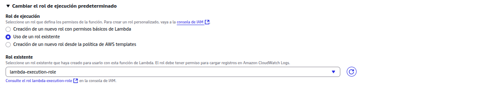

# Introduction to Lambda

## Lab overview
This Lab provides a basic explanation of AWS Lambda. It will demonstrate the steps required to get started to create a Lambda function in an event-driven environment.

AWS Lambda is a compute service that runs your code in response to events and automaticlly manages de compute resources for you, making it easy to build applications that respond quickly yo new information. AWS Lambda starts running your code within milliseconds of an event such as an image upload, in app activity, website click or output from a connected device. You can also use AWS Lambda to create new backend services where compute resources are automatically triggeres based on custom request.

## Presentation
https://prezi.com/p/qatfntzevzkx/aws-lambda-overview/ 

## Objectives
By the end of this lab you will be able to:
* Create an AWS Lambda function.
* Configure an Amazon S3 bucket as Lambda Event Source.
* Trigger a Lambda function by uploading an object to Amazon S3.
* Monitor AWS Lambda S3 functions through Amazon Cloudwatch Log.

## Lab environment
This Lab demonstrates AWS Lambda by creating a serverless image thumbnail application.
The following diagram ilustrates the application flow.

 

 1. A user uploads an object to the source bucket in AMzon S3 (object created event).
 2. Amazon S3 detects the object created event.
 3. Amazon S3 publishes the object created event to AWS Lambda by invoking the Lambda function and passing event data as a function parameter.
 4. AWS Lambda executes the Lambda function.
 5. From the event data it receives, the Lambda function knows the source bucket name and object key name. The Lambda function reads the object and creates a thumbnail using graphic libraries, then saves the thumbnail to the target bucket.

Upon completing this tutorial, you will have the following resources in your account:

 

In the preceding diagram, the user is shown having connections to both source and target S3 bucket, as well as access to use an AWS Lambda function through the given access policy.
The steps in this lab show you how to create the Amazon S3 buckets and the Lambda function. You then test the service by uploading images for resizing.

## Task 1: Create the Amazon S3 Buckets
In this task, you create two Amazon S3 buckets, one for input and one for output.
1. At the top of the AWS Management Console, in the unified search bar, search and choose S3.
2. Choose Create bucket.
3. For Bucket name:, enter images-randomnumber, but replace randomnumber with an actual random number to ensure a unique bucket name such as images-123456789.

**NOTE:** Amazon S3 buckets require unique names regardless of region.

4. Copy the name of your bucket to a text editor for later use.
images-968569854098

5. Keep everything else as default and choose Create bucket (at the bottom of the screen).

**NOTE:**  If you receive an error stating The requested bucket name is not available, then choose the first Edit link, change the bucket name to a different random number and try again until it works.

Configuration:


6. Create another bucket for the output. Choose Create bucket and create another bucket with the same name as the first, but with -resized appended to the name of this new bucket, such as images-123456789-resized:

images-968569854098-resized

You should now have buckets named something similar to images-123456789 and images-123456789-resized.


7. Download the file HappyFace.jpg to your local machine (Save link as…).

8. Open the image on your computer. It is a large picture, with dimensions of 1280 x 853.

9. In the AWS console, choose the link to the first bucket you created (the one without the -resized appendix).


10. Choose Upload.

11. Choose Add Files.


12. Use your file explorer and select the HappyFace.jpg file you just downloaded to your local machine.

13. Choose Upload.

**NOTE:** Later in this lab you invoke a Lambda function manually by passing sample event data to the function. The sample data refers to this HappyFace.jpg image.

## Task 2: Create an AWS Lambda function
In this task, you create an AWS Lambda function that reads an image from Amazon S3, resizes the image, and then stores the new image in Amazon S3.

1. At the top of the AWS Management Console, in the unified search bar, search for and choose Lambda.
2. Choose Create function.

**NOTE:** Blueprints are code templates for writing Lambda functions. Blueprints are provided for standard Lambda triggers such as creating Alexa skills and processing Amazon Kinesis Firehose streams. This lab provides you with a pre-written Lambda function, so you Author from scratch.

3. On the Create function page, select Author from scratch.
4. On the Basic Information:
   * For function name: Create-Thumbnail
   * For Runtime: Python 3.12
   * Expand Change default execution role
   * For Execution role: Use an existing role
   * For Existing role: lambda-execution-role

**NOTE:** This role grants permission to the Lambda function to access Amazon S3 to read and write the images.





5. Expand the Additional configuration section.

**NOTE:** To make this lab more secure, you must attach your function to a VPC, subnet, and security group that have been created for you. Conventionally, Lambda functions do not need to be attached to a VPC, but this lab will not let you create the function without the addition of defined networking.

6. In the Additional configuration section:
    * Choose VPC.
    * For VPC, select the VPC with CIDR range 10.0.0.0/16.
    * For Subnets, select the subnet with CIDR range 10.0.1.0/24.
    * For Security groups, select the security group with LambdaSecurityGroup in its name.


7. Choose Create function.

8. On the Getting started pop-up, choose Dismiss.

A page is displayed with your function configuration.

**NOTE:** Creating a VPC-attached Lambda function takes a few minutes. Wait until a banner at the top of the page displays  Successfully created the function Create-Thumbnail. to proceed.

AWS Lambda functions can be triggered automatically by activities such as data being received by Amazon Kinesis or data being updated in an Amazon DynamoDB database. For this lab, you trigger the Lambda function whenever a new object is created in your Amazon S3 bucket.

9. Choose Add Trigger.
10. For Trigger Configuration, use the Drop down selector to select S3.
11. Configure the rest of the trigger as follow:
    * For Bucket:, select your images- bucket (e.g. images-123456789).
    * For Event type:, select All object create events.
    * For Recursive invocation, select the checkbox for I acknowledge that ….


12. Choose Add.
13. Choose the Code Tab.
14. Choose Upload from and select Amazon S3 location.
15. For Amazon S3 link URL, copy and paste the value for AmazonS3LinkURL from the panel to the left of these instructions.
16. Choose Save.

**NOTE:** The CreateThumbnail.zip file contains the following Lambda function: Do not copy this code – it is just showing you what is in the Zip file.

```
import boto3
import os
import sys
import uuid
from PIL import Image
import PIL.Image

s3_client = boto3.client('s3')

def resize_image(image_path, resized_path):
    with Image.open(image_path) as image:
        image.thumbnail((128, 128))
        image.save(resized_path)

def handler(event, context):
    for record in event['Records']:
        bucket = record['s3']['bucket']['name']
        key = record['s3']['object']['key']
        download_path = '/tmp/{}{}'.format(uuid.uuid4(), key)
        upload_path = '/tmp/resized-{}'.format(key)

        s3_client.download_file(bucket, key, download_path)
        resize_image(download_path, upload_path)
        s3_client.upload_file(upload_path, '{}-resized'.format(bucket), key)
```


17. (Optional step): Examine the above code. It is performing the following steps:

* Receives an Event, which contains the name of the incoming object (Bucket, Key)
* Downloads the image to local storage
* Resizes the image using the Pillow library
* Uploads the resized image to the -resized bucket

18. In the Runtime settings section, choose Edit.
19. For Handler, replace the existing text with CreateThumbnail.handler.
20. Choose Save.


**NOTE:** Make sure you set the Handler field to the above value, otherwise the Lambda function will not be found.

21. Choose the Configuration tab.
22. Choose General configuration on the left, then choose Edit.
23. For Description - optional, enter Create a thumbnail-sized image.


**NOTE:** Leave the other settings as default, but here is a brief explanation of these settings:

* Memory defines the resources that will be allocated to your function. Increasing memory also increases CPU allocated to the function.
* Timeout sets the maximum duration for function execution.
24. Choose Save.

## Task 3: Test your function
In this task, you test your Lambda function. This is done by simulating an event with the same information normally sent from Amazon S3 when a new object is uploaded.

1. Choose the Test tab.
2. In the Test event section, select Create new event and then configure:
* For Event name:, enter Upload.
* For Template - optional:, select S3 Put

A sample template is displayed that shows the event data sent to a Lambda function when it is triggered by an upload into Amazon S3. You need to edit the bucket name so that it uses the bucket you created earlier.

3. Replace example-bucket text in the Event JSON section with the name of your images bucket (e.g. images-123456789) that you copied to your text editor.

**NOTE:** The example-bucket text appears twice, as the bucket name and the bucket arn (replace only the example-bucket text, leave the rest of the arn intact). Be sure to replace it in both locations.

4. Replace test%2Fkey text in the Event JSON section with the name of the picture that you uploaded. This should be HappyFace.jpg.

**NOTE:** this text is the object key in the JSON, near the bottom.

5. Choose Test.


After a moment, you should see the message: Executing function: succeeded

6. Choose  Details to expand it.


You are shown information including:
* Execution time
* Resources configured
* Maximum memory used
* Log output

You can now view the resized image that was stored in Amazon S3.

7. At the top of the AWS Management Console, in the unified search bar, search for and choose S3.

8. Choose the name of your -resized bucket (which is the second bucket you created).

9. Select the checkbox for HappyFace.jpg.

10. Choose Open .

**NOTE:** Depending on your browser and settings, this may either open the picture or download it (usually with a (1) added to the filename). If the browser only downloaded the file, open it on your machine using whatever app is appropriate.

The image should now be a smaller thumbnail of the original image.

You are welcome to upload your own images to the images- bucket and then check for thumbnails in the -resized bucket.

## Task 4: Monitoring and Logging
In this task, you monitor AWS Lambda functions to identify problems and view log files to assist in debugging.

1. At the top of the AWS Management Console, in the unified search bar, search for and choose Lambda.

2. Choose your Create-Thumbnail function (the link, not the checkbox).

3. Choose the Monitor tab.

The console displays graphs including:

* Invocations: The number of times that the function was invoked.
* Duration: The average, minimum, and maximum execution times.
* Error count and success rate (%): The number of errors and the percentage of executions that completed without error.
* Throttles: When too many functions are invoked simultaneously, they will be throttled. The default is 1000 concurrent executions.
* Async delivery failures: The number of errors that occurred when Lambda attempted to write to a destination or dead-letter queue.
* Iterator Age: Measures the age of the last record processed from streaming triggers (Amazon Kinesis and Amazon DynamoDB Streams).
* Total concurrent executions: The number of function instances that are processing events.


Log messages from Lambda functions are retained in Amazon CloudWatch Logs.

4. Choose View CloudWatch logs.

5. Choose the Log Stream that appears (the link, not the checkbox).

6. Expand each message to view the log message details.

The Event Data includes the Request Id, the duration (in milliseconds), the billed duration (rounded up to the nearest 100 ms, the Memory Size of the function and the Maximum Memory that the function used. In addition, any logging messages or print statements from the functions are displayed in the logs. This assists in debugging Lambda functions.


# Conclusion
You have successfully done the following:
* Created an AWS Lambda function
* Configured an Amazon S3 bucket as a Lambda Event Source
* Triggered a Lambda function by uploading an object to Amazon S3
* Monitored AWS Lambda S3 functions through Amazon CloudWatch Log

# Assesment
Question 1
Which AWS service is primarily used to monitor AWS Lambda functions triggered by Amazon S3 events?
Amazon CloudWatch
Selected
Correct
Amazon CloudWatch is the primary service used for monitoring AWS Lambda functions, including those triggered by S3 events. It collects and tracks metrics, logs, and alarms for Lambda functions.
Amazon EventBridge
Not selected
Incorrect
Amazon EventBridge is used for event routing and can trigger Lambda functions, but it is not the primary monitoring service for Lambda.
AWS CloudTrail
Not selected
Incorrect
AWS CloudTrail is used for auditing API calls across AWS services, but it is not the primary tool for monitoring Lambda function performance and logs.
AWS X-Ray
Not selected
Incorrect
While AWS X-Ray can be used for tracing Lambda functions, it is not the primary service for monitoring and logging Lambda functions triggered by S3 events.


Question 2
What does the 'Memory' setting define when configuring an AWS Lambda function?
The maximum number of concurrent executions
Not selected
Incorrect
Concurrent executions are controlled by Lambda's concurrency settings, not the memory configuration.
The size of the function's deployment package
Not selected
Incorrect
The deployment package size is determined by the code and dependencies you include, not by the memory setting.
The amount of disk space allocated to the function
Not selected
Incorrect
Lambda doesn't allow you to directly configure disk space. It provides temporary storage in /tmp, which scales with memory.
The amount of RAM allocated to the function
Selected
Correct
The 'Memory' setting in Lambda configuration specifies the amount of RAM allocated to your function. This also indirectly affects the CPU power allocated to the function.

Question 3
What is the MOST efficient way to trigger a Lambda function for multiple S3 buckets?
Use S3 bucket policies to invoke Lambda
Not selected
Incorrect
S3 bucket policies are used for access control, not for invoking Lambda functions directly.
Use S3 replication to a single bucket with Lambda trigger
Not selected
Incorrect
This approach is overly complex and would result in unnecessary data duplication.
Configure event notifications for each bucket to the same Lambda function
Selected
Correct
This is the most efficient approach as it allows a single Lambda function to handle events from multiple buckets, reducing management overhead and potential code duplication.
Create separate Lambda functions for each bucket
Not selected
Incorrect
While this would work, it's less efficient as it leads to code duplication and increased management overhead.

Question 4
Which of the following is a key component when creating an AWS Lambda function?
EC2 instance type
Not selected
Incorrect
EC2 instance types are not directly related to creating Lambda functions. Lambda is a serverless compute service that doesn't require managing EC2 instances.
EBS volume size
Not selected
Incorrect
EBS volumes are used with EC2 instances, not with Lambda functions. Lambda doesn't require you to manage storage volumes.
Function blueprint
Selected
Correct
Function blueprints are pre-configured function templates that help you get started quickly when creating a Lambda function. They provide sample code for common use cases.
VPC configuration
Not selected
Incorrect
While Lambda functions can be configured to access resources in a VPC, it's not a key component required for creating every Lambda function.

Question 5
What is the maximum execution time limit for an AWS Lambda function?
5 minutes
Not selected
Incorrect
While 5 minutes is within the allowed range, it's not the maximum limit for Lambda function execution time.
10 minutes
Not selected
Incorrect
10 minutes is less than the maximum allowed execution time for Lambda functions.
15 minutes
Selected
Correct
The maximum execution time limit for an AWS Lambda function is 15 minutes. Functions that run longer than this will be terminated.
30 minutes
Not selected
Incorrect
30 minutes exceeds the maximum allowed execution time for Lambda functions.

# Additional resources
https://docs.aws.amazon.com/lambda/ 