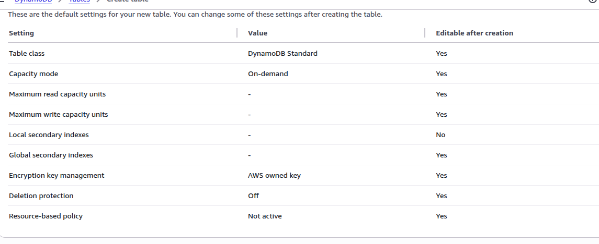
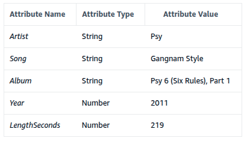

# Introduction to Amazon DynamoDB

## Lab overview
Amazon DynamoDB is a fast and flexible NoSQL database service for all applications that need consistent, single-digit millisecond latency at any scale. It is a fully managed database and supports both document and key-value data models. Its flexible data model and reliable performance make it a great fit for mobile, web, gaming, ad-tech, IoT, and many other applications.

In this lab, you create a table in Amazon DynamoDB to store information about a music library. You then query the music library and, finally delete the DynamoDB table.

## Objectives
After completing this lab, you will be able to:
* Create an Amazon DynamoDB table.
* Enter data into an Amazon DynamoDB table.
* Query an Amazon DynamoDB table.
* Delete an Amazon DynamoDB table.

## Task 1: Create a new table
In this task, you create a new table in DynamoDB named Music. Each table requires a Primary Key that is used to partition data across DynamoDB servers. A table can also have a Sort Key. The combination of Primary Key and Sort Key uniquely identifies each item in a DynamoDB table.

1. At the top of the AWS Management Console, in the search bar, search for and choose DynamoDB.
2. On the Amazon DynamoDB getting started page, choose Create table.
On the Create table page, configure the following options:
In the Table details section:
* For Table name, enter Music.
* For Partition key, enter Artist and choose String  from the dropdown menu.
* For Sort key - optional, enter Song and choose String  from the dropdown menu.
* Your table uses default settings for indexes and provisioned capacity.
3. Choose Create table. Expected output: Initial message.
A  Creating the Music table. It will be available for use shortly. message is displayed on top of the screen.
4. Wait for your table to be created and its status to be  Active.

 
 
 

## Task 2: Add data
In this task, you add data to the Music table. A table is a collection of data on a particular topic.

Each table contains multiple items. An item is a group of attributes that is uniquely identifiable among all of the other items. Items in DynamoDB are similar in many ways to rows in other database systems. In DynamoDB, there is no limit to the number of items you can store in a table.

Each item is composed of one or more attributes. An attribute is a fundamental data element, something that does not need to be broken down any further. For example, an item in a Music table contains attributes such as Song and Artist. Attributes in DynamoDB are similar columns in other database systems, but each item (row) can have different attributes (columns).

When you write an item to a DynamoDB table, only the Primary Key and Sort Key (if used) are required. Other than these fields, the table does not require a schema. This means that you can add attributes to one item that may be different to the attributes on other items.

1. In the left navigation pane, choose Explore items.
 
2. Select  Music table.

3. Choose Create item.

On the Create item page, configure the following options:

4. For Artist Value, enter Pink Floyd.

5. For Song Value, enter Money.

These are the only required attributes, but you also add additional attributes.

6. To create an additional attribute, choose Add new attribute .

7. In the drop-down list, select String.

A new string attribute row gets added.

8. For the new attribute, enter:
* For Attribute name, enter Album.
* For Value, enter The Dark Side of the Moon.

9. Create another new attribute by choosing Add new attribute.

10. In the drop-down list select Number.

A new number attribute gets added.

11. For the new attribute, enter:
* For Attribute name, enter Year.
* For Value, enter 1973.

12. Choose Create item to store the new item with its four attributes.
Expected output: A  The item has been saved successfully. message is displayed on top of the screen.

The item now appears in the console.

 

13. Create a second item, using these attributes:
 

Note that this item has an additional attribute called genre. This is an example of each item being capable of having different attributes without having to pre-define a table schema.

14. Create a third item, using these attributes:
 
Once again, this item has a new LengthSeconds attribute identifying the length of the song. This demonstrates the flexibility of a NoSQL database.

There are also faster ways to load data into DynamoDB, such as using AWS Data Pipeline, programmatically loading data or using one of the free tools available on the Internet.

## Task 3: Modify an Existing Item 
In this task, you modify an existing item.

1. From the list of items, select  Psy.

2. Choose Actions.

3. Choose Edit item.

4. Change the Year from 2011 to 2012.

5. Choose Save changes.
Expected output:A  The item has been saved successfully. message is displayed on top of the screen.
The item is now updated.

 

 ## Task 4: Query the table
 In this task, you query the Music table. There are two ways to query a DynamoDB table: Query and Scan.

A **query** operation finds items based on Primary Key and optionally Sort Key. It is fully indexed, so it runs very fast.

1. In the left navigation pane, choose Explore items.

2. Select  Music table.

3. Expand  Scan or query items to query or scan items.

4. Select  Query.

Fields for the Partition Key (which is the same as Primary Key) and Sort Key are now displayed.

5. Configure the following for Partition and Sort keys
* For Artist (Partition key), enter Psy.
* For Song (Sort key), select Equal to  from the dropdown menu and enter Gangnam Style.
6. Choose Run.
Expected output:
The song quickly appears in the list. A query is the most efficient way to retrieve data from a DynamoDB table.

 

Alternatively, you can **scan** for an item. This involves looking through every item in a table, so it is less efficient and can take significant time for larger tables.

7. Select  Scan.

8. Expand the  Filters section, and configure the following:

* For Attribute name, enter Year.
* For Type, select Number  from the dropdown menu.
* For Condition, select Equal to  from the dropdown menu.
* For Value, enter 1971.
9. Choose Run.
 Expected output: Only the song released in 1971 is displayed.

  

## Task 5: Delete the table
In this task, you delete the Music table, which also deletes all the data in the table.

1. In the left navigation pane, choose Tables.

2.Select  Music table.

3. Choose Delete.

4. On the Delete table pop-up window, locate the Enter “confirm” to agree. textbox and enter confirm.

5. Choose Delete.

Expected output: Initial message. A  The request to delete the “Music” table has been submitted successfully. message is displayed on top of the screen.

6. Use the refresh  option to confirm the table deletion.
  

# Conclusion
Congratulations! You have now successfully learned how to:

* Create an Amazon DynamoDB table.
* Enter data into an Amazon DynamoDB table.
* Query an Amazon DynamoDB table.
* Delete an Amazon DynamoDB table.

# Additional resources
https://docs.aws.amazon.com/dynamodb/ 

# Assesment 
Question 1
Answer status:
Correct
Question
Which of the following statements is TRUE about inserting data into a DynamoDB table?
Question Type
Multiple Choice
Answer Options
Option
Your Selection
Correct Answer
Rationale
All items in a table must have the same number of attributes
Not selected
Incorrect
This is false. Items in a DynamoDB table can have varying numbers of attributes, providing flexibility in data modeling.
You can only insert string data types into DynamoDB tables
Not selected
Incorrect
This is incorrect. DynamoDB supports multiple data types including numbers, booleans, lists, and maps, not just strings.
You must insert all attributes defined in the table's schema for each item
Not selected
Incorrect
This is incorrect. DynamoDB doesn't require a predefined schema, and you don't need to include all attributes for every item.
You can insert items with different attributes into the same table
Selected
Correct
This is correct. DynamoDB's flexible schema allows items in the same table to have different attributes, except for the primary key which must be present in all items.

Question 2
Answer status:
Correct
Question
What is the relationship between a Primary Key and a Sort Key in an Amazon DynamoDB table?
Question Type
Multiple Choice
Answer Options
Option
Your Selection
Correct Answer
Rationale
They uniquely identify each item when used in combination
Selected
Correct
When both are used, the combination of Primary Key and Sort Key uniquely identifies each item in a DynamoDB table.
They are always required together
Not selected
Incorrect
While they can be used together, a Sort Key is optional and not always required with a Primary Key.
They must be of the same data type
Not selected
Incorrect
Primary and Sort Keys can be of different data types.
The Sort Key replaces the Primary Key
Not selected
Incorrect
The Sort Key complements the Primary Key but do

Question 3
Answer status:
Correct
Question
Which statement BEST describes the flexibility of adding attributes to items in a DynamoDB table?
Question Type
Multiple Choice
Answer Options
Option
Your Selection
Correct Answer
Rationale
Attributes can be added only if they are defined in the table schema
Not selected
Incorrect
Incorrect. DynamoDB is schema-less and does not require predefined attributes except for key attributes.
New attributes can be added to some items without affecting others
Selected
Correct
Correct. DynamoDB's schema-less nature allows you to add new attributes to some items without affecting others or modifying the table structure.
All items must have the same attributes as defined during table creation
Not selected
Incorrect
Incorrect. DynamoDB does not require all items to have the same attributes, except for the key attributes.
Attributes can be added only after modifying the table structure
Not selected
Incorrect
Incorrect. DynamoDB's flexible structure allows adding attributes without modifying the table structure.

Question 4
Answer status:
Correct
Question
What should you consider before deleting a DynamoDB table?
Question Type
Multiple Choice
Answer Options
Option
Your Selection
Correct Answer
Rationale
The table's partition key
Not selected
Incorrect
The partition key structure is not relevant when deciding to delete a table.
The table's read capacity units
Not selected
Incorrect
While important for table performance, this is not critical when considering table deletion.
The table's write capacity units
Not selected
Incorrect
Write capacity is not a primary concern when deleting a table.
The need for a backup of the data
Selected
Correct
This is the most important consideration, as deleting a table permanently 

Question 5
Answer status:
Incorrect
Question
Which operation is used to retrieve data from a DynamoDB table based on specific criteria?
Question Type
Multiple Choice
Answer Options
Option
Your Selection
Correct Answer
Rationale
Scan
Selected
Incorrect
While Scan can retrieve data, it examines every item in the table and is less efficient than Query for specific lookups.
Fetch
Not selected
Incorrect
Fetch is not a DynamoDB-specific operation for data retrieval.
Get
Not selected
Incorrect
Get is not a standard DynamoDB operation for retrieving data based on criteria.
Query
Not selected
Correct
The Query operation in DynamoDB is used to efficiently retrieve data from a table based on specific criteria