# Introduction to Amazon API Gateway

## Lab overview
In this lab, you create a simple FAQ micro-service. The micro-service returns a JSON object containing a random question and answer pair using an Amazon API Gateway endpoint that invokes an AWS Lambda function.

The user sends a HTTP request or GET request to the services in the AWS cloud. Amazon API Gateway is the first service to receive the request. Amazon API Gateway transforms the HTTP request into JSON which is forwarded through a VPC endpoint to the AWS Lambda function. The Lambda function processes the request and returns a JSON formatted response through the VPC endpoint back to Amazon API Gateway. Amazon API Gateway transforms the JSON response into a final HTTP response to send back to the user.

## Objectives
By the end of this lab, you should be able to do the following:
* Create an AWS Lambda function.
* Create an Amazon API Gateway endpoints.
* Debug API Gateway and Lambda with Amazon CloudWatch.

## Lab environment
### Amazon API Gateway and AWS Lambda 
A microservice using Amazon API Gateway consists of a defined resource and associated methods (GET, POST, PUT, etc.) in API Gateway as well as the backend target. In this lab, the backend target is an AWS Lambda function. However, the backend target could be any other HTTP endpoint (a third-party API or listening web server), an AWS service proxy or a mock integration to be used as a placeholder.

### Amazon API Gateway
Amazon API Gateway is a managed service provided by AWS that makes creating, deploying and maintaining APIs easy.
Amazon API Gateway includes features to:
* Transform the body and headers of incoming API requests to match backend systems.
* Transform the body and headers of the outgoing API responses to match API requirements.
* Control API access via AWS Identity and Access Management.
* Create and apply API keys for third-party development.
* Enable Amazon CloudWatch integration for API monitoring.
* Cache API responses via Amazon CloudFront for faster response times.
* Deploy an API to multiple stages, allowing easy differentiation between development, test, production as well as versioning.
* Connect custom domains to an API.
* Define models to help standardize your API request and response transformations.

### AWS Lambda
AWS Lambda is a serverless, event-driven compute service that lets you run code for virtually any type of application or backend service without provisioning or managing servers. You can trigger Lambda from over 200 AWS services and software as a service (SaaS) applications, and only pay for what you use. These events may include changes in state or an update, such as a user placing an item in a shopping cart on an e-commerce website. You can use AWS Lambda to extend other AWS services with custom logic, or create your own backend services that operate at AWS scale, performance, and security. AWS Lambda automatically runs code in response to multiple events, such as HTTP requests via Amazon API Gateway, modifications to objects in Amazon Simple Storage Service (Amazon S3) buckets, table updates in Amazon DynamoDB, and state transitions in AWS Step Functions.

AWS Lambda includes features to:

* Extend other AWS services with custom logic.
* Build custom backend services.
* Bring your own code.
* Completely automate administration.
* Built-in fault tolerance.
* Package and deploy functions as container images.
* Automatic scaling.
* Connect to relational databases.
* Fine-grain control over performance.
* Connect to shared file systems.
* Orchestrate multiple functions.
* Integrate security model with AWS Identity and Access Management (IAM).
* Utilize trust and integrity controls for code.
* Integrate Lambda with your favorite operational tools.
* Monitoring and observability.

## Task 1: Create a Lambda Function
In this task, you use the AWS Lambda console to create a function with lab provided code, and finish configuring it to work with Amazon API Gateway.

### Task 1.1: Create the initial Lambda function
1. At the top of the AWS Management Console, in the search bar, search for and choose Lambda.

2. Choose Create a function.

**Learn more:** Blueprints are code templates for writing Lambda functions. Blueprints are provided for standard Lambda triggers such as creating Alexa skills and processing Amazon Kinesis Firehose streams. This lab provides you with a pre-written Lambda function to use.

3. Select Author from scratch.

4. In the Basic information section, configure the following:

* For Function name, enter FAQ.
* For Runtime, select Node.js 22.x.
* Expand  Change default execution role.
* For Execution role, select Use an existing role.
* For Existing role, select lambda-basic-execution.
* Expand the Additional configurations section.

**Note:** To make this lab more secure, you must attach your function to a VPC, subnet, and security group that have been created for you. Conventionally, Lambda functions do not need to be attached to a VPC, but this lab will not let you create the function without the addition of defined networking.

5. In the Additional configurations section:
* Choose VPC.
* For VPC, select the VPC with CIDR range 10.0.0.0/16.
* For Subnets, select both the subnets with CIDR range 10.0.1.0/24 and 10.0.2.0/24.
* For Security groups, select the security group with LambdaSecurityGroup in its name.

6. Choose Create function.

7. On the Getting started pop-up, choose Dismiss .

 Note: Creating a VPC-attached Lambda function takes a few minutes. Wait until a banner at the top of the page displays  Successfully created the function Create-Thumbnail. to proceed.

The Lambda console displays a page to configure your function.

 Note: In case you get an error while creating the Lambda function, check the function name, the name should be FAQ.


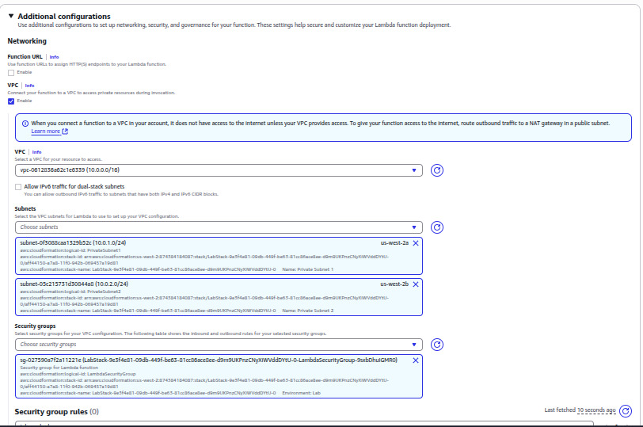

8. Choose the Code tab.

9. In the Code source window, select (or double-click) on the index.js file.

10. Delete the default content displayed under index.js tab.

11. Copy the code shown below and paste it into the index.js tab.

 Copy edit:

 ```
 var json = {
  "service": "lambda",
  "reference": "https://aws.amazon.com/lambda/faqs/",
  "questions": [{
    "q": "What is AWS Lambda?",
    "a": "AWS Lambda lets you run code without provisioning or managing servers. You pay only for the compute time you consume - there is no charge when your code is not running. With Lambda, you can run code for virtually any type of application or backend service - all with zero administration. Just upload your code and Lambda takes care of everything required to run and scale your code with high availability. You can set up your code to automatically trigger from other AWS services or call it directly from any web or mobile app."
  },{
   "q":"What events can trigger an AWS Lambda function?",
   "a":"You can use AWS Lambda to respond to table updates in Amazon DynamoDB, modifications to objects in Amazon S3 buckets, logs arriving in Amazon CloudWatch logs, incoming emails to Amazon Simple Email Service, notifications sent from Amazon SNS, messages arriving in an Amazon Kinesis stream, client data synchronization events in Amazon Cognito, and custom events from mobile applications, web applications, or other web services. You can also invoke a Lambda function on a defined schedule using the AWS Lambda console."
  },{
   "q":"When should I use AWS Lambda versus Amazon EC2?",
   "a":"Amazon Web Services offers a set of compute services to meet a range of needs. Amazon EC2 offers flexibility, with a wide range of instance types and the option to customize the operating system, network and security settings, and the entire software stack, allowing you to easily move existing applications to the cloud. With Amazon EC2 you are responsible for provisioning capacity, monitoring fleet health and performance, and designing for fault tolerance and scalability. AWS Elastic Beanstalk offers an easy-to-use service for deploying and scaling web applications in which you retain ownership and full control over the underlying EC2 instances. Amazon Elastic Container Service is a scalable management service that supports Docker containers and allows you to easily run distributed applications on a managed cluster of Amazon EC2 instances. AWS Lambda makes it easy to execute code in response to events, such as changes to Amazon S3 buckets, updates to an Amazon DynamoDB table, or custom events generated by your applications or devices. With Lambda you do not have to provision your own instances; Lambda performs all the operational and administrative activities on your behalf, including capacity provisioning, monitoring fleet health, applying security patches to the underlying compute resources, deploying your code, running a web service front end, and monitoring and logging your code. AWS Lambda provides easy scaling and high availability to your code without additional effort on your part."
  },{
    "q":"What kind of code can run on AWS Lambda?",
    "a":"AWS Lambda offers an easy way to accomplish many activities in the cloud. For example, you can use AWS Lambda to build mobile back-ends that retrieve and transform data from Amazon DynamoDB, handlers that compress or transform objects as they are uploaded to Amazon S3, auditing and reporting of API calls made to any Amazon Web Service, and server-less processing of streaming data using Amazon Kinesis."
  },{
    "q":"What languages does AWS Lambda support?",
    "a":"AWS Lambda supports code written in Node.js (JavaScript), Python, and Java (Java 8 compatible). Your code can include existing libraries, even native ones. Lambda functions can easily launch processes using languages supported by Amazon Linux, including Bash, Go, and Ruby. Please read our documentation on using Node.js, Python and Java."
  },{
    "q":"Can I access the infrastructure that AWS Lambda runs on?",
    "a":"No. AWS Lambda operates the compute infrastructure on your behalf, allowing it to perform health checks, apply security patches, and do other routine maintenance."
  },{
    "q":"How does AWS Lambda isolate my code?",
    "a":"Each AWS Lambda function runs in its own isolated environment, with its own resources and file system view. AWS Lambda uses the same techniques as Amazon EC2 to provide security and separation at the infrastructure and execution levels."
  },{
    "q":"How does AWS Lambda secure my code?",
    "a":"AWS Lambda stores code in Amazon S3 and encrypts it at rest. AWS Lambda performs additional integrity checks while your code is in use."
  },{
    "q":"What is an AWS Lambda function?",
    "a":"The code you run on AWS Lambda is uploaded as a Lambda function. Each function has associated configuration information, such as its name, description, entry point, and resource requirements. The code must be written in a stateless style i.e. it should assume there is no affinity to the underlying compute infrastructure. Local file system access, child processes, and similar artifacts may not extend beyond the lifetime of the request, and any persistent state should be stored in Amazon S3, Amazon DynamoDB, or another Internet-available storage service. Lambda functions can include libraries, even native ones."
  },{
    "q":"Will AWS Lambda reuse function instances?",
    "a":"To improve performance, AWS Lambda may choose to retain an instance of your function and reuse it to serve a subsequent request, rather than creating a new copy. Your code should not assume that this will always happen."
  },{
    "q":"What if I need scratch space on disk for my AWS Lambda function?",
    "a":"Each Lambda function receives 500MB of non-persistent disk space in its own /tmp directory."
  },{
    "q":"Why must AWS Lambda functions be stateless?",
    "a":"Keeping functions stateless enables AWS Lambda to rapidly launch as many copies of the function as needed to scale to the rate of incoming events. While AWS Lambda's programming model is stateless, your code can access stateful data by calling other web services, such as Amazon S3 or Amazon DynamoDB."
  },{
    "q":"Can I use threads and processes in my AWS Lambda function code?",
    "a":"Yes. AWS Lambda allows you to use normal language and operating system features, such as creating additional threads and processes. Resources allocated to the Lambda function, including memory, execution time, disk, and network use, must be shared among all the threads/processes it uses. You can launch processes using any language supported by Amazon Linux."
  },{
    "q":"What restrictions apply to AWS Lambda function code?",
    "a":"Lambda attempts to impose few restrictions on normal language and operating system activities, but there are a few activities that are disabled: Inbound network connections are managed by AWS Lambda, only TCP/IP sockets are supported, and ptrace (debugging) system calls are restricted. TCP port 25 traffic is also restricted as an anti-spam measure."
  },{
    "q":"How do I create an AWS Lambda function using the Lambda console?",
    "a":"You can author the code for your function using the inline editor in the AWS Lambda console. You can also package the code (and any dependent libraries) as a ZIP and upload it using the AWS Lambda console from your local environment or specify an Amazon S3 location where the ZIP file is located. Uploads must be no larger than 50MB (compressed). You can use the AWS Eclipse plugin to author and deploy Lambda functions in Java and Node.js. If you are using Node.js, you can author the code for your function using the inline editor in the AWS Lambda console. Go to the console to get started."
  },{
    "q":"How do I create an AWS Lambda function using the Lambda CLI?",
    "a":"You can package the code (and any dependent libraries) as a ZIP and upload it using the AWS CLI from your local environment, or specify an Amazon S3 location where the ZIP file is located. Uploads must be no larger than 50MB (compressed). Visit the Lambda Getting Started guide to get started."
  },{
    "q":"Which versions of Python are supported?",
    "a":"Lambda provides a Python 2.7-compatible runtime to execute your Lambda functions. Lambda will include the latest AWS SDK for Python (boto3) by default."
  },{
    "q":"How do I compile my AWS Lambda function Java code?",
    "a":"You can use standard tools like Maven or Gradle to compile your Lambda function. Your build process should mimic the same build process you would use to compile any Java code that depends on the AWS SDK. Run your Java compiler tool on your source files and include the AWS SDK 1.9 or later with transitive dependencies on your classpath. For more details, see our documentation."
  },{
    "q":"What is the JVM environment Lambda uses for execution of my function?",
    "a":"Lambda provides the Amazon Linux build of openjdk 1.8."
  }
  ]
}

export const handler = function(event, context) {
    var rand = Math.floor(Math.random() * json.questions.length);
    console.log("Quote selected: ", rand);

    var response = {
        body: JSON.stringify(json.questions[rand])
    };
    console.log(response);
    context.succeed(response);
};
```
12. Examine the code.
It performs the following steps:
* Defines a list of Frequently Asked Questions (FAQs).
* Returns a random FAQ.
13. Choose Deploy.

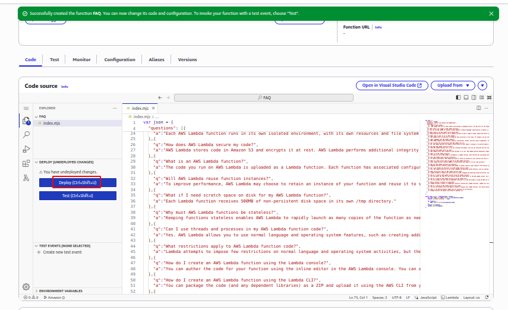

### Task 1.2: Create an API Gateway endpoint
 Learn more: An API endpoint refers to a host name of the API. The API endpoint can be edge-optimized or regional, depending on where the majority of your API traffic originates from. You choose a specific endpoint type when creating an API.

1. Choose the Configuration tab.

2. Choose General configuration, then choose Edit.

3. For Description, enter Provide a random FAQ.

4. Choose Save.

AWS Lambda functions can be triggered automatically by activities such as data being received by Amazon Kinesis or data being updated in an Amazon DynamoDB database. For this lab, you trigger the Lambda function whenever a call is made to API Gateway.


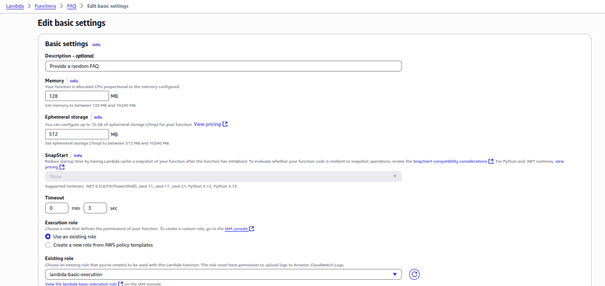

5. Locate the Function overview section, at the top of the console page.

6. Choose  Add trigger, then configure the following:

* For Select a source, select API Gateway.
* For Intent, select Create a new API.
* For API type, select REST API.
* For Security, select Open.
* Expand  Additional settings.
* For API name, enter FAQ-API.
* For Deployment stage, enter myDeployment.

7. Choose Add.
 Task complete: You have successfully created the Lambda function and configured the settings. This has also created a new API Gateway REST endpoint, which is used to trigger the Lambda function.

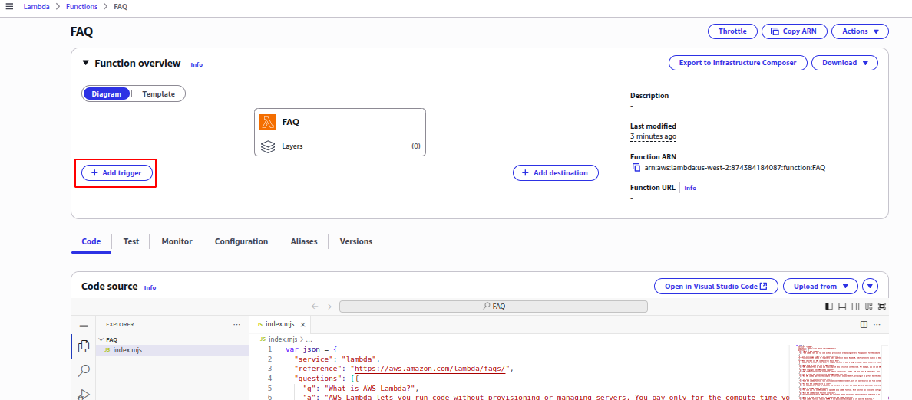
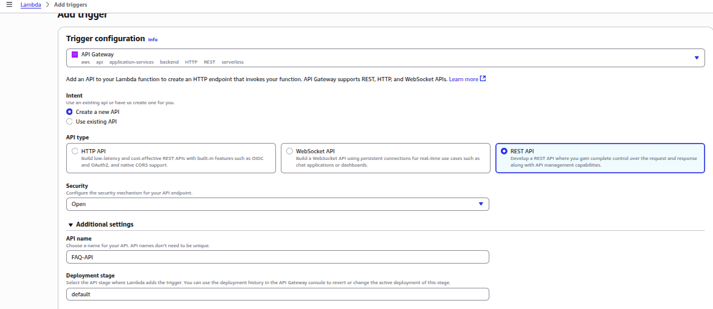
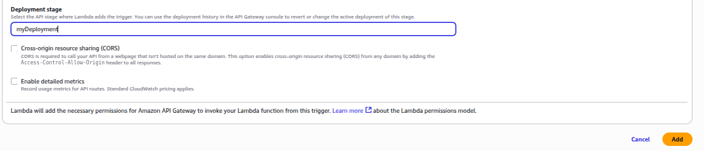


## Task 2: Test the Lambda function
In this task, you test the Lambda function and are presented with the FAQ Lambda function page when successful.

1. In the Configuration tab, select Triggers from the navigation menu on the left.

2. In the Triggers section, locate API Gateway, and expand  Details to view the details of your API.

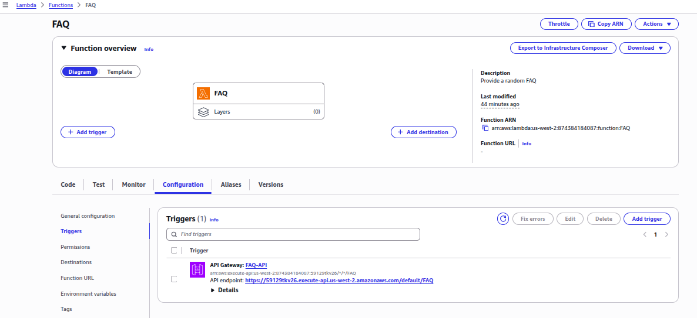

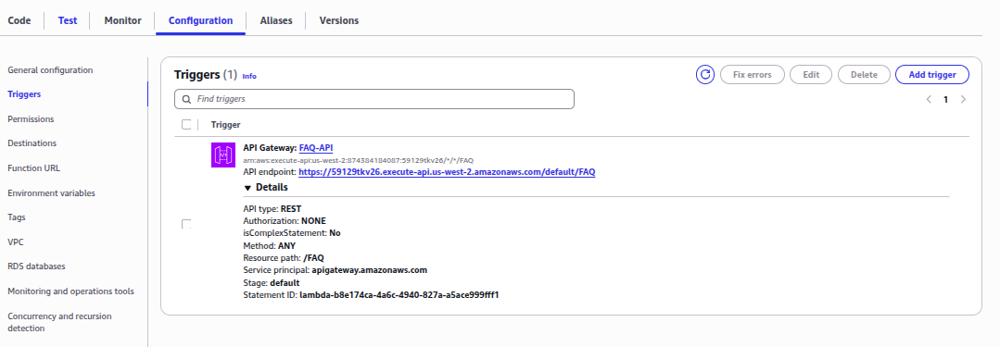

3. Copy the API endpoint to your clipboard, then:
* In a new browser tab, paste the API endpoint.
* Press Enter to go to the URL.

A new browser tab opens.

A random FAQ entry for the Lambda code is displayed on the web page.

An example is text similar to:

```
q "What languages does AWS Lambda support?"
a "AWS Lambda supports code written in Node.js (JavaScript), Python, and Java (Java 8 compatible). Your code can include existing libraries, even native ones. Lambda functions can easily launch processes using languages supported by Amazon Linux, including Bash, Go, and Ruby. Please read our documentation on using Node.js, Python and Java."
```
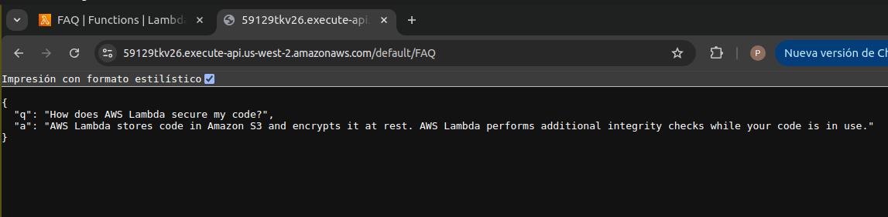

The Lambda function can also be tested in isolation.

4. Close the FAQ browser tab and return to the web browser tab showing the AWS Lambda Management Console.

5. Select the Test tab and configure a new test event.

6. In the Test event section, configure the following:
* For Event name, enter BasicTest.
* Delete the provided keys and values.
* Keep an empty {} to represent an empty JSON object:
```
{}
```
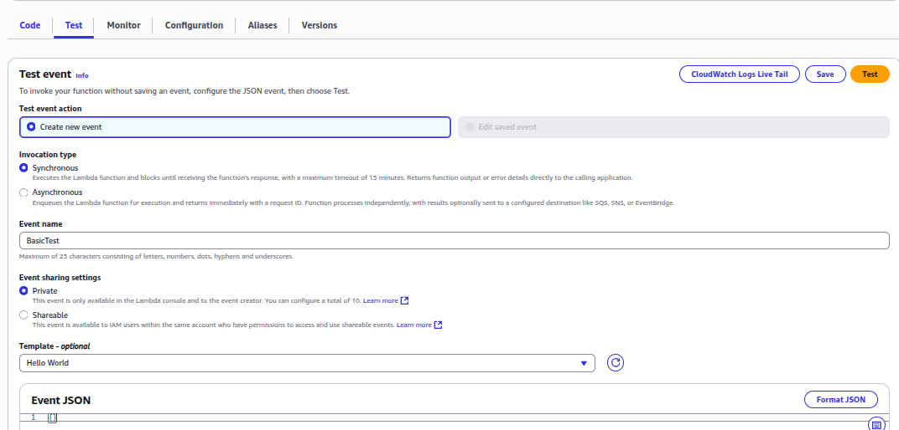

7. Choose Save.
8. Choose Test.
9. In the Execution result: succeeded window, expand  Details.

The output shows the FAQ entry wrapped inside a body parameter.

Below the Execution result are two columns. The Summary displays the total execution time for the AWS Lambda function and the resources consumed. The Log output displays logging information. This section contains any console logging as well as any error messages.

10. Choose the Monitor tab.
11. Choose View CloudWatch logs.
12. Choose on one of the log streams.

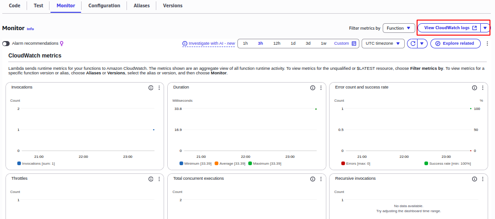
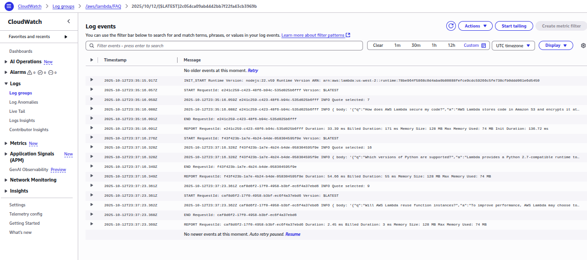

You are presented with the same event data that was displayed in the AWS Lambda Management Console. Examine the contents of each line to review the log information.

Task complete: You have successfully tested that the AWS Lambda Function works and displays a FAQ page by making a request from the Amazon API Gateway endpoint… You also created a new test event for testing the function from within the AWS Lambda console. Finally, you learned how to locate and review the CloudWatch logs associated with the AWs Lambda function.

# Conclusion
You now know how to:
* Create an AWS Lambda function.
* Create an Amazon API Gateway endpoints.
* Debug API Gateway and Lambda with Amazon CloudWatch.

# Next steps
This lab was intended to provide an introduction into microservices architecture patterns, why they are important and how to set up a basic open API.

Now that you have completed the lab, take it a step further! Here are some additional things you could do to extend the functionality of your microservice in your own AWS account:

* Control access to your endpoint by integrating AWS IAM.
* Move the JSON object with the questions into a data store like DynamoDB.
* Implement a URL parameter that returns a specific question.
* Implement an endpoint that returns all questions.
* Implement a new method that adds a question into the list.
* Checkout serverless development frameworks like Serverless. https://github.com/serverless/serverless 

# Additional resources
https://www.vinaysahni.com/best-practices-for-a-pragmatic-restful-api
https://docs.aws.amazon.com/apigateway/latest/developerguide/welcome.html
https://docs.aws.amazon.com/lambda/latest/dg/welcome.html
https://microservices.io/index.html 
https://ics.uci.edu/~fielding/pubs/dissertation/rest_arch_style.htm 
https://docs.aws.amazon.com/apigateway/latest/developerguide/rest-api-develop.html 

# Appendix
## Technical Concepts
### Microservice Architecture
“The microservice architectural style is an approach to developing a single application as a suite of small services, each running in its own process and communicating with lightweight mechanisms, often an HTTP resource API. These services are built around business capabilities and independently deployable by fully automated deployment machinery. There is a bare minimum of centralized management of these services, which may be written in different programming languages and use different data storage technologies.” – James Lewis and Martin Fowler

The idea of a microservices architecture is to take a large, complex system and break it down into independent, decoupled services that are easy to manage and extend. This enables developers to meet their key design goals like extensibility, availability and maintainability.

Amazon API Gateway and AWS Lambda provide the perfect combination of web services to effortlessly build, deliver and maintain a suite of microservices that can be the foundation of complex software systems.

In this lab, you learn how to develop, deploy and debug a simple microservice that represents one part of a much larger system. It consists of two pieces: the RESTful API and the function that is executed when a user hits the endpoint.

### Application Programming Interface (API)
An application programming interface is a set of instructions that defines how developers interface with an application. The idea behind an API is to create a standardized approach to interfacing the various services provided by an application. An API is designed to be used with a Software Development Kit (SDKs), which is a collection of tools that allows developers to easily create downstream applications based on the API.

### API-First Strategy
Many software organizations are adopting an API-First strategy, where each service within their stack is first and always released as an API. When designing a service, it is hard to know all of the various applications that may want to utilize the service. For instance, the FAQ service in this lab would be ideal to seed FAQ pages on an external website. However, it is feasible to think that a cloud education company would also want to ingest the FAQ within their training materials for flash cards or training documents. If it was simply a static website, the ingestion process for the education company would be very difficult. By providing an API that can be consumed in a standardized format, the microservice is enabling the development of an ecosystem around the service, and use-cases that were not initially considered.

### RESTful API
Representational state transfer (REST) refers to architectures that follow six constraints:

* Separation of concerns via a client-server model.
* State is stored entirely on the client and the communication between the client and server is stateless.
* The client will cache data to improve network efficiency.
* There is a uniform interface (in the form of an API) between the server and client.
* As complexity is added into the system, layers are introduced. There may be multiple layers of RESTful components.
* Follows a code-on-demand pattern, where code can be downloaded on the fly (in our case implemented in Lambda) and changed without having to update clients.

This lab is following a RESTful model. Clients send requests to backend Lambda functions (server). The logic of service is encapsulated within the Lambda function and it is providing a uniform interface for clients to use.

### Best Practices for Building a RESTful API
A key goal of building an API is to help establish an ecosystem of innovation around your set of services. Therefore, it is important to make your API intuitive and easy-to-use. Here is a common naming and method scheme to follow:

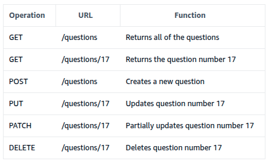

Notice how to get a specific question, the API endpoint is NOT /question/name but instead /questions/identifier. This enables the API designer to provide functionality to return groups of questions (could be all questions) with the /questions endpoint as well as single record responses with the /questions/identifier. For more information, see the additional resources section at the end of this lab guide.

A few good examples of RESTful APIs to look at are:
https://docs.aws.amazon.com/mediaconvert/latest/apireference/resources.html 
https://developer.spotify.com/documentation/web-api 
https://dev.twitch.tv/docs/api/reference 
https://netflix.github.io/genie/docs/3.1.0/rest/ 
https://docs.slack.dev/ 

### Amazon API Gateway and AWS Lambda Terminology
* Resource: Represented as a URL endpoint and path. For example, api.mysite.com/questions. You can associate HTTP methods with resources and define different backend targets for each method. In a microservices architecture, a resource would represent a single microservice within your system.
* Method: In API Gateway, a method is identified by the combination of a resource path and an HTTP verb, such as GET, POST, and DELETE.
* Method Request: The method request settings in API Gateway store the methods authorization settings and define the URL Query String parameters and HTTP Request Headers that are received from the client.
* Integration Request: The integration request settings define the backend target used with the method. It is also where you can define mapping templates, to transform the incoming request to match what the backend target is expecting.
* Integration Response: The integration response settings is where the mappings are defined between the response from the backend target and the method response in API Gateway. You can also transform the data that is returned from your backend target to fit what your end users and applications are expecting.
* Method Response: The method response settings define the method response types, their headers and content types.
* Model: In API Gateway, a model defines the format, also known as the schema or shape, of some data. You create and use models to make it easier to create mapping templates. Because API Gateway is designed to work primarily with JavaScript Object Notation (JSON)-formatted data, API Gateway uses JSON Schema to define the expected schema of the data.
* Stage: In API Gateway, a stage defines the path through which an API deployment is accessible. This is commonly used to deviate between versions, as well as development vs production endpoints, etc.
* Blueprint: A Lambda blueprint is an example lambda function that can be used as a base to build out new Lambda functions.

# Assesment
Question 1
Answer status:
Incorrect
Question
What is the primary purpose of creating an API Gateway endpoint?
Question Type
Multiple Choice
Answer Options
Option
Your Selection
Correct Answer
Rationale
To process API requests
Selected
Incorrect
While API Gateway can transform requests, its primary role is routing, not processing.
To provide a URL for accessing your API
Not selected
Correct
The main purpose of an API Gateway endpoint is to provide a unique URL that clients can use to access your API and its resources.
To authenticate API users
Not selected
Incorrect
Although API Gateway can handle authentication, it's not the primary purpose of creating an endpoint.
To store API data
Not selected
Incorrect
API Gateway doesn't store API data; it routes requests to backend services that handle data storage.


Question 2
Answer status:
Correct
Question
Which AWS service allows you to run code without provisioning or managing servers?
Question Type
Multiple Choice
Answer Options
Option
Your Selection
Correct Answer
Rationale
AWS Fargate
Not selected
Incorrect
AWS Fargate is a serverless compute engine for containers, but it's not used for running individual functions like Lambda.
AWS Lambda
Selected
Correct
AWS Lambda is a serverless compute service that lets you run code without provisioning or managing servers, making it the correct answer.
Amazon EC2
Not selected
Incorrect
Amazon EC2 is a service that provides resizable compute capacity in the cloud, but it requires server management.
Amazon ECS
Not selected
Incorrect
Amazon ECS is a container orchestration service that requires management of EC2 instances or Fargate tasks.


Question 3
Answer status:
Correct
Question
What is the FIRST step in creating an API Gateway endpoint from the Lambda console?
Question Type
Multiple Choice
Answer Options
Option
Your Selection
Correct Answer
Rationale
Configure API settings
Not selected
Incorrect
This is typically done after selecting the Lambda function and choosing to create an API.
Choose 'Create API'
Not selected
Incorrect
This option appears after selecting the Lambda function, not as the first step.
Select the Lambda function
Selected
Correct
When creating an API Gateway endpoint from the Lambda console, you start by selecting the Lambda function you want to expose through the API.
Define API resources
Not selected
Incorrect
Resources are defined after the initial API creation, not as the first step.

Question 4
Answer status:
Correct
Question
Which AWS service is used to create an HTTP endpoint for invoking a Lambda function?
Question Type
Multiple Choice
Answer Options
Option
Your Selection
Correct Answer
Rationale
AWS AppSync
Not selected
Incorrect
AWS AppSync is used for building GraphQL APIs, not for creating HTTP endpoints for Lambda functions.
Amazon API Gateway
Selected
Correct
Amazon API Gateway is the correct service for creating HTTP endpoints that can invoke Lambda functions. It allows you to create, publish, and manage APIs that act as a 'front door' for applications to access data or functionality from your Lambda functions.
AWS Elastic Beanstalk
Not selected
Incorrect
AWS Elastic Beanstalk is a platform for deploying and scaling web applications, not for creating API endpoints for Lambda functions.
Amazon CloudFront
Not selected
Incorrect
Amazon CloudFront is a content delivery network (CDN) service, not used for creating API endpoints.


Question 5
Answer status:
Correct
Question
Which AWS service allows you to create a new test event for testing a Lambda function from within its console?
Question Type
Multiple Choice
Answer Options
Option
Your Selection
Correct Answer
Rationale
Amazon API Gateway
Not selected
Incorrect
While API Gateway can trigger Lambda functions, you cannot create Lambda test events from within the API Gateway console.
AWS Step Functions
Not selected
Incorrect
Step Functions can orchestrate Lambda functions but doesn't offer a way to create test events for individual Lambda functions.
AWS CloudFormation
Not selected
Incorrect
CloudFormation is used for infrastructure as code and doesn't provide a direct interface for creating Lambda test events.
AWS Lambda
Selected
Correct
AWS Lambda console provides the ability to create and manage test events directly within its interface, allowing developers to test their functions with various inputs.