# Introduction to Amazon Simple Storage Service (S3)

## Objectives
After completing this lab, you will know how to:
* Create a bucket in Amazon S3.
* Add an object to a bucket.
* Manage access permissions on an object and a bucket.
* Create a bucket policy.
* Use bucket versioning.

## Overview
Amazon Simple Storage Service (Amazon S3) is an object storage service that offers industry-leading scalability, data availability, security, and performance. This means customers of all sizes and industries can use it to store and protect any amount of data for a range of use cases, such as websites, mobile applications, backup and restore, archive, enterprise applications, Internet of Things (IoT) devices, and big data analytics. Amazon S3 provides easy-to-use management features so you can organize your data and configure finely-tuned access controls to meet your specific business, organizational, and compliance requirements. Amazon S3 is designed for 99.999999999% (11 9’s) of durability and stores data for millions of applications for companies all around the world.

 Visit the Amazon S3 product information page https://aws.amazon.com/es/s3/?nc2=h_m1 for additional details, capabilities, and a short introduction video about the service.

## Lab Scenario
You work for a company using Amazon S3 for data storage. An application residing on an EC2 instance needs to push reporting data to an S3 bucket daily. You are tasked with creating an S3 bucket for your company to use for storing this report data. For a successful deployment, you need to ensure the EC2 instance has enough privileges to be able to upload and retrieve data from the S3 bucket. For security reasons, only the EC2 instance can write data to the S3 bucket. The files in the S3 bucket also require protection against accidental deletion. This lab follows the Getting Started with Amazon S3 digital course.

## Task 1: Create a bucket 
You are new to Amazon S3 and want to test the features and security of S3 as you configure the environment to hold the EC2 report data. You know that every object in Amazon S3 is stored in a bucket so creating a new bucket to hold the reports is the first thing on your task list.

In this task, you create a bucket to hold your EC2 report data and then examine the different bucket configuration options.

1. At the top-left of the AWS Management Console, on the Services  menu choose S3. You can also search for S3 at the top of the services menu.
2. Choose Bucket.

Caution: Bucket names must be between 3 and 63 characters long and consist of only lowercase letters, numbers, or hyphens. The bucket name must be globally unique across all of Amazon S3, regardless of account or region, and cannot be changed after the bucket is created. As you enter a bucket name, a help box displays showing any violations of the naming rules. Refer to the Amazon S3 bucket naming rules in the Additional resources section for more information.

In this lab, you will use your AWSLabUser account number in the bucket name to ensure that it is unique.

3. At the top right of the Management Console, choose the AWSLabsUser dropdown menu.
4. Under Account ID, select  to copy the AWSLabsUser account ID to your clipboard.
5. Under the General configuration section, name your bucket: reportbucket-<Account ID> > 483193047214.
   * Example bucket name: reportbucket-12345678901  Replace NUMBER in the bucket name with a random number. This ensures that you have a unique name.
   * Example Bucket Name - reportbucket-987987987987
6. In the Object Ownership section, configure:
   * ACLs enabled
   * Object writter
7. Leave Region at its default value.

Selecting a particular region allows you to optimize latency, minimize costs, or address regulatory requirements. Objects stored in a region never leave that region unless you explicitly transfer them to another region.

8. Scroll to the bottom and choose Create bucket.

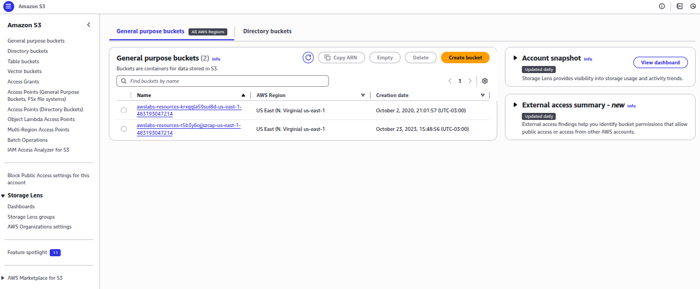
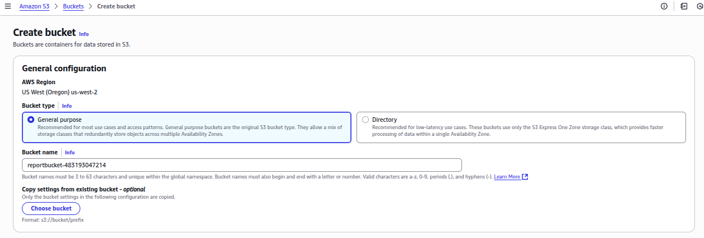
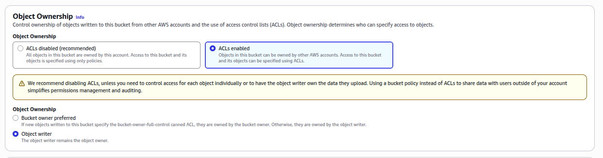
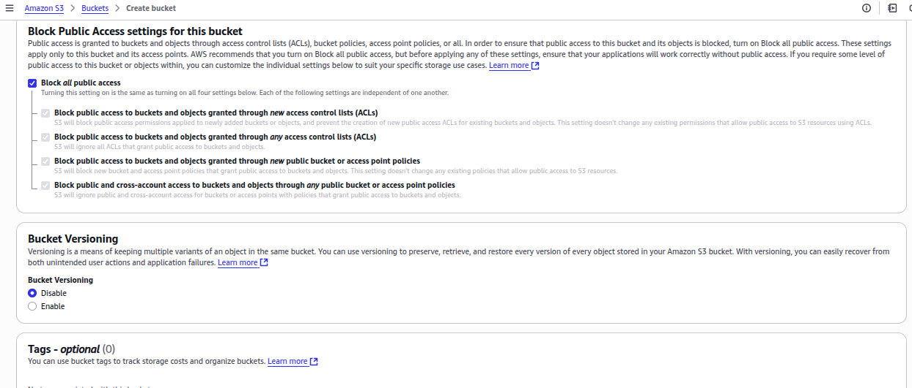
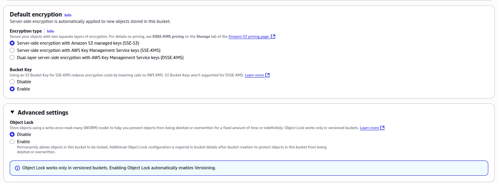

## Task 2: Upload an object to the bucket
Now that you have a bucket created for your report data, you are ready to work with objects. An object can be any kind of file: a text file, a photo, a video, a zip file, and so on. When you add an object to Amazon S3, you have the option of including metadata with the object and setting permissions to control access to the object.

In this task you test uploading objects to your reportbucket. You have a screencapture of a daily report and want to upload this image to your S3 bucket.

1. Right-click this link new-report.png, choose Save link as, and save the file locally.

2. In the S3 Management Console, find and select the bucket that starts with the name reportbucket.

3. Choose Upload. This launches an upload wizard. Use this wizard to upload files either by selecting them from a file chooser or by dragging them to the S3 window.

4. Choose Add files.

5. Browse to and select the new-report.png file that you downloaded previously.

6. Scroll down and choose Upload.

Your file is successfully uploaded when the green bar indicating Upload succeeded appears.

If the file does not display in the bucket within a few seconds of uploading it, you may need to choose the  refresh button at the top-right.

7. In the Upload: status section, choose Close.

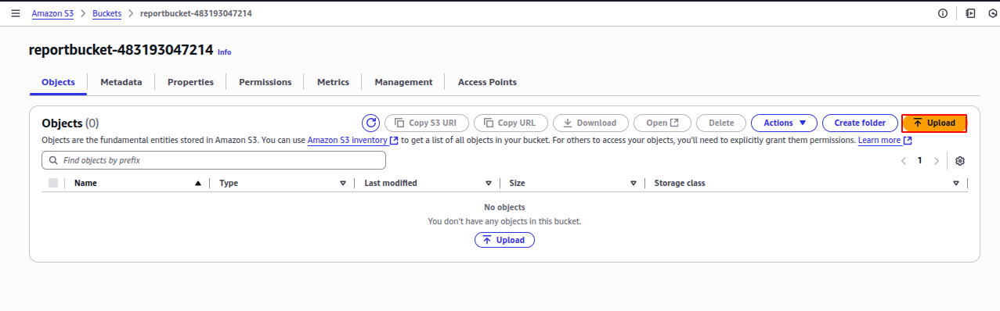
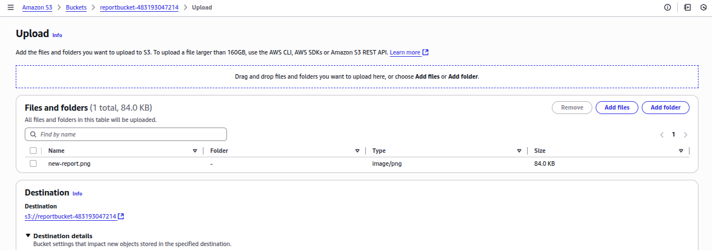
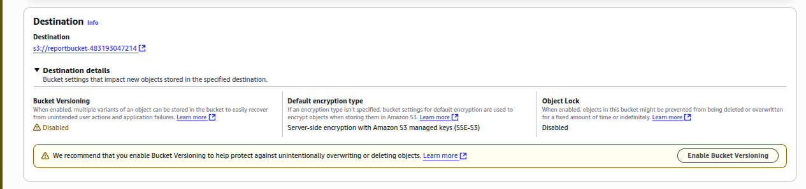
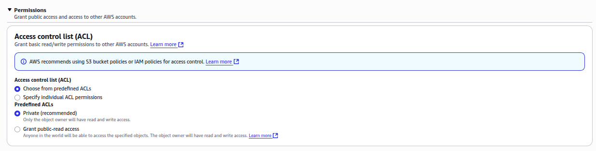
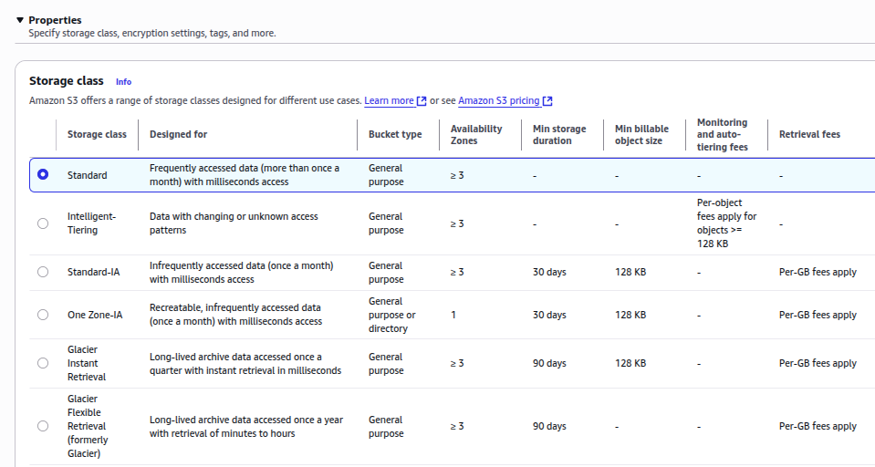
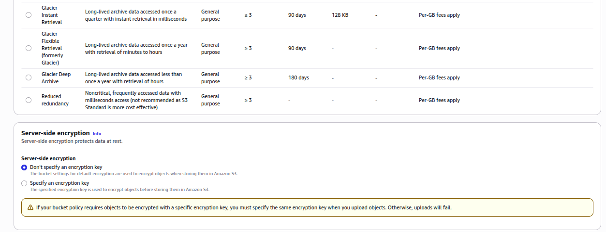 
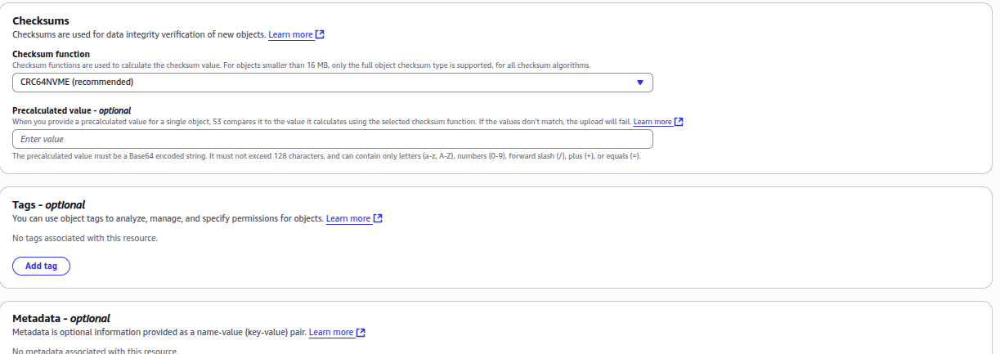

## Task 3: Make an object public
Security is a priority in Amazon S3. Before you configure your EC2 instance to connect to the reportbucket, you want to test the bucket and object settings for security.

In this task, you configure permissions on your bucket and your object to test accessibility.

First, you attempt to access the object to confirm that it is private by default.

1. In the reportbucket overview page, on the objects tab, locate the new-report.png object, and choose the new-report.png file name.

The new-report.png overview page opens. Notice that the navigation in the top-left updates with a link to return to the bucket overview page.

2. In the Object overview section, locate and copy the Object URL link.
The link should look similar to: https://reportbucket987987.s3-us-west-2.amazonaws.com/new-report.png

https://reportbucket-483193047214.s3.us-west-2.amazonaws.com/new-report.png 

3. Open a new browser tab and paste the Object URL link into the address field, and then press Enter.
You receive an Access Denied error. This is because objects in Amazon S3 are private by default.
Now that you’ve confirmed the default security of S3 is private, you want to test how to make the object publicly accessible.

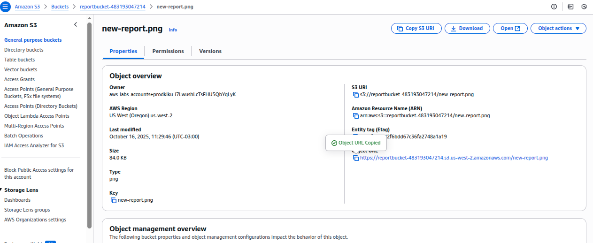
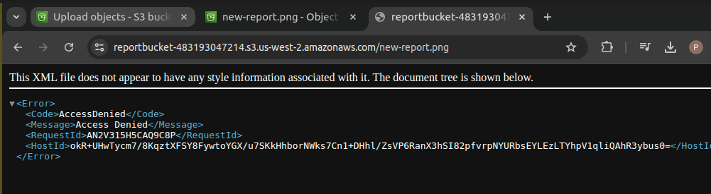
4. Keep the browser with the Access Denied error open and return to the web browser tab with the S3 Management Console.

5. You should still be on the new-report.png Object overview tab.

6. Choose the Object actions button and Make public using ACL, which will be the last item in the list.

**NOTE**: Notice the warning Public access is blocked because Block Public Access settings are turned on for this bucket. This error displays because this bucket is configured not to allow public access. The bucket settings override any permissions applied to individual objects. If you want the object to viewable by the general public, you need to turn off Block Public Access (BPA).

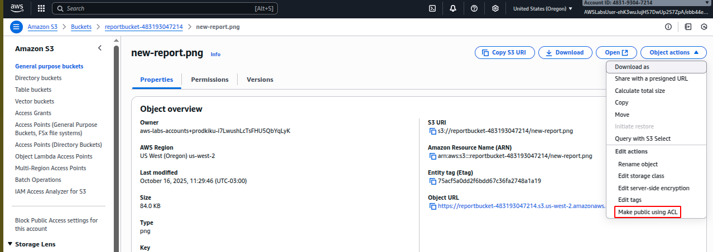
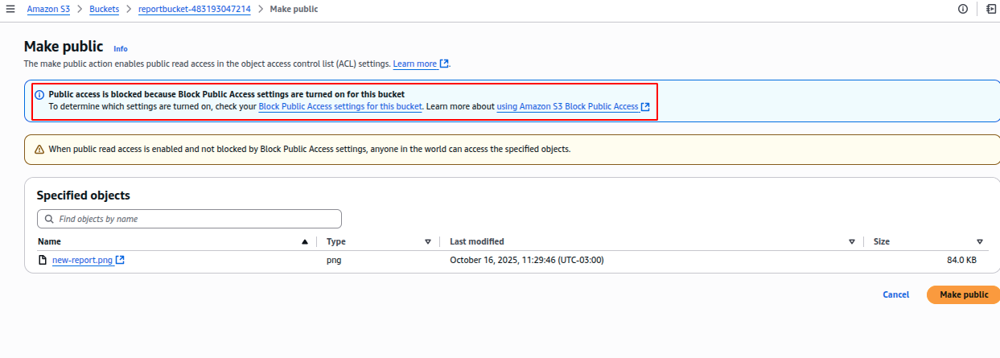
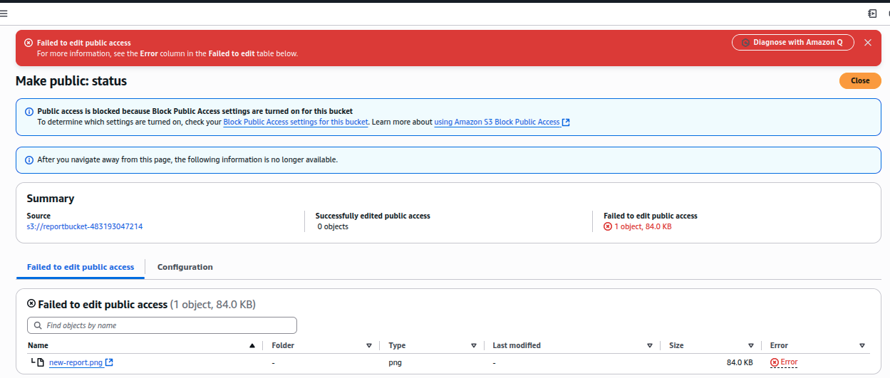

7. Choose Make public and read the warning at the top of the window indicating that it “Failed to edit public access” again this is due to BPA being enabled.

8. Choose Close to return to the object overview.

9. Use the navigation at the top to go back to the main reportbucket overview page.

10. Choose the Permissions tab.

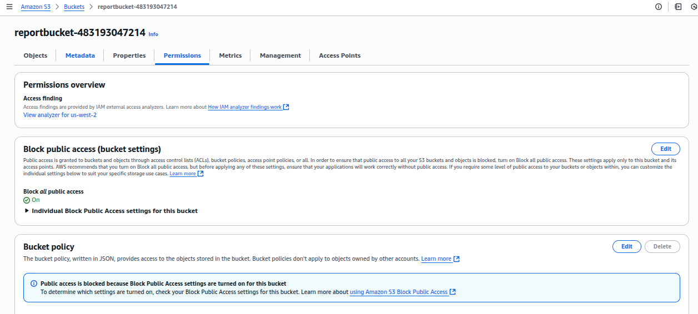

11. Under Block public access (bucket settings), choose Edit to change the settings.
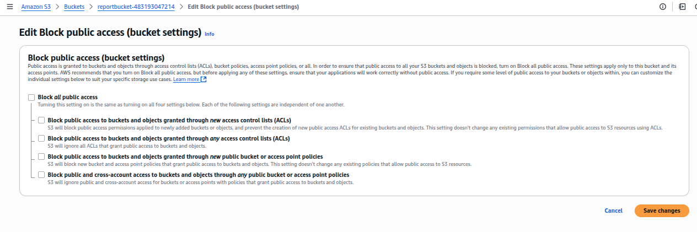
12. Deselect the Block all public access option, and then leave all other options deselected.

Notice that all of the individual options remain deselected. When deselecting all public access, you must then select the individual options that apply to your situation and security objectives. Both ACLs and bucket policies are used later in the lab, so they all remain deselected in this task. In a production environment, it is recommended to use the least permissive settings possible. Refer to the Amazon S3 block public access link in the Additional Resources section at the end of the lab for more information.

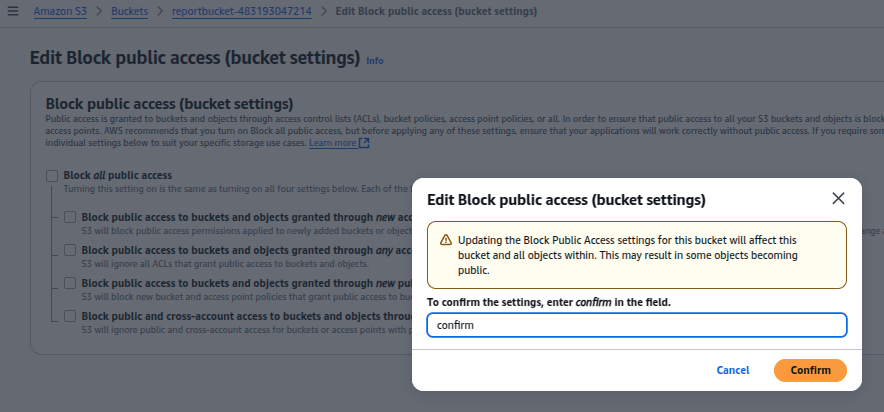
13. Choose Save changes

14. A dialogue box opens asking you to confirm your changes. Type confirm in the field, and then choose Confirm
 A Successfully edited bucket settings for Block Public Access message displays at the top of the window.

15. Choose the Objects tab.

16. Choose the new-report.png file name.

17. On the new-report.png overview page, choose the Object actions button and select Make public using ACL.
 Notice the warning: When public read access is enabled and not blocked by Block Public Access settings, anyone in the world can access the specified objects. This is designed to remind you that if you make the object public then everyone in the world will be able to read the object.

18. Choose Make public and you should see the green banner Successfully edited public access at the top of the window.

19. Choose Close to return to the object overview.
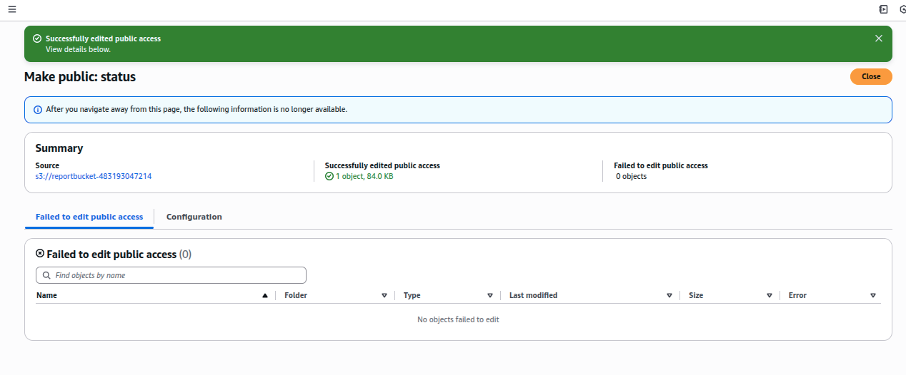
20. Return to the other browser tab that displayed Access Denied for the new-report.png and refresh  the page. The new-report.png now displays properly because it is publicly accessible.
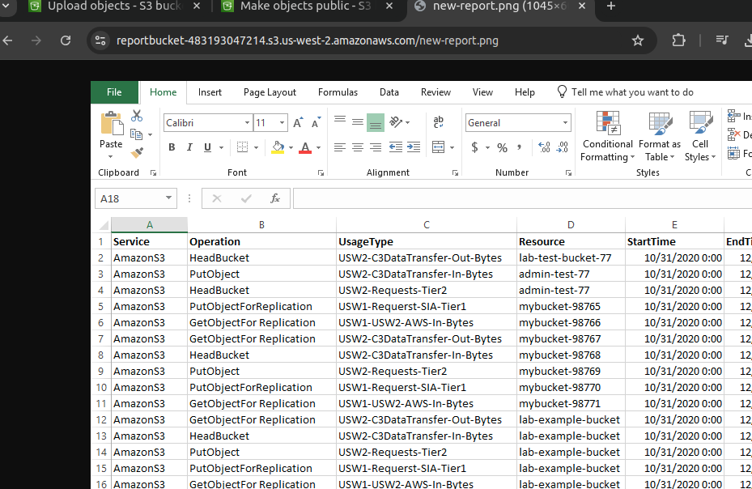
21. Close the web browser tab that displays your new-report.png image and return to the tab with the Amazon S3 Management Console.

In this example, you granted read access to just one specific object. If you wish to grant access to the entire bucket, you need to use a bucket policy, which is covered later in this lab.

In the next task, you work with your EC2 instance to confirm connectivity to the S3 bucket.

## Task 4: Test connectivity from the EC2 instance
In this task, you connect to your Amazon Elastic Compute Cloud (Amazon EC2) instance to test connectivity and security to the S3 reportbucket.

You should already be logged into the AWS Managment Console. If not, follow the steps in the Start Lab section to log in to the AWS Management Console.

1. On the Services  menu, choose EC2.

2. On the EC2 Dashboard, under the Resources section, choose Instances (running).

3. Select  Bastion Host and choose Connect

4. In the Connect to instance window: For Connection method, select Session Manager.
 Session Manager enables you to connect to the bastion host instance without the need for specific ports to be open on your firewall or Amazon Virtual Private Cloud (Amazon VPC) security group. Refer to AWS Systems Manager Session Manager in the Additional resources section at the end of this lab for more information.

5. Choose Connect.
A new browser tab or window opens with a connection to the bastion host instance.

 You are now connected to the EC2 instance that holds the reporting application. Because Session Manager uses https port 443, it does not require you to open SSH port 22 to the outside world, you are satisfied with this security feature. Now you want to see how EC2 interacts with your S3 bucket.

6.  In the bastion host session, enter the following command to change to home directory (/home/ssm-user/):

```
cd ~
```
The output returns you to the command prompt.

7. Enter the following command to verify you are in the home directory:
```
pwd
```
 The output should be:
```
/home/ssm-user
```
You are now in the ssm-user’s home directory where you will run all of the commands in this lab.

8.  Enter the following command to list all of your S3 buckets.
```
aws s3 ls
```
The output should look similar to this:
```
2020-11-11 22:27:28 ql-cf-templates-1603924046-5d95cf473a39fe4e-us-west-2
2020-11-11 22:27:49 qltrail-lab-59350-1603924067
2020-11-11 22:34:46 reportbucket987987
```
You see the reportbucket you created as well as lab auto-generated buckets. 

9. Enter the following command to list all objects in your reportbucket. Remember to change the number at the end of the reportbucket name, to match the name of the bucket you created.
```
aws s3 ls s3://reportbucket(NUMBER)
```
The command looks similar to this: aws s3 ls s3://reportbucket987987
The output should look like this:
```
2020-11-11 15:46:34      86065 new-report.png
```
There is currently just one object in your bucket called new-report.png.

10. Type the following to change directories into the reports directory.
```
cd reports
```
 The output returns you to the command prompt.

11. Type the following to list the contents of the directory.
```
ls
```
 The output shows some files created in your reports directory to test the application.
```
dolphins.jpg files.zip report-test.txt  report-test1.txt report-test2.txt report-test3.txt  whale.jpg
```

12. Type the following to see if you can copy a file to the S3 bucket.
```
aws s3 cp report-test1.txt s3://reportbucket(NUMBER)
```
The command looks similar to this: aws s3 cp report-test1.txt s3://reportbucket987987

 The output indicates an error upload failed. This is because we have read-only rights to the bucket and do not have the permissions to perform the PutObject operation.
```
sh-4.2$ cd ~
sh-4.2$ aws s3 ls
2020-10-03 00:01:57 awslabs-resources-krxqqla59sui8d-us-east-1-483193047214
2023-10-23 18:48:56 awslabs-resources-r5b3y6ojjszcap-us-east-1-483193047214
2025-10-16 14:22:03 reportbucket-483193047214
sh-4.2$ aws s3 ls s3://reportbucket-483193047214
2025-10-16 14:29:46      86065 new-report.png
sh-4.2$ cd reports
sh-4.2$ ls
dolphins.jpg  files.zip  report-test1.txt  report-test2.txt  report-test3.txt  whale.jpg
sh-4.2$ aws s3 cp report-test1.txt s3://reportbucket-483193047214
upload failed: ./report-test1.txt to s3://reportbucket-483193047214/report-test1.txt An error occurred (AccessDenied) when calling the PutObject operation: User: arn:aws:sts::483193047214:assumed-role/EC2InstanceProfileRole/i-08545c9433e6adb5e is not authorized to perform: s3:PutObject on resource: "arn:aws:s3:::reportbucket-483193047214/report-test1.txt" because no identity-based policy allows the s3:PutObject action
sh-4.2$
```
13. Leave this window open and go back to the AWS Console tab.
In the next task you create a bucket policy to add the PutOperation.

## Task 5: Create a bucket policy
A bucket policy is a set of permissions associated with an S3 bucket. It is used to control access to an entire bucket or to specific directories within a bucket.

In this task, you use the AWS Policy Generator to create a bucket policy to enable read and write access from the EC2 instance to the bucket to ensure your reporting application can successfully write to S3.

1. Right-click this link sample-file.txt, choose Save link as, and save the file locally.

2. Return to the AWS Management Console, go to the Services  menu and select S3.

3. In the S3 Management Console tab, select the name of your bucket.

4. Choose Upload and use the same upload process as in the previous task to upload the sample-file.txt.

5. Choose the sample-file.txt file name. The sample-file.txt overview page opens.

6. Under the Object overview section, locate and copy the Object URL link.

7. In a new browser tab, paste the link into the address field, and then press Enter.
Once again, Access Denied will be displayed. You need to configure a bucket policy to grant access to all objects in the bucket without having to specify permissions on each object individually.

8. Keep this browser tab open, but return to the tab with the S3 Management Console.

9. Go to Services  > IAM > Roles.

10. In the Search field type EC2InstanceProfileRole. This is the Role that the EC2 instance uses to connect to S3.

11. Select EC2InstanceProfileRole. On the Summary page, copy the Role ARN to a text file to be used in a later step.
It should look similar to this: arn:aws:iam::596123517671:role/EC2InstanceProfileRole.

arn:aws:iam::483193047214:role/EC2InstanceProfileRole

12. Choose Services , S3 and return to the S3 Management Console.

13. Choose the reportbucket.
You should see the two objects you uploaded. If not, navigate back to your bucket so that you see the list of objects you have uploaded.

14. Choose the Permissions tab.

15. In the Permissions tab, scroll to the Bucket Policy section, choose Edit
A blank Bucket policy editor is displayed. Bucket policies can be created manually, or they can be created with the assistance of the AWS Policy generator.
 Amazon Resource Names (ARN)s uniquely identify AWS resources across all of AWS. Each section of the ARN is separated by a “:” and represents a specific piece of the path to the specified resource. The sections can vary slightly depending on the service being referenced, but generally follows this format:
arn:partition:service:region:account-id:resource
Amazon S3 does not require region or account-id parameters in ARNs, so those sections are left blank. However, the “:” to separate the sections is still used, so it looks similar to arn:aws:s3:::reportbucket987987
Refer to the Amazon Resource Names (ARNs) and AWS Service Namespaces documentation link in the Additional Resources section at the end of the lab for more information.


16. Copy the Bucket ARN to a text file to be used in a later step.

It is displayed below the Policy examples and Policy generator buttons.

It looks like this:
```
Bucket ARN
arn:aws:s3:::reportbucket987987
```
arn:aws:s3:::reportbucket-483193047214

17. Choose Policy generator
A new web browser tab will open with the AWS Policy Generator.

https://awspolicygen.s3.amazonaws.com/policygen.html 

 AWS policies use the JSON format, and are used to configure granular permissions for AWS services. While you can write the policy in JSON manually, the AWS Policy Generator allows you to create it using a friendly web interface.

In the AWS Policy Generator window:

* For Select Type of Policy, select S3 Bucket Policy.
* For Effect, select Allow.
* For Principal, paste the EC2InstanceProfileRole ARN that you copied to a text file in a previous step.
* For AWS Service, keep the default setting of Amazon S3.
* For Actions, select PutObject and GetObject

The get GetObject action grants permission for objects to be retrieved from Amazon S3. Refer to the Additional Resources section at the end of the lab for links to more information about the actions available for use in Amazon S3 policies.

* Amazon Resource Name (ARN): Paste the Bucket ARN that you previously copied.
* At the end of the ARN, append /*

The ARN should look similar to: arn:aws:s3:::reportbucket987987/*

 An Amazon Resource Name (ARN) is a standard way to refer to resources within AWS. In this case, the ARN is referring to your S3 bucket. Adding /* to the end of the bucket name allows the policy to apply to all objects within the bucket.

18. Choose Add Statement. The details of the statement you configured are added to a table below the button. You can add multiple statements to a policy.

19. Choose Generate Policy.

A new window is displayed showing the generated policy in JSON format. It should look similar to:
```
{
    "Version": "2012-10-17",
    "Id": "Policy1604361694227",
    "Statement": [
        {
            "Sid": "Stmt1604361692117",
            "Effect": "Allow",
            "Principal": {
                "AWS": "arn:aws:iam::416159072693:role/EC2InstanceProfileRole"
            },
            "Action": [
                "s3:GetObject",
                "s3:PutObject"
            ],
            "Resource": "arn:aws:s3:::reportbucket987987/*"
        }
    ]
}

```
 Confirm that /* appears after your bucket name as shown in the Resource line in the sample above.
```
{
  "Version": "2012-10-17",
  "Statement": [
    {
      "Sid": "Statement1",
      "Effect": "Allow",
      "Principal": {
        "AWS": "arn:aws:iam::483193047214:role/EC2InstanceProfileRole"
      },
      "Action": [
        "s3:PutObject",
        "s3:GetObject"
      ],
      "Resource": "arn:aws:s3:::reportbucket-483193047214/*"
    }
  ]
}
```
El error que me aparece es porque debo reemplazar la variable instance-profile: arn:aws:iam::483193047214:role/EC2InstanceProfileRole estaba mal copiada.

20. Copy the policy you created to your clipboard.

21. Close the web browser tab and return to the tab with the Bucket policy editor.

22. Paste the bucket policy you created into the Bucket policy editor.

23. Choose Save changes

24. Return to the AWS Systems Manager (SSM) window. If your session has timed out, reconnect to the SSM using the steps from earlier in the lab.

25. Type the following to verify you are in the /home/ssm-user/reports directory.

```
pwd
```
 The output should be:
```
/home/ssm-user/reports
```
26. Enter the following command to list all objects in your reportbucket. Replace NUMBER with the number you used to create your bucket.
```
aws s3 ls s3://reportbucket(NUMBER)
```
The command should look similar to this: aws s3 ls s3://reportbucket987987

The output should look similar to this:
```
sh-4.2$ aws s3 ls s3://reportbucket987987
2020-11-02 23:20:27      86065 new-report.png
2020-11-02 23:57:03         90 sample-file.txt
```
27. Type the following to list the contents of the reports directory.
```
ls
```
 The output returns a list of files.

28. Type the following to try coping the report-test1.txt file to the s3 bucket.
```
aws s3 cp report-test1.txt s3://reportbucket(NUMBER)
```
The command should look like this: aws s3 cp report-test1.txt s3://reportbucket987987
The output returns the following:
```
upload: ./report-test1.txt to s3://reportbucket987987/report-test1.txt
```
29. Type the following to see if the file successfully uploaded to S3.
```
aws s3 ls s3://reportbucket(NUMBER)
```
 The output should look similar to this:
 ```
 2020-11-11 18:20:23      86065 new-report.png
2020-11-11 18:32:18         31 report-test1.txt
2020-11-11 18:20:22         90 sample-file.txt
```
You have successfully uploaded (PutObject) a file from the EC2 instance to your S3 bucket.

30. Now type the following command to retrieve (GetObject) a file from S3 to the EC2 Instance.
 ```
aws s3 cp s3://reportbucket(NUMBER)/sample-file.txt sample-file.txt
```
The output should look similar to this:
 ```
download: s3://reportbucket987987/sample-file.txt to ./sample-file.txt
```
31. Type the following to see if the file is now in the /reports directory.
 ```
ls
```
The output should look similar to this:
 ```
dolphins.jpg  files.zip  report-test1.txt  report-test2.txt  report-test3.txt  sample-file.txt
```
You now see the sample-file.txt in your file list. Congratulations! You have succesfully uploaded and retrieved a file from EC2 to the S3 bucket.
```
sh-4.2$ pwd
/usr/bin
sh-4.2$ cd /home/ssm-user/reports
sh-4.2$ pwd
/home/ssm-user/reports
sh-4.2$ aws s3 ls s3://reportbucket-483193047214
2025-10-16 14:29:46      86065 new-report.png
2025-10-17 13:02:44        113 sample-file.txt
sh-4.2$ aws s3 cp report-test1.txt s3://reportbucket-483193047214
upload: ./report-test1.txt to s3://reportbucket-483193047214/report-test1.txt
sh-4.2$ aws s3 ls s3://reportbucket-483193047214
2025-10-16 14:29:46      86065 new-report.png
2025-10-17 13:24:45         31 report-test1.txt
2025-10-17 13:02:44        113 sample-file.txt
sh-4.2$ aws s3 cp s3://reportbucket-483193047214/sample-file.txt sample-file.txt
download: s3://reportbucket-483193047214/sample-file.txt to ./sample-file.txt
sh-4.2$ ls
dolphins.jpg  files.zip  report-test1.txt  report-test2.txt  report-test3.txt  sample-file.txt  whale.jpg
sh-4.2$
```
32. Return to the browser tab that displayed the Access Denied for the sample-file.txt and refresh  the page.
The page still displays an error message because the Bucket Policy only gave rights to the principal called EC2InstanceProfileRole.

33. Next, on your own, go back to the policy generator and add another statement to the bucket policy allowing EVERYONE (*), Read access (GetObject). Take a moment to generate this policy which allows both the EC2InstanceProfileRole to have access to the bucket while giving EVERYONE access to read the objects via the browser.

34. To test if your policy works, go to your browser with the Access Denied error and refresh it. If you can read the text, then congratulations! Your policy was successful.

 If not, look at the policy below for help. The modified policy should look like the policy listed below. Notice that there are TWO statements, one with the EC2InstanceProfileRole and one where the Principal is “*” for everyone.

If you had trouble generating the policy on your own, you can copy the policy below and paste it into the BucketPolicy Editor. Remember to replace the existing EC2InstanceProfileRole ARN in the policy below with the EC2InstanceProfileRole ARN you copied in an earlier step. Ensure that the /* appears at the end of the Bucket ARN. See the last line of the file as an example.

 ```
{
    "Version": "2012-10-17",
    "Id": "Policy1604428844058",
    "Statement": [
        {
            "Sid": "Stmt1604428821481",
            "Effect": "Allow",
            "Principal": {
                "AWS": "arn:aws:iam::285058481724:role/EC2InstanceProfileRole"
            },
            "Action": [
                "s3:GetObject",
                "s3:PutObject"
            ],
            "Resource": "arn:aws:s3:::reportbucket987987/*"
        },
        {
            "Sid": "Stmt1604428842806",
            "Effect": "Allow",
            "Principal": "*",
            "Action": "s3:GetObject",
            "Resource": "arn:aws:s3:::reportbucket987987/*"
        }
    ]
}

```

Generado:
```
{
  "Version": "2012-10-17",
  "Statement": [
    {
      "Sid": "AllowEC2InstanceProfileRoleAccess",
      "Effect": "Allow",
      "Principal": {
        "AWS": "arn:aws:iam::483193047214:role/EC2InstanceProfileRole"
      },
      "Action": [
        "s3:GetObject",
        "s3:PutObject"
      ],
      "Resource": "arn:aws:s3:::reportbucket-483193047214/*"
    },
    {
      "Sid": "AllowPublicReadAccess",
      "Effect": "Allow",
      "Principal": "*",
      "Action": "s3:GetObject",
      "Resource": "arn:aws:s3:::reportbucket-483193047214/*"
    }
  ]
}
```
35. Leave the tab open with the sample-file.txt displayed. You will return to this tab in the next task.
In this task you created a bucket policy to allow specific access rights to your bucket. In the next section you explore how to keep copies of files to prevent against accidental deletion.

## Task 6: Explore Versioning
Versioning is a means of keeping multiple variants of an object in the same bucket. You can use versioning to preserve, retrieve, and restore every version of every object stored in your Amazon S3 bucket. With versioning, you can easily recover from both unintended user actions and application failures.

For auditing and compliance reasons you need to enable versionsing on your reportbucket. Versioning should protect the reports in the reportbucket against accidental deletion. You are curious to see if this works as advertised. In this task, you enable versioning and test the feature by uploading a modified version of the sample-file.txt file from the previous task.
You should be on the S3 bucket Permissions tab from the previous task. If you are not, choose the link to the bucket at the top-left of the screen to return to the bucket Overview page.

1. On the reportbucket overview page, choose the Properties tab.

2. Under the Bucket Versioning section, choose Edit

3. Select  Enable and then choose Save changes
 Versioning is enabled for an entire bucket and all objects within the bucket. It cannot be enabled for individual objects.

 There are also cost considerations when enabling versioning. Refer to the Additional Resources section at the end of the lab for links to more information.

4. Right-click this link and save the text file to your computer using the same name as the text file in the previous task: sample-file.txt.
While this file has the same name as the previous file, it contains new text. 

5. In the S3 Management Console, on the reportbucket, choose the Objects tab.
Under the Objects section look for  Show versions.

6. Choose Upload and use the same upload process in the previous task to upload the new sample-file.txt file.

7. Go to the browser tab that has the contents of the sample-file.txt file.

8. Make a note of the contents on the page, then refresh  the page.

Notice new lines of text appear.

 Amazon S3 always returns the latest version of an object if a version is not otherwise specified.

You can also obtain a list of available versions in the S3 Management Console.

9. Close the web browser tab with the contents of the text file.

10. In the S3 Management Console, choose the sample-file.txt file name. The sample-file.txt overview page opens.

11. Choose the Versions tab and then select the bottom version which reads null (Note: This is not the latest version).

12. Select Open.

You should now see the original version of the file using the S3 Management Console.

 However, if you try to access the older version of the sample-file.txt file using the object URL link, you will receive an access denied message. This is expected because the bucket policy you created in the previous task only allows permission to access the latest version of the object. In order to access a previous version of the object, you need to update your bucket policy to include the “s3:GetObjectVersion” permission. Below is an example bucket policy with the additional “s3:GetObjectVersion” action added that allows you to access the older version using the link. You do not need to update your bucket policy with this example to complete this lab. You can try to do this on your own after you complete the task.
```
{
  "Id": "Policy1557511288767",
  "Version": "2012-10-17",
  "Statement": [
    {
      "Sid": "Stmt1557511286634",
      "Action": [
        "s3:GetObject",
        "s3:GetObjectVersion"
      ],
      "Effect": "Allow",
      "Resource": "arn:aws:s3:::mybucket45647467/*",
      "Principal": "*"
    }
  ]
}
```
13. Return to the AWS Management Console tab and choose the link for the bucket name at the top-left to return to the bucket Objects tab.

14. Locate the  Show versions option and toggle the button to on  to show the versions.

Now you can view the available versions of each object and identify which version is the latest. Notice the new-report.png object only has one version and the version ID is null. This is because the object was uploaded before versioning was enabled on this bucket.

Also notice that you can now choose the version name link to navigate directly to that version of the object in the console.

Next to Show versions toggle the button to off  to return to the default object view.

Select the checkbox to the left of the sample-file.txt.

With the object selected, choose Delete

The Delete objects window appears.

At the bottom, in the Delete objects? section you must type the word delete to confirm deletion of the object. Type delete and choose the Delete objects button.

Choose Close to return to the bucket overview.

The sample-file.txt object is no longer displayed in the bucket. However, if the object is deleted by mistake, versioning can be used to recover it.

Locate the  Show versions option and toggle the button to on  to show the versions.
Notice that the sample-file.txt object is displayed again, but the most recent version is a Delete marker. The two previous versions are listed as well. If versioning has been enabled on the bucket, objects are not immediately deleted. Instead, Amazon S3 inserts a delete marker, which becomes the current object version. The previous versions of the object are not removed. Refer to the Additional Resources section at the end of the lab for links to more information about versioning.

Select the checkbox to the left of the version of the sample-file.txt object with the Delete marker.

With the object selected, choose Delete

The Delete objects window appears.

At the bottom in the Permanently delete objects? section you must type the word permanently delete to confirm deletion of the object. Type permanently delete and choose the Delete objects button.

Choose Close to return to the bucket overview.

Next to Show versions toggle the button to off  to return to the default object view.

Notice that the sample-file.txt object has been restored to the bucket. Removing the delete marker has effectively restored the object to its previous state. Refer to the Additional Resources section at the end of the lab for links to more information about undeleting S3 objects.

Next, you delete a specific version of the object.

To delete a specific version of the object, locate the  Show versions option and toggle the button to on  to show the versions.
You should see two versions of the sample-file.txt object.

Select the checkbox to the left of the latest version of the sample-file.txt object.

With the object selected, choose Delete.

The Delete objects window appears.

At the bottom in the Permanently delete objects? section type permanently delete and choose the Delete objects button.

Choose Close to return to the bucket overview.

Notice that there is now only one version of the sample-file.txt file. When deleting a specific version of an object no delete marker is created. The object is permanently deleted. Refer to the Additional Resources section at the end of the lab for links to more information about deleting object versions in Amazon S3.

Next to Show versions toggle the button to off  to return to the default object view.

Choose the sample-file.txt file name. The sample-file.txt overview page opens.

Copy the Object URL link displayed at the bottom of the window.

In a new browser tab, paste the link into the address field, and then press Enter.

The text of the original version of the sample-file.txt object is displayed.

Summary:
You have successfully created an S3 bucket for your company to use to store report data from your EC2 Instance. You created a bucket policy to allow for the EC2 Instance to PutObjects and GetObject from the reportbuckt and you successfully tested uploading and downloading files from the EC2 instance to test the bucket policy. You have enabled versioning on the S3 bucket to protect against accidental object deletion. You have successfully completed the configuration for your EC2 reportbucket. Congratulations!


# Assesment 
Question 1
Answer status:
Correct
Question
What is the default access setting for newly created S3 buckets?
Question Type
Multiple Choice
Answer Options
Option
Your Selection
Correct Answer
Rationale
Public read access
Not selected
Incorrect
This is incorrect. S3 buckets are not public by default for security reasons.
Public read and write access
Not selected
Incorrect
This is incorrect and would pose significant security risks if it were the default setting.
Private
Selected
Correct
This is the correct answer. By default, all newly created S3 buckets are private and do not allow public access.
Authenticated users only
Not selected
Incorrect
While S3 buckets are private by default, they do not automatically grant access to all authenticated AWS users.
Question 2
Answer status:
Correct
Question
What happens if you try to create an Amazon S3 bucket with a name that already exists?
Question Type
Multiple Choice
Answer Options
Option
Your Selection
Correct Answer
Rationale
The bucket is created with a numeric suffix added to the name
Not selected
Incorrect
S3 does not automatically modify bucket names. If a name is taken, it simply fails to create the bucket.
AWS automatically suggests an alternative name for your bucket
Not selected
Incorrect
AWS does not provide automatic name suggestions for S3 buckets. Users must choose a unique name themselves.
The existing bucket is overwritten with the new one
Not selected
Incorrect
S3 does not allow overwriting existing buckets. This would be a security risk and is not permitted.
The bucket creation fails, and you receive an error message
Selected
Correct
This is correct. S3 bucket names must be globally unique, so if the name is already taken, the creation process will fail with an error message.
Question 3
Answer status:
Incorrect
Question
What happens when you upload an object with the same name as an existing object in an S3 bucket?
Question Type
Multiple Choice
Answer Options
Option
Your Selection
Correct Answer
Rationale
A new version is created if versioning is enabled
Selected
Incorrect
While this is true if versioning is enabled, the question doesn't specify this, so we assume the default behavior.
The object is automatically renamed
Not selected
Incorrect
S3 does not automatically rename objects to avoid conflicts.
The existing object is overwritten
Not selected
Correct
This is correct. By default, if versioning is not enabled, the existing object will be overwritten.
The upload is rejected
Not selected
Incorrect
This is incorrect. S3 allows objects with the same name to be uploaded.
Question 4
Answer status:
Incorrect
Question
In an Amazon S3 bucket policy, which element specifies the AWS accounts or users that the policy applies to?
Question Type
Multiple Choice
Answer Options
Option
Your Selection
Correct Answer
Rationale
Action
Selected
Incorrect
The Action element defines the specific actions that are allowed or denied by the policy.
Condition
Not selected
Incorrect
The Condition element defines optional conditions for when the policy should be in effect.
Resource
Not selected
Incorrect
The Resource element specifies the S3 bucket and objects to which the policy applies.
Principal
Not selected
Correct
The Principal element in an S3 bucket policy specifies the AWS accounts, users, or roles to which the policy applies.
Question 5
Answer status:
Correct
Question
What is the primary purpose of Amazon S3 bucket versioning?
Question Type
Multiple Choice
Answer Options
Option
Your Selection
Correct Answer
Rationale
To preserve, retrieve, and restore every version of every object in a bucket
Selected
Correct
This is correct. S3 bucket versioning is designed to keep multiple variants of an object in the same bucket, allowing you to preserve, retrieve, and restore every version.
To replicate objects across multiple regions
Not selected
Incorrect
While S3 offers replication features, this is separate from versioning. Versioning operates within a single bucket.
To encrypt objects automatically
Not selected
Incorrect
While S3 offers encryption features, this is not the primary purpose of versioning. Versioning is about maintaining multiple variants of an object.
To compress objects for storage efficiency
Not selected
Incorrect
S3 does not automatically compress objects. This is not related to versioning functionality.

..
Question 1
Answer status:
Correct
Question
What is the primary purpose of Amazon S3 bucket versioning?
Question Type
Multiple Choice
Answer Options
Option
Your Selection
Correct Answer
Rationale
To preserve, retrieve, and restore every version of every object in a bucket
Selected
Correct
This is correct. S3 bucket versioning is designed to keep multiple variants of an object in the same bucket, allowing you to preserve, retrieve, and restore every version.
To replicate objects across multiple regions
Not selected
Incorrect
While S3 offers replication features, this is separate from versioning. Versioning operates within a single bucket.
To encrypt objects automatically
Not selected
Incorrect
While S3 offers encryption features, this is not the primary purpose of versioning. Versioning is about maintaining multiple variants of an object.
To compress objects for storage efficiency
Not selected
Incorrect
S3 does not automatically compress objects. This is not related to versioning functionality.
Question 2
Answer status:
Incorrect
Question
What happens when you upload an object with the same name as an existing object in an S3 bucket?
Question Type
Multiple Choice
Answer Options
Option
Your Selection
Correct Answer
Rationale
A new version is created if versioning is enabled
Selected
Incorrect
While this is true if versioning is enabled, the question doesn't specify this, so we assume the default behavior.
The object is automatically renamed
Not selected
Incorrect
S3 does not automatically rename objects to avoid conflicts.
The existing object is overwritten
Not selected
Correct
This is correct. By default, if versioning is not enabled, the existing object will be overwritten.
The upload is rejected
Not selected
Incorrect
This is incorrect. S3 allows objects with the same name to be uploaded.
Question 3
Answer status:
Correct
Question
What happens if you try to create an Amazon S3 bucket with a name that already exists?
Question Type
Multiple Choice
Answer Options
Option
Your Selection
Correct Answer
Rationale
The bucket is created with a numeric suffix added to the name
Not selected
Incorrect
S3 does not automatically modify bucket names. If a name is taken, it simply fails to create the bucket.
AWS automatically suggests an alternative name for your bucket
Not selected
Incorrect
AWS does not provide automatic name suggestions for S3 buckets. Users must choose a unique name themselves.
The existing bucket is overwritten with the new one
Not selected
Incorrect
S3 does not allow overwriting existing buckets. This would be a security risk and is not permitted.
The bucket creation fails, and you receive an error message
Selected
Correct
This is correct. S3 bucket names must be globally unique, so if the name is already taken, the creation process will fail with an error message.
Question 4
Answer status:
Correct
Question
In an Amazon S3 bucket policy, which element specifies the AWS accounts or users that the policy applies to?
Question Type
Multiple Choice
Answer Options
Option
Your Selection
Correct Answer
Rationale
Action
Not selected
Incorrect
The Action element defines the specific actions that are allowed or denied by the policy.
Condition
Not selected
Incorrect
The Condition element defines optional conditions for when the policy should be in effect.
Resource
Not selected
Incorrect
The Resource element specifies the S3 bucket and objects to which the policy applies.
Principal
Selected
Correct
The Principal element in an S3 bucket policy specifies the AWS accounts, users, or roles to which the policy applies.
Question 5
Answer status:
Correct
Question
What is the default access setting for newly created S3 buckets?
Question Type
Multiple Choice
Answer Options
Option
Your Selection
Correct Answer
Rationale
Public read access
Not selected
Incorrect
This is incorrect. S3 buckets are not public by default for security reasons.
Public read and write access
Not selected
Incorrect
This is incorrect and would pose significant security risks if it were the default setting.
Private
Selected
Correct
This is the correct answer. By default, all newly created S3 buckets are private and do not allow public access.
Authenticated users only
Not selected
Incorrect
While S3 buckets are private by default, they do not automatically grant access to all authenticated AWS users.

# Conclusion
You have successfully learned how to:
* Create a bucket in Amazon S3
* Add an object to your bucket
* Manage access permissions on an object
* Create a bucket policy
* Use bucket versioning

# Additional resources
https://aws.amazon.com/es/s3/ 
https://www.aws.training/LearningLibrary?query=&filters=Language%3A1&from=0&size=15&sort=_score 
https://docs.aws.amazon.com/AmazonS3/latest/userguide/managing-acls.html 
https://docs.aws.amazon.com/AmazonS3/latest/userguide/BucketRestrictions.html#bucketnamingrules 
https://docs.aws.amazon.com/AmazonS3/latest/userguide/access-control-block-public-access.html 
https://docs.aws.amazon.com/IAM/latest/UserGuide/reference-arns.html 
https://docs.aws.amazon.com/IAM/latest/UserGuide/reference_policies_elements_principal.html 
https://docs.aws.amazon.com/service-authorization/latest/reference/list_amazons3.html 
https://docs.aws.amazon.com/AmazonS3/latest/userguide/Versioning.html
https://docs.aws.amazon.com/AmazonS3/latest/userguide/restoring-objects.html
https://docs.aws.amazon.com/AmazonS3/latest/userguide/DeletingObjectVersions.html
https://aws.amazon.com/es/s3/faqs/ 
https://docs.aws.amazon.com/systems-manager/latest/userguide/session-manager.html 