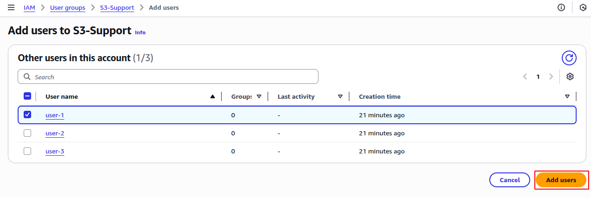
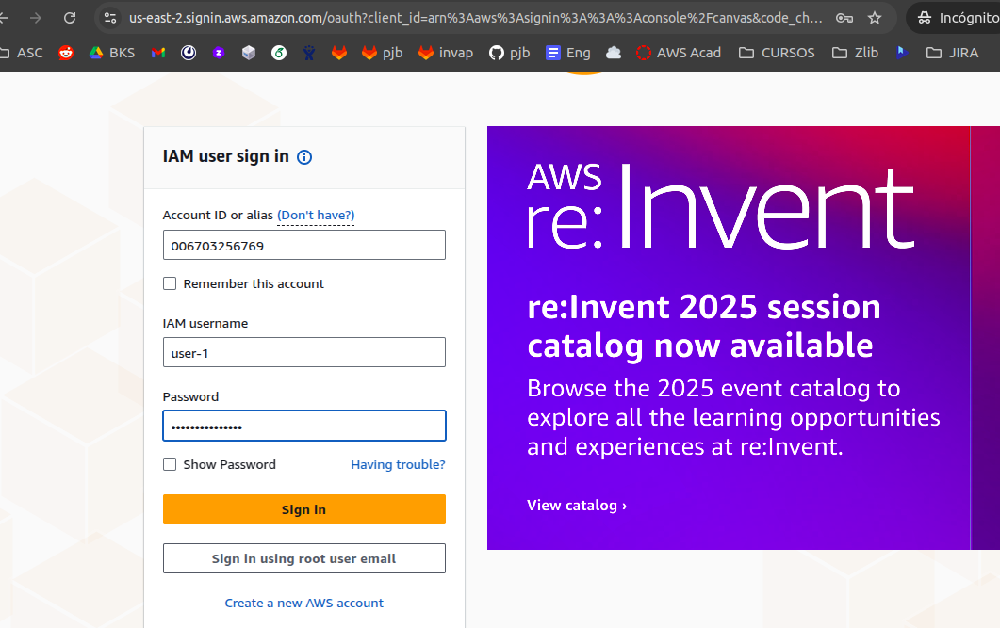

# Introduction to AWS Identity and Access Management (IAM)

## Lab Overview
AWS Identity and Access Management (IAM) is a web service that enables Amazon Web Services (AWS) customers to manage users and user permissions in AWS. With IAM, you can centrally manage users, security credentials such as access keys, and permissions that control which AWS resources users can access.

## Topics covered
This lab will demonstrate:

* Exploring pre-created IAM Users and Groups
* Inspecting IAM policies as applied to the pre-created groups
* Following a real-world scenario, adding users to groups with specific capabilities enabled
* Locating and using the IAM sign-in URL
* Experimenting with the effects of policies on service access

AWS Identity and Access Management

AWS Identity and Access Management (IAM) can be used to:

* Manage IAM Users and their access: You can create Users and assign them individual security credentials (access keys, passwords, and multi-factor authentication devices). You can manage permissions to control which operations a User can perform.

* Manage IAM Roles and their permissions: An IAM Role is similar to a User, in that it is an AWS identity with permission policies that determine what the identity can and cannot do in AWS. However, instead of being uniquely associated with one person, a Role is intended to be assumable by anyone who needs it.

* Manage federated users and their permissions: You can enable identity federation to allow existing users in your enterprise to access the AWS Management Console, to call AWS APIs and to access resources, without the need to create an IAM User for each identity.

## Task 1: Explore the Users and Groups
In this task, you will explore the Users and Groups that have already been created for you in IAM.

1. At the top of the AWS Management Console, in the search bar, search for and choose IAM.

2. In the navigation pane on the left, choose Users.

The following IAM Users have been created for you:
* user-1
* user-2
* user-3


3. Choose user-1.
This will bring to a summary page for user-1. The Permissions tab will be displayed.

4. Notice that user-1 does not have any permissions.

Note: You should see an Unexpected error message. This is normal.

5. Choose the Groups tab.
user-1 also is not a member of any groups.

6. Choose the Security credentials tab.
user-1 is assigned a Console password


7. In the navigation pane on the left, choose User groups.
The following groups have already been created for you:
* EC2-Admin
* EC2-Support
* S3-Support


8. Choose the EC2-Support group.
This will bring you to the summary page for the EC2-Support group.

9. Choose the Permissions tab.
This group has a Managed Policy associated with it, called AmazonEC2ReadOnlyAccess. Managed Policies are pre-built policies (built either by AWS or by your administrators) that can be attached to IAM Users and Groups. When the policy is updated, the changes to the policy immediately apply against all Users and Groups to which the policy is attached.


10. Choose AmazonEC2ReadOnlyAccess under the Permissions tab and a new browser window opens. Now choose JSON.

A policy defines what actions are allowed or denied for specific AWS resources. This policy is granting permission to List and Describe information about EC2, Elastic Load Balancing, CloudWatch and Auto Scaling. This ability to view resources, but not modify them, is ideal for assigning to a Support role.

The basic structure of the statements in an IAM Policy is:

* Effect says whether to Allow or Deny the permissions.

* Action specifies the API calls that can be made against an AWS Service (eg cloudwatch:ListMetrics).

* Resource defines the scope of entities covered by the policy rule (eg a specific Amazon S3 bucket or Amazon EC2 instance, or * which means any resource).

```
{
    "Version": "2012-10-17",
    "Statement": [
        {
            "Effect": "Allow",
            "Action": [
                "ec2:Describe*",
                "ec2:GetSecurityGroupsForVpc"
            ],
            "Resource": "*"
        },
        {
            "Effect": "Allow",
            "Action": "elasticloadbalancing:Describe*",
            "Resource": "*"
        },
        {
            "Effect": "Allow",
            "Action": [
                "cloudwatch:ListMetrics",
                "cloudwatch:GetMetricStatistics",
                "cloudwatch:Describe*"
            ],
            "Resource": "*"
        },
        {
            "Effect": "Allow",
            "Action": "autoscaling:Describe*",
            "Resource": "*"
        }
    ]
}
```
11. In the navigation pane on the left, choose User groups.

12. Choose the S3-Support group.
The S3-Support group has the AmazonS3ReadOnlyAccess policy attached.

13. Choose AmazonS3ReadOnlyAccess under the Permissions tab and a new browser window opens. Now choose JSON.
This policy has permissions to Get and List resources in Amazon S3.


```
{
    "Version": "2012-10-17",
    "Statement": [
        {
            "Effect": "Allow",
            "Action": [
                "s3:Get*",
                "s3:List*",
                "s3:Describe*",
                "s3-object-lambda:Get*",
                "s3-object-lambda:List*"
            ],
            "Resource": "*"
        }
    ]
}
```
14. In the navigation pane on the left, choose User groups.

15. Choose the EC2-Admin group.
This Group is slightly different from the other two. Instead of a Managed Policy, it has an Inline Policy, which is a policy assigned to just one User or Group. Inline Policies are typically used to apply permissions for one-off situations.

16. Choose EC2-Admin-Policy under the Permissions tab. Now choose JSON tab.
This policy grants permission to view (Describe) information about Amazon EC2 and also the ability to Start and Stop instances.


```
{
    "Version": "2012-10-17",
    "Statement": [
        {
            "Effect": "Allow",
            "Action": [
                "ec2:Describe*",
                "ec2:GetSecurityGroupsForVpc"
            ],
            "Resource": "*"
        },
        {
            "Effect": "Allow",
            "Action": "elasticloadbalancing:Describe*",
            "Resource": "*"
        },
        {
            "Effect": "Allow",
            "Action": [
                "cloudwatch:ListMetrics",
                "cloudwatch:GetMetricStatistics",
                "cloudwatch:Describe*"
            ],
            "Resource": "*"
        },
        {
            "Effect": "Allow",
            "Action": "autoscaling:Describe*",
            "Resource": "*"
        }
    ]
}
```

17. At the bottom of the screen, choose Cancel and then choose Continue to close the policy.

### Business Scenario
For the remainder of this lab, you will work with these Users and Groups to enable permissions supporting the following business scenario:

Your company is growing its use of Amazon Web Services, and is using many Amazon EC2 instances and a great deal of Amazon S3 storage. You wish to give access to new staff depending upon their job function:


## Task 2: Add Users to Groups
You have recently hired user-1 into a role where they will provide support for Amazon S3. You will add them to the S3-Support group so that they inherit the necessary permissions via the attached AmazonS3ReadOnlyAccess policy.

 You can ignore any “not authorized” errors that appear during this task. They are caused by your lab account having limited permissions and will not impact your ability to complete the lab.

### Add user-1 to the S3-Support Group 
1. In the left navigation pane, choose User groups.

2. Choose the S3-Support group.

3. Choose the Users tab.

4. In the Users tab, choose Add users.

5. In the Add users to Group window, configure the following:
* Select  user-1.
* At the bottom of the screen, choose Add users.

In the Users tab you will see that user-1 has been added to the group.




### Add user-2 to the EC2-Support Group
 You have hired user-2 into a role where they will provide support for Amazon EC2.

1. Using similar steps to the ones above, add user-2 to the EC2-Support group.

user-2 should now be part of the EC2-Support group.


### Add user-3 to the EC2-Admin Group
 You have hired user-3 as your Amazon EC2 administrator, who manage your EC2 instances.

1. Using similar steps to the ones above, add user-3 to the EC2-Admin group.

 user-3 should now be part of the EC2-Admin group.

2. In the navigation pane on the left, choose User groups.

Each Group should have a 1 in the Users column for the number of Users in each Group.

If you do not have a 1 beside each group, revisit the above instructions to ensure that each user is assigned to a Group, as shown in the table in the Business Scenario section.

## Task 3: Sign-In and Test Users
In this task, you will test the permissions of each IAM User.

1. In the navigation pane on the left, choose Dashboard.
An IAM users Sign-in URL is displayed It will look similar to: https://123456789012.signin.aws.amazon.com/console
This link can be used to sign-in to the AWS Account you are currently using.

2. Copy the IAM users Sign-in URL to a text editor.

3. Open a private window.
Mozilla Firefox
* Choose the menu bars  at the top-right of the screen
* Select New Private Window
Google Chrome
* Choose the ellipsis  at the top-right of the screen
* Choose New Incognito window
Microsoft Edge
* Choose the ellipsis  at the top-right of the screen
* Choose New InPrivate window
Microsoft Internet Explorer
* Choose the Tools menu option
* Choose InPrivate Browsing

4. Paste the IAM users sign-in link into your private window and press Enter.
You will now sign-in as user-1, who has been hired as your Amazon S3 storage support staff.

5. Sign-in with:
* IAM username: user-1
* Password: Paste the value of AdministratorPassword located to the left of these instructions.




6. At the top of the AWS Management Console, in the search bar, search for and choose S3.

7. Choose the bucket that has s3bucket in its name.
The name of your S3 bucket is also located to the left of these instructions.
Since your user is part of the S3-Support Group in IAM, they have permission to view a list of Amazon S3 buckets and the contents of the s3bucket.
Now, test whether they have access to Amazon EC2.

8. At the top of the AWS Management Console, in the search bar, search for and choose EC2.

9. Navigate to the region that your lab was launched in by:
* Choosing the drop-down  arrow at the top of the screen, to the left of Support
* Selecting the region value that matches the value of Region to the left of these instructions

10. In the left navigation pane, choose Instances.
You cannot see any instances. This is because your user has not been assigned any permissions to use Amazon EC2.


You will now sign-in as user-2, who has been hired as your Amazon EC2 support person.

11. Sign user-1 out of the AWS Management Console by completing the following actions:
* At the top of the screen, choose user-1
* Choose Sign out

12. Paste the IAM users sign-in link into your private window and press Enter.
This links should be in your text editor.

13. Sign-in with:
* IAM user name: user-2
* Password: Paste the value of AdministratorPassword located to the left of these instructions.

14. At the top of the AWS Management Console, in the search bar, search for and choose EC2.

15. Navigate to the region that your lab was launched in by:
* Choosing the drop-down  arrow at the top of the screen, to the left of Support
* Selecting the region value that matches the value of Region to the left of these instructions

16. In the navigation pane on the left, choose Instances.
You are now able to see an Amazon EC2 instance because you have Read Only permissions. However, you will not be able to make any changes to Amazon EC2 resources.
Your EC2 instance should be selected  If it is not selected, select  it.

17. In Instance state, menu choose Stop instance.


18. In the Stop instance window, choose Stop.
You will receive an error stating You are not authorized to perform this operation. This demonstrates that the policy only allows you to information, without making changes.

19. Close the displayed error message.
Next, check if user-2 can access Amazon S3.

20. At the top of the AWS Management Console, in the search bar, search for and choose S3.
You will receive an  Error Access Denied because user-2 does not permission to use Amazon S3.


21. You will now sign-in as user-3, who has been hired as your Amazon EC2 administrator.

22. Sign user-2 out of the AWS Management Console by completing the following actions:
* At the top of the screen, choose user-2
* Choose Sign out

23. Paste the IAM users sign-in link into your private window and press Enter.

24. Paste the sign-in link into your web browser address bar again. If it is not in your clipboard, retrieve it from the text editor where you stored it earlier.

25. Sign-in with:
* IAM user name: user-3
* Password: Paste the value of AdministratorPassword located to the left of these instructions.

26. At the top of the AWS Management Console, in the search bar, search for and choose EC2.

27. Navigate to the region that your lab was launched in by:
* Choosing the drop-down  arrow at the top of the screen, to the left of Support
* Selecting the region value that matches the value of Region to the left of these instructions

28. In the navigation pane on the left, choose Instances.
* As an EC2 Administrator, you should now have permissions to Stop the Amazon EC2 instance.
* Your EC2 instance should be selected . If it is not, please select  it.

29. In Instance state, menu choose Stop instance.

30. In the Stop Instance window, choose Stop.
The instance will enter the stopping state and will shutdown.
31. Close your private window.

# Conclusion
* Explored pre-created IAM users and groups
* Inspected IAM policies as applied to the pre-created groups
* Followed a real-world scenario, adding users to groups with specific capabilities enabled
* Located and used the IAM sign-in URL
* Experimented with the effects of policies on service access

# Additional resources
https://aws.amazon.com/es/iam/ 

# Assessment 
Question 1
Answer status:
Correct
Question
What type of IAM policy is managed by AWS and cannot be modified by users?
Question Type
Multiple Choice
Answer Options
Option
Your Selection
Correct Answer
Rationale
Customer managed policy
Not selected
Incorrect
Customer managed policies are created and managed by users, offering more flexibility than AWS managed policies.
Group policy
Not selected
Incorrect
Group policies can be either inline or managed policies attached to a group, and can be modified by users with appropriate permissions.
AWS managed policy
Selected
Correct
AWS managed policies are created and managed by AWS. They are designed for common use cases and cannot be modified by users.
Inline policy
Not selected
Incorrect
Inline policies are created and managed by users, embedded directly in a single user, group, or role.
Question 2
Answer status:
Correct
Question
Which of the following best describes the principle of least privilege in IAM?
Question Type
Multiple Choice
Answer Options
Option
Your Selection
Correct Answer
Rationale
Granting users all possible permissions
Not selected
Incorrect
This goes against the principle of least privilege and can pose security risks.
Granting users only the permissions they need to perform their tasks
Selected
Correct
This is correct. The principle of least privilege involves giving users only the permissions necessary for their specific roles.
Denying all permissions by default
Not selected
Incorrect
While IAM does deny by default, the principle of least privilege is about granting necessary permissions, not denying all.
Sharing admin credentials among all users
Not selected
Incorrect
This is a security risk and goes against AWS best practices.
Question 3
Answer status:
Correct
Question
Which of the following is a benefit of using IAM Roles?
Question Type
Multiple Choice
Answer Options
Option
Your Selection
Correct Answer
Rationale
They provide permanent credentials
Not selected
Incorrect
IAM Roles provide temporary credentials, not permanent ones.
They allow you to avoid using IAM users
Not selected
Incorrect
While Roles can reduce the need for some IAM users, they don't completely replace the need for IAM users.
They grant permissions without sharing long-term access keys
Selected
Correct
This is correct. IAM Roles allow you to grant permissions to entities without sharing long-term access keys, improving security.
They automatically scale your AWS resources
Not selected
Incorrect
IAM Roles are not related to scaling resources; this is typically handled by services like Auto Scaling.
Question 4
Answer status:
Correct
Question
What does IAM use to define permissions for users, groups, and roles?
Question Type
Multiple Choice
Answer Options
Option
Your Selection
Correct Answer
Rationale
Templates
Not selected
Incorrect
Templates might be used in other AWS services, but IAM specifically uses policies to define permissions.
Certificates
Not selected
Incorrect
Certificates are used for authentication and encryption, not for defining permissions in IAM.
Policies
Selected
Correct
IAM uses policies to define permissions. These are JSON documents that specify what actions are allowed or denied on what AWS resources.
Scripts
Not selected
Incorrect
While scripts can be used to automate IAM tasks, they are not used to define permissions directly.
Question 5
Answer status:
Incorrect
Question
A company wants to allow their employees to use their existing corporate credentials to access AWS resources. Which IAM feature should they implement?
Question Type
Multiple Choice
Answer Options
Option
Your Selection
Correct Answer
Rationale
IAM Roles
Not selected
Incorrect
While IAM Roles can be used with federated users, they don't provide the authentication mechanism itself.
IAM Groups
Not selected
Incorrect
IAM Groups are used to organize IAM Users and manage permissions collectively, not for external authentication.
IAM Users
Selected
Incorrect
IAM Users are individual identities created within AWS, not suitable for using existing corporate credentials.
Identity Federation
Not selected
Correct
Identity Federation allows users to access AWS resources using their existing corporate credentials, which is the requirement in this scenario.
