# Performing a Basic Audit of Your AWS Environment

## Lab overview
In this lab, you perform basic audits of core AWS resources. You use the AWS Management Console to understand how to audit the use of multiple AWS services, such as Amazon EC2, Amazon VPC, Amazon IAM, Amazon Security Groups, AWS CloudTrail, and Amazon CloudWatch. This lab teaches you how to extend your existing auditing objectives related to organizational Governance, Asset Configuration, Logical Access Controls, Operating Systems, Databases, and Applications security configurations within AWS.

## Objectives
By the end of this lab, you will be able to do the following:
* Review user permissions in AWS IAM.
* Capture audit evidence using AWS IAM Policy Simulator.
* Review Inbound and Outbound networking rules for Amazon EC2 Security Groups.
* Review Amazon VPC configurations, subnets, and Network ACLs.
* Review Amazon CloudWatch performance metrics.
* Review raw Amazon CloudTrail logs within Amazon S3.

## Task 1: Audit user permissions in IAM
AWS Identity and Access Management (IAM) enables you to securely control access to AWS services and resources for your users. Using IAM, you can create and manage AWS users and groups and use permissions to allow and deny their access to AWS resources.

In this lab, you launch IAM secure AWS Access Control in order to review permissions, group assignments and roles associated with the auditing instance:

### Review your permissions
1. At the top of the AWS Management Console, in the search bar, search for and choose IAM.

2. In the navigation pane at the left of the page, under Access management, choose Users.

3. On the Users page, choose the link for user-1 to view its details.

4. Review the Summary section for information about your user.

5. Select the Security credentials tab to review it.

Here, you can see how many access keys a user has, when an access key was created, whether a Multi-Factor Authentication (MFA) device is assigned, and more.

* Access Keys: Keys can be active or inactive and only administrators have the ability to inactivate or delete keys. If a user with limited permissions tried to deactivate or delete an access key, they would receive a message similar to the following:
We encountered the following errors while processing your request: User:arn:aws:iam::111122223333:user/user-1_01 is not authorized to perform: iam:UpdateAccessKey on resource: user user-1_01
* Signing Certificates: Can be signed certificates, X.509 Certificate and/or third party tools (e.g. OpenSSL).
* Console password: Users with access to the AWS Management Console require a password. Passwords can be generated and/or changed by administrators within the IAM dashboard. Passwords can be auto-generated or custom-generated based on organization preferences.
* Assigned MFA (Multi-Factor Authentication) Device: Multi-Factor Authentication is a simple best practice that adds an extra layer of protection on top of your username and password.
* Virtual: Use your existing smartphone, tablet, or computer running any application that supports the open TOTP standard. https://datatracker.ietf.org/doc/html/rfc6238
* Hardware Keyfob: Tamper-evident hardware keyfob device provided by Gemalto, a 3rd-party provider.
* Hardware Display Card: Tamper-evident hardware display card device provided by Gemalto, a 3rd-party provider.

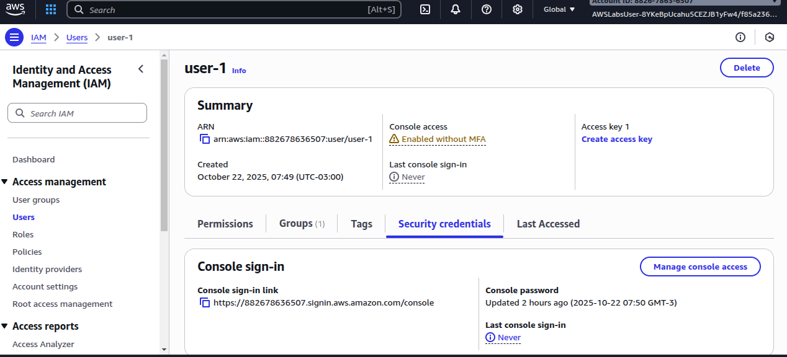
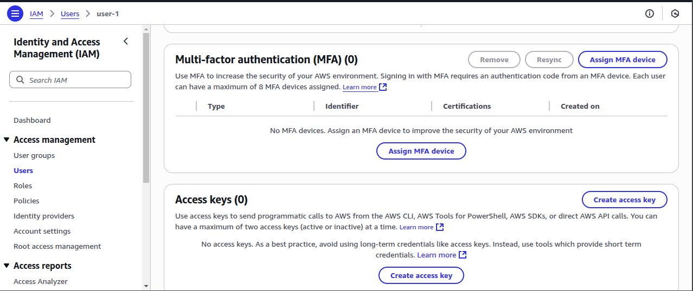
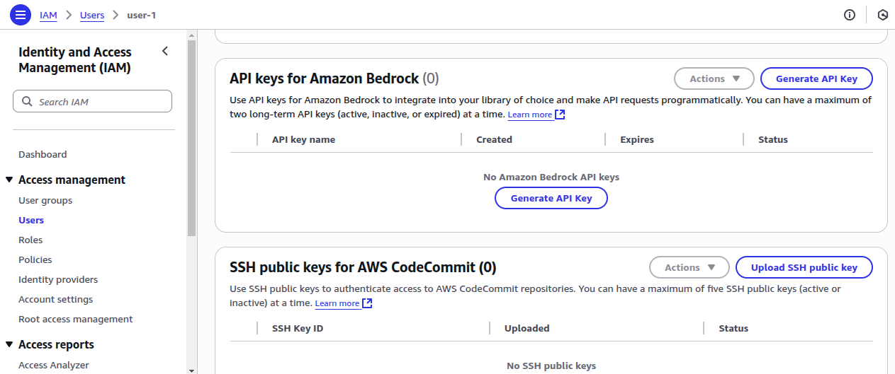
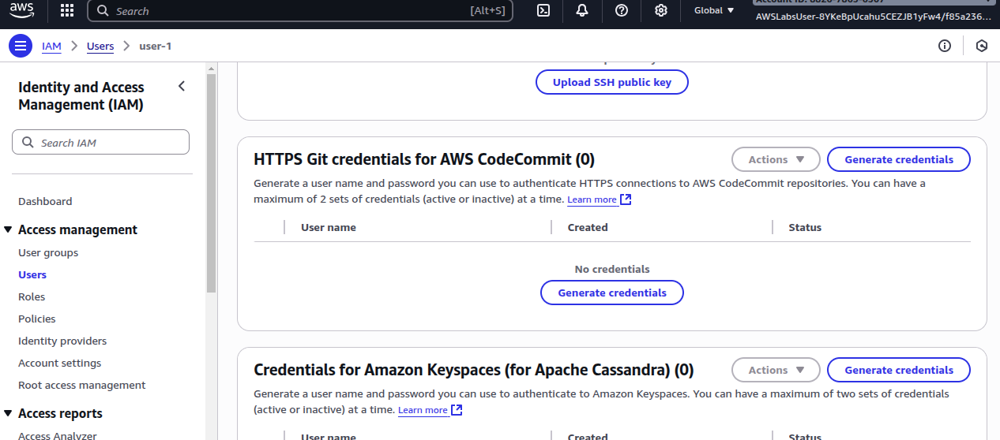
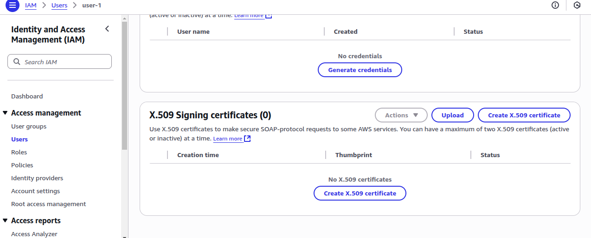


6. Choose the Groups tab.
Consider: Which groups is user-1 associated with?
Notice that user-1 is a member of the user1group group. Groups are a collection of IAM users. Administrators use groups to specify permissions for a collection of users to manage those permissions more efficiently.

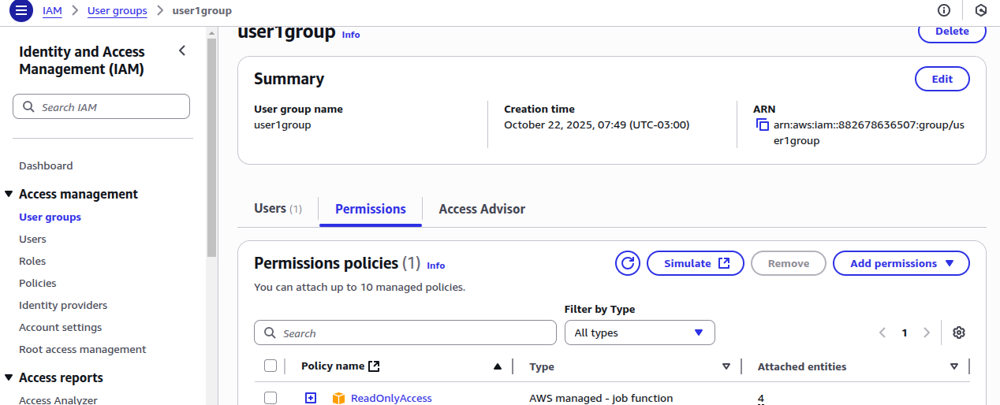

```
{
    "Version": "2012-10-17",
    "Statement": [
        {
            "Sid": "ReadOnlyActionsGroup1",
            "Effect": "Allow",
            "Action": [
                "a4b:Get*",
                "a4b:List*",
                "a4b:Search*",
                "access-analyzer:GetAccessPreview",
                "access-analyzer:GetAnalyzedResource",
                "access-analyzer:GetAnalyzer",
                "access-analyzer:GetArchiveRule",
                "access-analyzer:GetFinding",
                "access-analyzer:GetFindingsStatistics",
                "access-analyzer:GetGeneratedPolicy",
                ................
                "ivs:ListTagsForResource",
                "ivschat:GetLoggingConfiguration",
                "ivschat:GetRoom",
                "ivschat:ListLoggingConfigurations",
                "ivschat:ListRooms",
                "ivschat:ListTagsForResource"
            ],
            "Resource": "*"
        },
        {
            "Sid": "ReadOnlyActionsGroup2",
            "Effect": "Allow",
            "Action": [
                "kafka:Describe*",
                "kafka:DescribeCluster",
                "kafka:DescribeClusterOperation",
                "kafka:DescribeClusterV2",
                "kafka:DescribeConfiguration",
                "workspaces-web:ListUserAccessLoggingSettings",
                "workspaces-web:ListUserSettings",
                "workspaces:Describe*",
                "xray:BatchGet*",
                "xray:Get*"
            ],
            "Resource": "*"
        }
    ]
}
```

### Run the IAM Policy Simulator
You can use the IAM Policy Simulator to test the effects of AWS IAM policies to test your existing IAM policies to verify that they have the intended effect and capture the Policy Simulator output to use as supporting evidence in user access reviews.

1. Choose the Permissions tab.
In the Permissions policies section, notice there is one policy attached to the user. The Attached via column shows that the ReadOnlyAccess policy is attached to user-1 via the user1group IAM group.

2. To run the IAM Policy Simulator, open the following link in a new web browser tab: IAM Policy Simulator.
https://policysim.aws.amazon.com/

3. On the IAM Policy Simulator page, in the Users, Groups, and Roles pane, choose user-1.

4. In the Policy Simulator pane, on the Select service drop-down menu, choose Identity and Access Management.

5. On the Select actions drop-down menu, select the following options:
* DeleteGroup
* DeleteRolePolicy

6. Choose Run Simulation.

Expected output: The Action Settings and Results section displays the effective permissions for user-1, similar to this:


Consider: Why do you think think both actions were denied?

Recall that the policy attached to user-1 is a read-only policy. Any actions that could allow changes to a service or resource are denied.

7. Close the IAM Policy Simulator web browser tab.
Learn more: For more information about the IAM Policy Simulator, refer to Testing IAM policies with the IAM policy simulator in the Additional resources section.

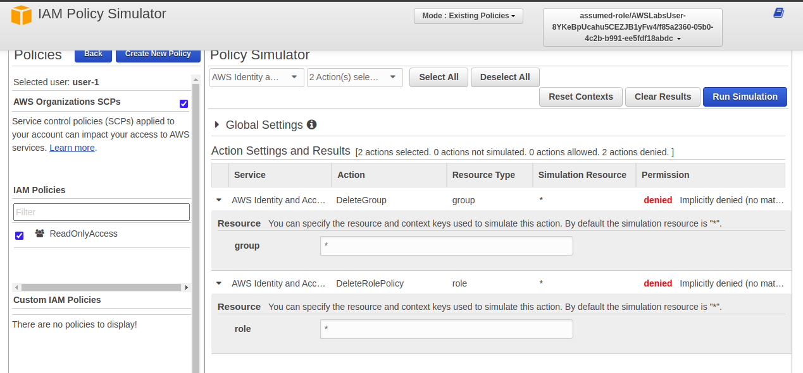

### Collecting audit evidence
From an audit evidence standpoint, you can capture the IAM settings and the IAM Policy Simulator output to be used as support evidence in user access reviews.

Congratulations! You have successfully audited the permissions assigned to an IAM user.

## Task 2: Review the security configuration of Amazon EC2 instances
### What is Amazon EC2?
Amazon Elastic Compute Cloud (Amazon EC2) is a web service that provides resizable compute capacity in the cloud. It is designed to make web-scale computing easier for developers. Amazon EC2 presents a true virtual computing environment, allowing you to use web service interfaces to launch instances with a variety of operating systems, load them with your custom application environment, manage your network’s access permissions, and run your image using as many or few systems as you desire.

### What is a security group?
A security group acts as a virtual firewall for your instance to control inbound and outbound traffic. Security groups act at the instance level, not the subnet level. For each security group, you add rules that control the inbound traffic to instances and a separate set of rules that control the outbound traffic.

The following are basic characteristics of security groups:
* You can specify allow rules, but not deny rules.
* You can specify separate rules for inbound and outbound traffic.
* By default, no inbound traffic is allowed until you add inbound rules to the security group.
* By default, all outbound traffic is allowed until you add outbound rules to the group. Then, you specify the outbound traffic that is allowed.
* Responses to allowed inbound traffic are allowed to flow outbound regardless of outbound rules and vice versa, as security groups are therefore stateful.
* Instances associated with a security group can’t talk to each other unless you add rules allowing it.
Exception: The default security group has these rules by default.
* After you launch an instance, you can change which security groups the instance is associated with.

### Review running Amazon EC2 instances
1. At the top of the AWS Management Console, in the search bar, search for and choose EC2.

2. In the navigation pane at the left of the page, under Instances, choose Instances.

In this lab environment, there are three running instances: Web Server, Bastion Host, and SQL Server.

### Review the web server security group
1. In the navigation pane at the left of the page, under Network & Security, choose Security Groups.

2. Select WebServerSG.

3. In the details pane at the bottom of the page, choose the Inbound rules tab.

4. Review the Inbound rules.

 Consider: Are the inbound rules what you would expect for a web server in a restricted access environment?

The WebServerSG security group demonstrates a security-focused configuration. Unlike typical public-facing web servers that allow HTTP/HTTPS access from anywhere, this configuration implements a more restrictive security posture by:

* Limiting web traffic (ports 80/443) to a specific IP range (10.10.10.0/24) Restricting RDP access (port 3389) to connections from the BastionSG security group only
* This restricted configuration is typical for internal web applications, development environments, or services requiring controlled access. Even if an EC2 instance in the same subnet as the Web Server attempts to connect via RDP, it is only allowed if the BastionSG security group is associated with it.

Note: When configuring security group rules, you can specify sources such as specific CIDR ranges, My IP, or security group IDs. While anywhere (0.0.0.0/0) access is common for public web servers, using more restrictive sources aligns with security best practices and the principle of least privilege.

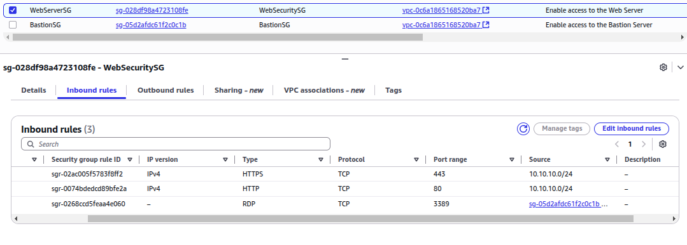
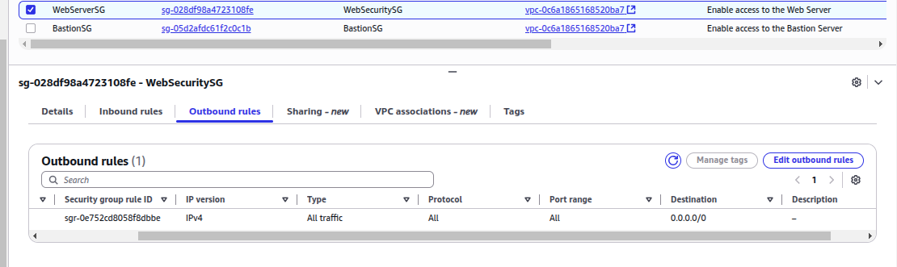

### Review the bastion host security group
1. Clear WebServerSG.
2. Select BastionSG.

A bastion host is a special purpose server on a network specifically designed and configured to withstand attacks. The computer generally hosts a single application (such as a proxy server) and all other services are removed or limited to reduce threats to the computer. It is hardened in this manner primarily due to its location and purpose, which is typically on the outside of the firewall and usually involves access from untrusted networks or computers.
http://en.wikipedia.org/wiki/Proxy_server 
http://en.wikipedia.org/wiki/Firewall_%28computing%29

3. To review the inbound and outbound rules, choose the Inbound rules and Outbound rules tabs respectively.
Consider: Are the Inbound and Outbound rules what you would expect for the bastion host?

The Bastion host should be set to accept traffic from your management network. Notice that the Bastion host instance is specifically set up to allow TCP port 22 (SSH) and TCP port 3389 (RDP) from an IP range of 10.10.10.0/24. Think of this IP range as your data center management network which can be reached via a private network.

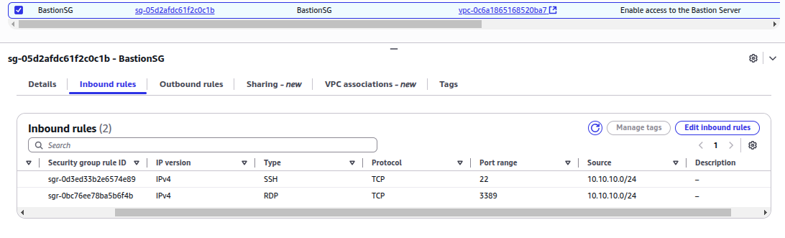
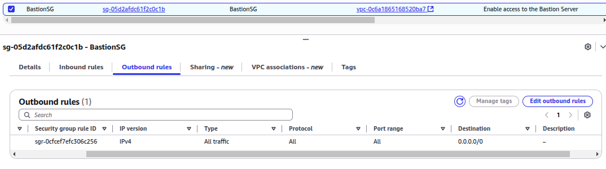

### Review the SQL server security group
1. Clear BastionSG.
2. Select SQLSG.
3. To review the inbound rules, choose the Inbound rules tab.

Consider: Are the inbound rules what you would expect for the SQL Server?

Notice that the inbound rules are configured with a custom source—a security group ID from this account.

4. To review the outbound rules, choose the Outbound rules tab.
 Consider: Are the Outbound Rules what you would expect for the SQL Server?

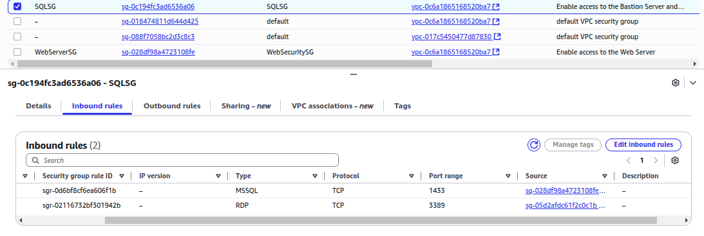
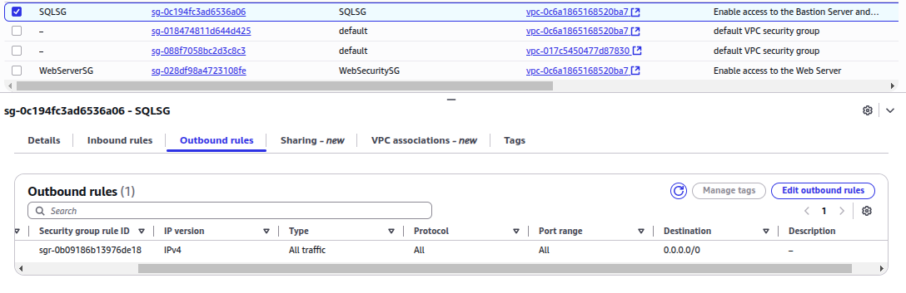


### Collecting audit evidence
From an audit evidence standpoint, these findings can support your resource access isolation and data protection from internal or external threats. All access to the SQL Server instance is restricted via a jump box (Bastion Host); therefore, no internal user has direct access to it. Externally, the SQL Server only communicates with the web service via the WebServerSG and SQLSG security groups.

 Congratulations! You have successfully reviewed the security group configuration for each EC2 instance in the environment.

### Task 3: Review Amazon VPC security configurations
### What is Amazon VPC?
Amazon Virtual Private Cloud (Amazon VPC) permits you to launch AWS resources into a virtual network that you have defined. This virtual network closely resembles a traditional network that you would operate in your own data center, with the benefits of using the scalable infrastructure of AWS. You have complete control over your virtual networking environment, including selection of your own IP address range, creation of subnets, and configuration of route tables and network gateways.
https://prezi.com/p/ntgdys4iabr9/amazon-vpc-security/

Amazon VPC provides two features that you can use to increase security for your VPC:

* Security Groups: Act as a firewall for associated Amazon EC2 instances, controlling both inbound and outbound traffic at the instance level.
* Network Access Control Lists (ACLs): Act as a firewall for associated subnets, controlling both inbound and outbound traffic at the subnet level.

When you launch an instance in a VPC, you can associate one or more security groups that you have created. Each instance in your VPC could belong to a different set of security groups. If you do not specify a security group when you launch an instance, the instance automatically belongs to the default security group for the VPC.

### Locate Amazon EC2 instance VPC configurations
1. In the navigation pane at the left of the page, under Instances, choose Instances.
2. Select Web Server.
The Details pane appears below the list of instances that shows information about the instance you selected.
3. In the Instance summary section, locate the VPC ID value and copy it to your favorite text editor.
 Note: The VPC ID should look similar to: vpc-0586914dd2bce2335.

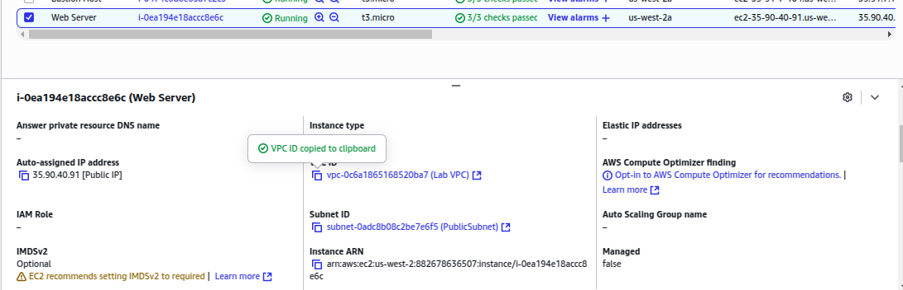

vpc-0c6a1865168520ba7

Every VPC is associated with a VPC ID. In the next section, you identify the VPC that is associated with this VPC ID.

### Review existing VPCs, subnets, and NACLs
In this section, you review your existing VPCs, subnets, and Network ACL capabilities within a Virtual Private Cloud.

1. At the top of the AWS Management Console, in the search bar, search for and choose VPC.
2. In the navigation pane at the left of the page, under Virtual private cloud, choose Your VPCs.
3. Select Lab VPC.
The Details pane appears below the list of VPCs that shows the configuration elements for the selected VPC.

4. Notice that the VPC ID value is the same VPC ID value that you copied to your text editor.

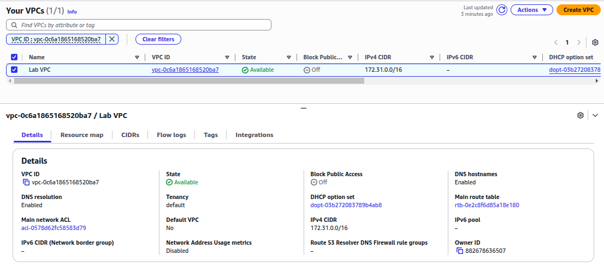

5. In the Details section, choose the Main network ACL link.
6. On the Network ACLs page, select the Network ACL which has a Default parameter value of Yes.
Note: There should only be one choice.

7. To review the inbound and outbound rules, in the Details pane at the bottom of the page, choose the Inbound rules and Outbound rules tabs respectively.
 Note: As audit evidence, you can see how the VPC is using ACLs to communicate with an external network via explicit protocols.

 Congratulations! You have successfully reviewed the details of the lab VPC.

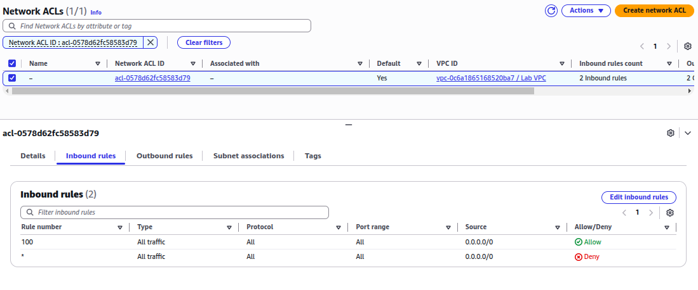
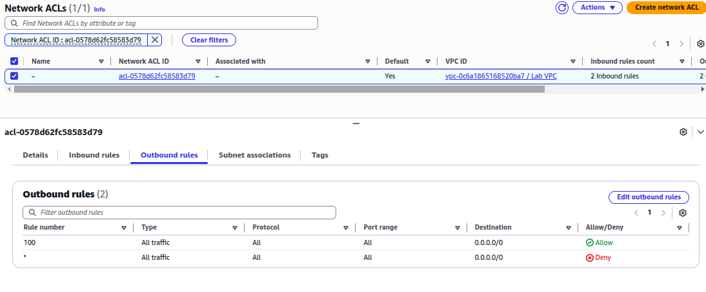

## Task 4: Audit CloudWatch metrics and alarms
In this task, you review built-in CloudWatch metrics, alarms, and service health associated with running instances, storage volumes, and data services within the auditing instance.

### What is Amazon CloudWatch?
Amazon CloudWatch is a monitoring and management service built for developers, system operators, site reliability engineers (SREs), and IT managers. CloudWatch provides you with data and actionable insights to monitor your applications, understand and respond to system-wide performance changes, optimize resource utilization, and get a unified view of operational health. CloudWatch collects monitoring and operational data in the form of logs, metrics, and events, providing you with a unified view of AWS resources, applications and services that run on AWS, and on-premises servers. You can use CloudWatch to set high resolution alarms, visualize logs and metrics side by side, take automated actions, troubleshoot issues, and discover insights to optimize your applications, and ensure they are running smoothly.

### Audit CloudWatch metrics and alarms
1. At the top of the AWS Management Console, in the search bar, search for and choose CloudWatch.
2. In the navigation pane at the left of the page, in the Metrics section, choose All metrics.
3. On the Browse tab, choose EC2.
4. Choose Per-Instance Metrics.
5. In the Search box, search for CPUUtilization.

Expected output: The search results should display the three EC2 instance that you reviewed previously.

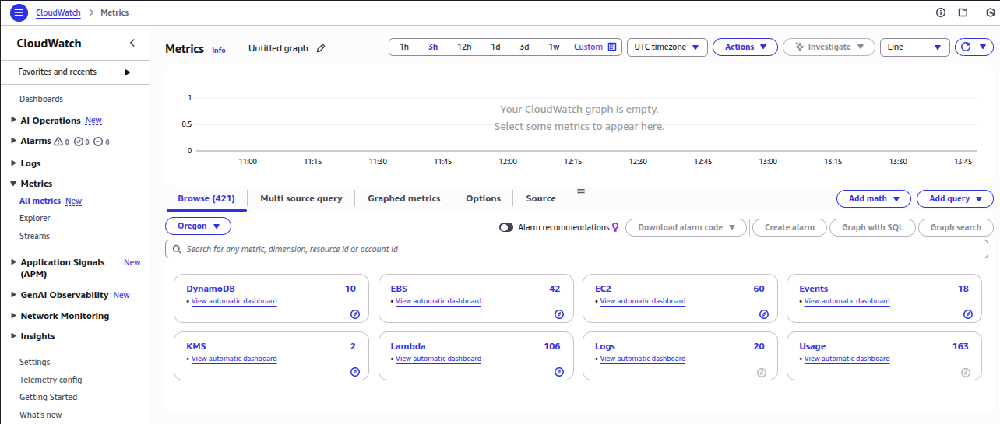
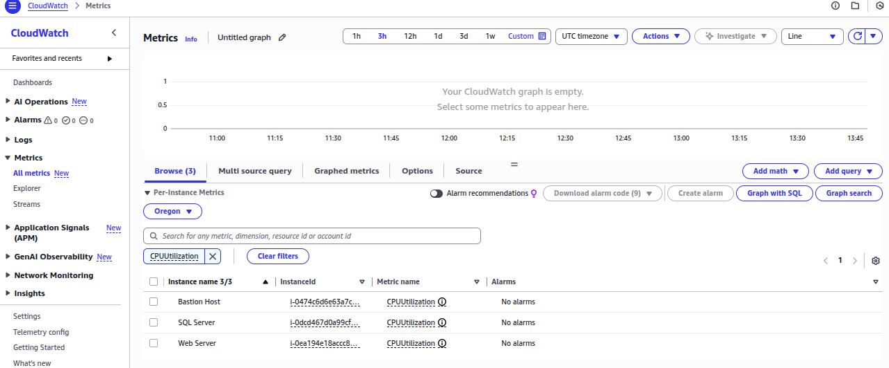

6. Select SQL Server.
7. Choose the Graphed metrics tab.
Note: You can change the Statistic and the Period settings to customize the view to your liking.

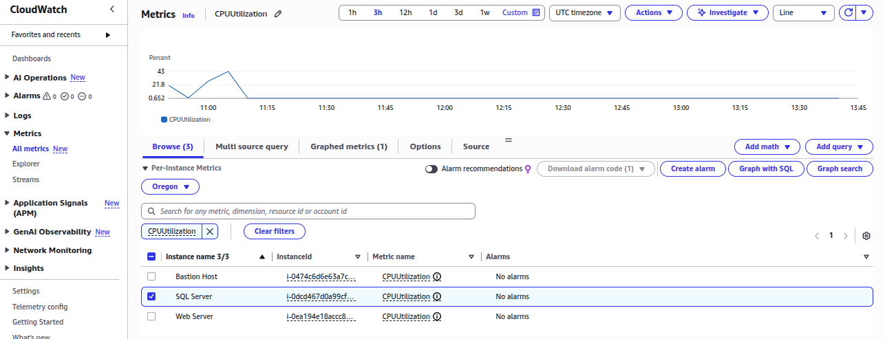

### Review CloudWatch data for EBS volumes
In addition to viewing Amazon CloudWatch metrics and alarms via the CloudWatch dashboard, you can also view the data in other locations. In this section, you review Amazon CloudWatch data for your Amazon EBS volumes.

1. At the top of the AWS Management Console, in the search bar, search for and choose EC2.
2. In the navigation pane at the left of the page, under Elastic Block Store, choose Volumes.
3. Select the Volume that is attached to the Web Server instance.
Note: To review the volume names and their attached instances, you might need to scroll to the right until you see the Attached Instances column header.
4. In the details pane at the bottom of the page, choose the Monitoring tab.
5. Review the CloudWatch metrics and any configured CloudWatch alarms.

Note: Amazon CloudWatch metrics can directly support several auditing elements and provide real-time audit evidence based on pre-defined criterion and custom criterion related to organization processes.

You have successfully reviewed where to locate CloudWatch metrics and alarms related to an EC2 instance.

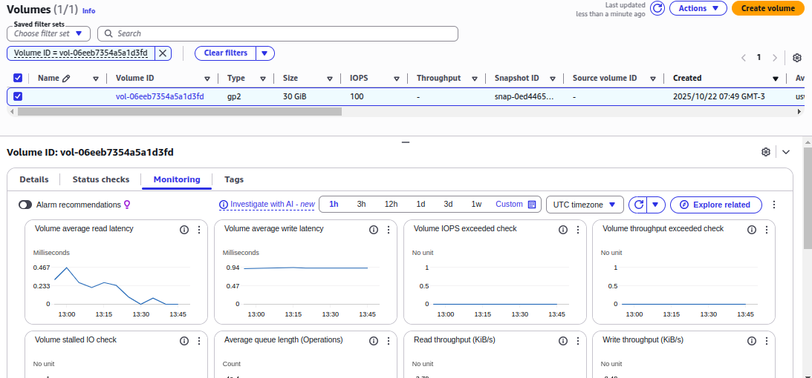

## Task 5: Audit CloudTrail logs
In this task, you use AWS CloudTrail to review configuration details and S3 storage locations.

### What is AWS CloudTrail?
AWS CloudTrail is a service that enables governance, compliance, operational auditing, and risk auditing of your AWS account. With CloudTrail, you can log, continuously monitor, and retain account activity related to actions across your AWS infrastructure. CloudTrail provides event history of your AWS account activity, including actions taken through the AWS Management Console, AWS SDKs, command line tools, and other AWS services. This event history simplifies security analysis, resource change tracking, and troubleshooting.

### Find CloudTrail logs
1. At the top of the AWS Management Console, in the search bar, search for and choose CloudTrail.
2. In the navigation pane at the left of the page, choose Trails.
3. Choose the LabCloudTrail link to view its details.
4. Review the CloudTrail configuration details.

Note: The LabCloudTrail trail was created using AWS CloudFormation when you started the lab. It’s configured to store logs in the Amazon S3 bucket with a name that starts with SPL73Logs, as defined by the Trail log location property.

5. At the top of the AWS Management Console, in the search bar, search for and choose S3.
6. Choose the link for the bucket name that starts with spl73logs.
7. Choose the AWSLogs/ link.
8. Continue selecting the links for the various folders until you get to a folder that represents the region your lab was launched in.

Note: The Region value is listed to the left of these instructions.

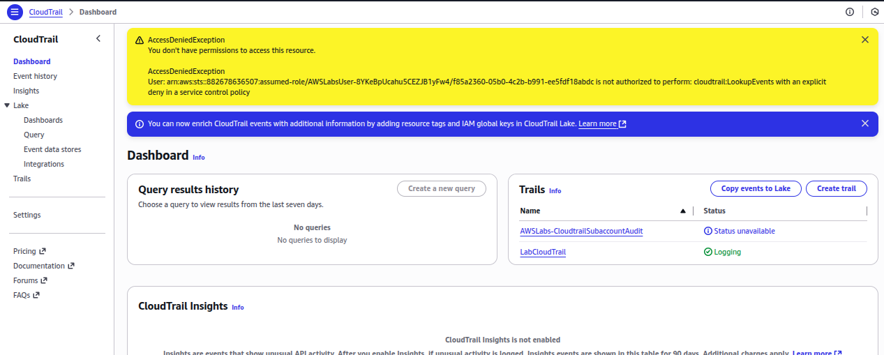
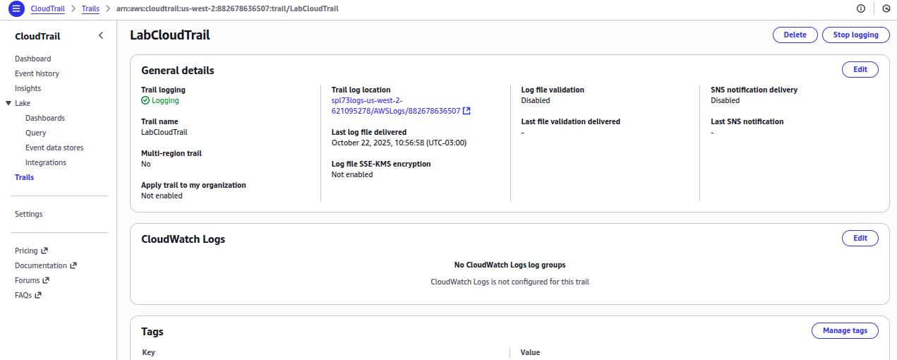
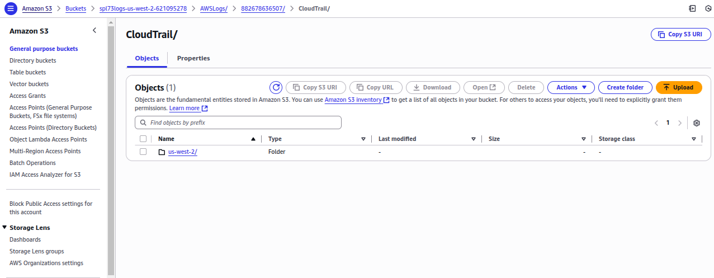
9. Continue selecting the links for the various folders, which represent today’s date, until you see a log file.
The log file name contains the AWS account number, AWS region, a numeric representation of the day’s date and time, and a unique identifier, similar to this: 111122223333_CloudTrail_us-east-1_20230314T1535Z_MArnLpySt8ZdwFnQ.json.gz

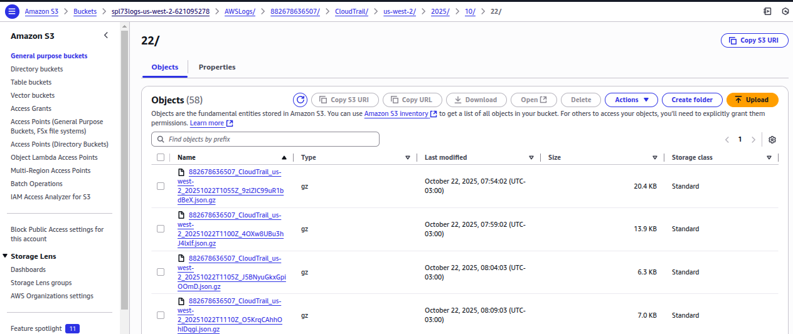
10. Choose the link for one of the log files, with a file name that ends in json.gz.

11. Choose Open.

 Expected output: Depending on your web browser settings, a new window or a new tab opens that displays the contents of the log file. It is in JSON format.

An alternate approach to viewing your Amazon CloudTrail logs is to download them locally and use a text editor along with the JSON Viewer plug-in.

3rd Party Solutions: AWS partners with third-party specialists in logging and analysis to provide solutions that leverage Amazon CloudTrail output, such as Splunk or Alert Logic.

 Congratulations! You have successfully reviewed the CloudTrail logs for an EC2 instance.

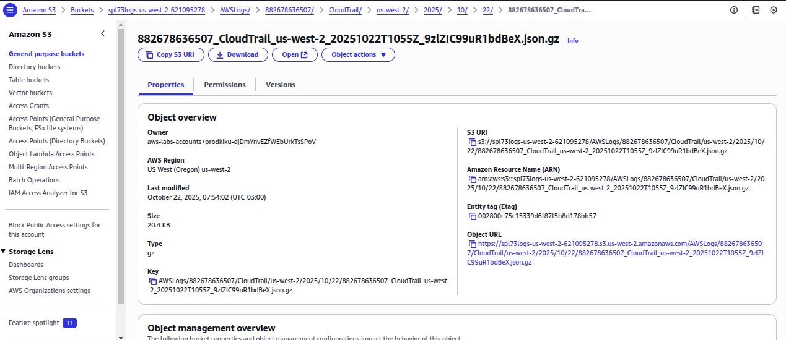

# Conclusion
You have now successfully:
* Reviewed user permissions in AWS IAM.
* Captured audit evidence using AWS IAM Policy Simulator.
* Reviewed Inbound and Outbound networking rules for Amazon EC2 Security Groups.
* Reviewed Amazon VPC configurations, subnets, and Network ACLs.
* Reviewed Amazon CloudWatch performance metrics.
* Reviewed raw Amazon CloudTrail logs within Amazon S3.

# Aditional resources
https://docs.aws.amazon.com/IAM/latest/UserGuide/access_policies_testing-policies.html 
https://aws.amazon.com/es/security/ 

# Knowledge check 
Question 1
Answer status:
Correct
Question
What is the default behavior of an Amazon EC2 security group for inbound traffic?
Question Type
Multiple Choice
Answer Options
Option
Your Selection
Correct Answer
Rationale
Allow only HTTP traffic
Not selected
Incorrect
This is incorrect. Security groups do not automatically allow any specific type of traffic by default.
Deny all inbound traffic
Selected
Correct
This is correct. By default, security groups deny all inbound traffic until specific allow rules are added.
Allow all inbound traffic
Not selected
Incorrect
This is incorrect. By default, security groups deny all inbound traffic for security reasons.
Allow only traffic from the same VPC
Not selected
Incorrect
This is incorrect. Security groups do not automatically allow traffic from the same VPC without specific rules.
Question 2
Answer status:
Correct
Question
What type of output does the IAM Policy Simulator provide that is useful for audit evidence?
Question Type
Multiple Choice
Answer Options
Option
Your Selection
Correct Answer
Rationale
Billing information
Not selected
Incorrect
The IAM Policy Simulator does not provide any billing information. This is handled by separate AWS billing and cost management tools.
User login history
Not selected
Incorrect
The IAM Policy Simulator does not provide user login history. This information is typically found in AWS CloudTrail logs.
Resource usage statistics
Not selected
Incorrect
Resource usage statistics are not part of the IAM Policy Simulator's output. These are typically found in AWS CloudWatch or Cost Explorer.
Simulated permission results
Selected
Correct
This is the correct answer. The IAM Policy Simulator provides simulated results of how policies would affect permissions, which is valuable audit evidence for reviewing access controls.
Question 3
Answer status:
Correct
Question
What types of data does Amazon CloudWatch collect for monitoring and operational purposes?
Question Type
Multiple Choice
Answer Options
Option
Your Selection
Correct Answer
Rationale
Only logs
Not selected
Incorrect
CloudWatch collects logs, but this is not the only type of data it collects.
Only network traffic data
Not selected
Incorrect
While network traffic data can be part of the metrics CloudWatch collects, it's not limited to just this type of data.
Logs, metrics, and events
Selected
Correct
This is the correct answer. CloudWatch collects monitoring and operational data in the form of logs, metrics, and events.
Only metrics
Not selected
Incorrect
While CloudWatch does collect metrics, it's not limited to just metrics.
Question 4
Answer status:
Correct
Question
Which AWS service is used to store raw CloudTrail logs?
Question Type
Multiple Choice
Answer Options
Option
Your Selection
Correct Answer
Rationale
Amazon RDS
Not selected
Incorrect
Amazon RDS is a relational database service and is not used for storing raw CloudTrail logs.
Amazon S3
Selected
Correct
Amazon S3 is the correct answer. CloudTrail is configured to store logs in Amazon S3 buckets, providing durable and scalable object storage for log files.
Amazon EBS
Not selected
Incorrect
Amazon EBS is used for block-level storage volumes for EC2 instances, not for storing CloudTrail logs.
Amazon EFS
Not selected
Incorrect
Amazon EFS is a file storage service for EC2 instances, not typically used for CloudTrail log storage.
Question 5
Answer status:
Correct
Question
In the AWS IAM console, where can you find information about which groups a user is associated with?
Question Type
Multiple Choice
Answer Options
Option
Your Selection
Correct Answer
Rationale
Groups tab
Selected
Correct
This is the correct tab where you can see which IAM groups the user belongs to.
Access Advisor tab
Not selected
Incorrect
This tab shows the services that the user has accessed and when, not their group associations.
Permissions tab
Not selected
Incorrect
This tab shows the policies attached to the user, not their group memberships.
Security credentials tab
Not selected
Incorrect
This tab shows information about access keys, MFA devices, and console passwords, not group associations.
Question 6
Answer status:
Correct
Question
How does a security group handle return traffic for allowed inbound connections?
Question Type
Multiple Choice
Answer Options
Option
Your Selection
Correct Answer
Rationale
It blocks all return traffic by default
Not selected
Incorrect
This is incorrect. Security groups do not block return traffic for allowed inbound connections.
It requires a separate outbound rule for return traffic
Not selected
Incorrect
This is incorrect. Due to the stateful nature of security groups, separate outbound rules are not needed for return traffic.
It automatically allows the return traffic
Selected
Correct
This is correct. Security groups are stateful, meaning they automatically allow return traffic for allowed inbound connections.
It only allows return traffic during business hours
Not selected
Incorrect
This is incorrect. Security groups do not have time-based rules by default.
Question 7
Answer status:
Correct
Question
Which AWS service allows you to launch resources into a virtual network that you define?
Question Type
Multiple Choice
Answer Options
Option
Your Selection
Correct Answer
Rationale
Amazon EC2
Not selected
Incorrect
Amazon EC2 is a compute service that provides resizable compute capacity in the cloud, but it doesn't define the network itself.
Amazon VPC
Selected
Correct
Amazon Virtual Private Cloud (VPC) permits you to launch AWS resources into a virtual network that you have defined, closely resembling a traditional network in your own data center.
AWS Direct Connect
Not selected
Incorrect
AWS Direct Connect is a networking service that provides an alternative to using the internet to connect to AWS, but it doesn't create virtual networks.
Amazon Route 53
Not selected
Incorrect
Amazon Route 53 is a scalable domain name system (DNS) web service, not related to creating virtual networks.
Question 8
Answer status:
Correct
Question
Which of the following best describes how the IAM Policy Simulator can be used as an audit tool?
Question Type
Multiple Choice
Answer Options
Option
Your Selection
Correct Answer
Rationale
It directly modifies existing policies
Not selected
Incorrect
The simulator does not have the ability to modify existing policies. It is used for testing and simulating policy effects only.
It automatically fixes policy errors
Not selected
Incorrect
The IAM Policy Simulator does not have the capability to automatically fix policy errors. It is a testing tool, not a correction tool.
It generates reports on user activity
Not selected
Incorrect
While the simulator can show the effects of policies on user permissions, it does not generate reports on actual user activity.
It simulates policy effects without making changes
Selected
Correct
This is correct. The IAM Policy Simulator allows you to test policies and their effects without actually applying them to your AWS environment, making it a safe tool for auditing purposes.
Question 9
Answer status:
Correct
Question
Which AWS tool can be used to test the effects of IAM policies on a user's permissions?
Question Type
Multiple Choice
Answer Options
Option
Your Selection
Correct Answer
Rationale
IAM Policy Simulator
Selected
Correct
This is the correct tool used to test and troubleshoot IAM policies, roles, and permissions.
AWS CloudTrail
Not selected
Incorrect
AWS CloudTrail is used for logging API activity, not for testing IAM policies.
AWS Config
Not selected
Incorrect
AWS Config is used for assessing, auditing, and evaluating configurations of AWS resources, not for testing IAM policies.
IAM Access Analyzer
Not selected
Incorrect
IAM Access Analyzer is used to identify resources that are shared with external entities, not for testing policy effects.
Question 10
Answer status:
Correct
Question
What is the default behavior when you launch an EC2 instance without specifying a security group in a VPC?
Question Type
Multiple Choice
Answer Options
Option
Your Selection
Correct Answer
Rationale
The instance belongs to the default security group for the VPC
Selected
Correct
If you do not specify a security group when you launch an instance, the instance automatically belongs to the default security group for the VPC.
The instance is not launched
Not selected
Incorrect
AWS does not prevent instance launch due to lack of a specified security group.
A new security group is automatically created
Not selected
Incorrect
AWS does not automatically create new security groups for instances without specified groups.
The instance has no security group
Not selected
Incorrect
AWS ensures all instances have at least one security group for basic network security.
Question 11
Answer status:
Correct
Question
Which AWS service provides data and actionable insights to monitor applications, understand system-wide performance changes, and optimize resource utilization?
Question Type
Multiple Choice
Answer Options
Option
Your Selection
Correct Answer
Rationale
Amazon Inspector
Not selected
Incorrect
Amazon Inspector is an automated security assessment service to help improve the security and compliance of applications deployed on AWS.
Amazon EC2
Not selected
Incorrect
Amazon EC2 is a compute service and does not provide monitoring capabilities.
Amazon CloudWatch
Selected
Correct
Amazon CloudWatch is the correct answer. It is a monitoring and management service that provides data and actionable insights for AWS, hybrid, and on-premises applications and infrastructure resources.
AWS Config
Not selected
Incorrect
AWS Config is used for assessing, auditing, and evaluating the configurations of AWS resources, not for monitoring performance metrics.
Question 12
Answer status:
Correct
Question
What is the typical file extension for compressed CloudTrail log files in S3?
Question Type
Multiple Choice
Answer Options
Option
Your Selection
Correct Answer
Rationale
.json.gz
Selected
Correct
CloudTrail log files are typically stored in JSON format and compressed with gzip, resulting in the .json.gz file extension.
.csv.bz2
Not selected
Incorrect
CloudTrail logs are not stored in CSV format, and bzip2 compression is not used by default.
.log.tar
Not selected
Incorrect
While .log is a common extension for log files, CloudTrail uses JSON format, and TAR is not the default compression method.
.xml.zip
Not selected
Incorrect
CloudTrail does not use XML format for its log files, nor does it use ZIP compression by default.
